# Google Project Management — Execution, Agile & Capstone (Part 2)

> **Source:** [YouTube — Project Management Full Course By Google (Part 2)](https://www.youtube.com/watch?v=-84E_-aTpck)
> **Channel/Event:** Google · Google Project Management Certificate · Courses 4–6 of 6
> **Topic:** project execution, quality management, team dynamics, Agile, Scrum, data storytelling, capstone, AI in PM
> **Key Claim:** The Google PM Certificate qualifies learners for 100+ hours of PMI education toward CAPM® and prepares them for entry-level PM roles in under 6 months.

---

## Table of Contents

1. [Overview](#1-overview)
2. [Course Map — Part 2 at a Glance](#2-course-map--part-2-at-a-glance)
3. [Course 4 — Project Execution: Running the Project](#3-course-4--project-execution-running-the-project)
4. [Quality Management](#4-quality-management)
5. [Team Development & Dynamics](#5-team-development--dynamics)
6. [Data Analysis & Storytelling](#6-data-analysis--storytelling)
7. [Project Closure](#7-project-closure)
8. [Course 5 — Agile Project Management](#8-course-5--agile-project-management)
9. [Scrum Framework & Events](#9-scrum-framework--events)
10. [Team Coaching in Agile](#10-team-coaching-in-agile)
11. [Course 6 — Capstone: Applying PM in the Real World](#11-course-6--capstone-applying-pm-in-the-real-world)
12. [AI Integration in Project Management](#12-ai-integration-in-project-management)
13. [Comparison Tables](#13-comparison-tables)
14. [PM Templates & Artifacts](#14-pm-templates--artifacts)
15. [Best Practices](#15-best-practices)
16. [Interview Talking Points](#16-interview-talking-points)
17. [Learning Resources](#17-learning-resources)

---

## 1. Overview

This file covers the second half of the **Google Project Management Professional Certificate** (Courses 4–6), building on the foundations, initiation, and planning concepts from Part 1. Course 4 dives into the execution and monitoring phase — quality management, team leadership, data storytelling, and project closure. Course 5 covers Agile philosophy and the Scrum framework end-to-end. Course 6 is the capstone where learners apply everything to a realistic scenario incorporating AI tools. Together, these three courses represent the operational and delivery side of project management: getting the work done, maintaining quality, handling change, and closing out cleanly.

> **Where Part 1 left off:** Part 1 (Foundations, Initiation, Planning) produced the project charter, RACI, stakeholder register, risk plan, and communication plan. Part 2 picks up at project kick-off and carries the project through execution, delivery, and retrospective.

---

## 2. Course Map — Part 2 at a Glance

| Course | Name | Duration | Key Focus |
|---|---|---|---|
| **4** | Project Execution: Running the Project | 26 hrs | Quality, team dynamics, tracking, closure |
| **5** | Agile Project Management | 20 hrs | Agile values, Scrum framework, coaching |
| **6** | Capstone: Applying PM in the Real World | 38 hrs | End-to-end project, AI tools, stakeholder artifacts |

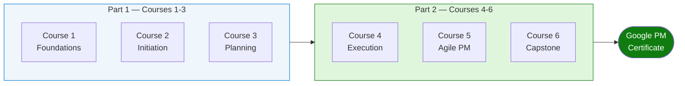

---

## 3. Course 4 — Project Execution: Running the Project

Course 4 is the operational heart of PM: keeping the project on track after the plan is approved. It covers how to manage quality, build a high-performing team, use data to make decisions, and formally close a project.

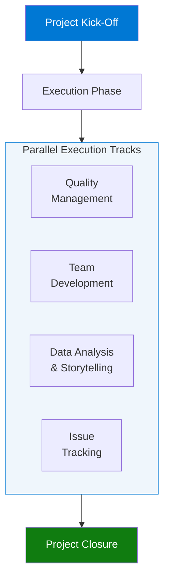

### Key Execution Responsibilities

| PM Responsibility | What It Involves |
|---|---|
| **Quality Management** | Define standards, assure process, control outputs |
| **Team Leadership** | Manage conflict, motivate, delegate, develop trust |
| **Stakeholder Communication** | Status reports, escalations, change requests |
| **Issue & Risk Tracking** | Log issues, update risk register, escalate blockers |
| **Change Control** | Assess impact, get approval, update plan |
| **Progress Tracking** | Earned value, burndown charts, milestone reviews |

---

## 4. Quality Management

Quality management is the systematic process of ensuring that project outputs meet agreed standards throughout the entire delivery lifecycle — not just at the end. It spans three linked disciplines: planning, assurance, and control.

### What Is Quality Management?

Quality management in project management is the process of ensuring deliverables meet defined standards — before, during, and after production. It is a three-stage discipline: **plan quality**, **assure quality**, **control quality**.

### Quality Management Lifecycle

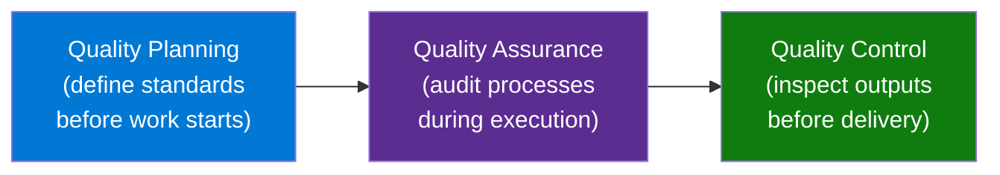

### Quality Planning

Define what "done right" looks like before work begins:
- Set **quality standards** — measurable criteria the deliverable must meet (e.g., "load time < 2 seconds", "error rate < 0.1%")
- Create a **quality management plan** documenting standards, assurance processes, and control checkpoints
- Identify **evaluation questions**: What will we measure? How often? Who signs off?

### Quality Assurance (QA)

QA is a **process audit** — ensuring the team is following the right procedures to produce quality outputs:
- Conduct process reviews and retrospectives
- Identify systemic issues before they produce defects
- Proactive: prevents problems from occurring

### Quality Control (QC)

QC is **output inspection** — checking the actual deliverable against the quality standards:
- Testing, code reviews, user acceptance testing (UAT)
- Reactive: catches defects after they occur
- Triggers a fix cycle → re-test → pass/fail

| Dimension | Quality Assurance | Quality Control |
|---|---|---|
| **Focus** | Process | Product/Output |
| **Timing** | During execution (ongoing) | After work is done |
| **Goal** | Prevent defects | Detect defects |
| **Owner** | PM + team | QA team / PM |
| **Example** | Code review process audit | Bug testing UAT session |

```python
# Quality checklist example (lightweight QC gate)
quality_checks = {
    "functional_requirements_met": False,
    "performance_benchmarks_passed": False,
    "uat_sign_off_received": False,
    "documentation_updated": False,
    "stakeholder_review_completed": False
}

def gate_check(checks: dict) -> str:
    passed = all(checks.values())
    failed = [k for k, v in checks.items() if not v]
    return "✅ PASS" if passed else f"⛔ FAIL — missing: {failed}"
```

### Business Conversation Example

**Context:** A business stakeholder is pushing to skip the QA audit to hit a fixed launch date 2 weeks away.

**PM (Priya):** "Sara, I know the August 15th date is fixed. I want to walk through what 'launch ready' means under our quality plan — specifically the QA audit and UAT steps — so we can decide together if there's a trade-off to make."

**Sara (Stakeholder):** "Honestly, the team has been building this for 3 months. If there were major issues, we'd know by now. Can we just do a smoke test and ship?"

**PM (Priya):** "A smoke test is QC — we check the outputs. What we'd be skipping is the QA audit: verifying that our review process was actually followed across the 47 stories we completed. On the payments integration last quarter, we skipped the process audit and found 6 stories where acceptance criteria were never formally reviewed before merge. That cost us 2 weeks in production fixes."

**Sara:** "That was a different team. I trust this team."

**PM (Priya):** "I trust them too — and that's exactly why I want to protect their work. The QA audit is 3 days. Fixing a defect in production costs 10 to 15 times more than catching it now."

**Sara:** "What if we run the audit in parallel with UAT?"

**PM (Priya):** "That's the right call — they don't depend on each other. I can complete both streams by August 12th, which still leaves a 3-day buffer before the 15th."

**Sara:** "OK. What do you need from me?"

**PM (Priya):** "Just sign off that the parallel approach is acceptable, and a 48-hour window to resolve any findings before the launch call is made. I'll send that in writing for steering committee alignment."

> **Why this works:** Priya separates QA (process audit) from QC (output inspection) — the core interview distinction — and makes the difference tangible with a real prior incident and a cost ratio (10–15× more expensive to fix in production). She offers a path forward (parallel streams) rather than just defending the process. The sponsor's ask for written alignment signals that the PM has earned credibility by speaking in business terms.

> **Interview tip:** "When asked about quality management, distinguish QA from QC: QA is a process audit (preventing defects), QC is output inspection (detecting defects). PMs own QA — they build the right process. The team and testers own QC — they verify the result. Both must pass before a deliverable is accepted."

---

## 5. Team Development & Dynamics

A PM does not just manage tasks — they build the conditions for team effectiveness. Understanding how teams form, where they break down, and how to coach through conflict is what separates execution-focused PMs from task-tracking coordinators.

### Tuckman's Stages of Team Development

Every new project team moves through predictable stages. The PM's role differs at each stage.

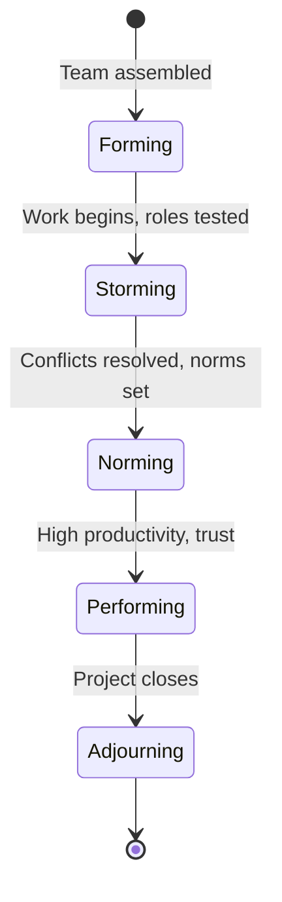

| Stage | What Happens | PM's Role |
|---|---|---|
| **Forming** | Team meets, roles unclear, polite but cautious | Provide structure, clarify roles, set expectations |
| **Storming** | Conflicts emerge, power dynamics surface | Mediate conflict, establish norms, be decisive |
| **Norming** | Team settles into rhythms, trust builds | Reduce micromanagement, empower decision-making |
| **Performing** | High output, self-organizing, minimal friction | Remove blockers, celebrate wins, protect the team |
| **Adjourning** | Project ends, team disperses | Recognize contributions, capture lessons, close cleanly |

### Managing Team Conflict

Conflict is inevitable and, if managed well, productive. The PM's conflict resolution toolkit:

1. **Clarify the issue** — often conflicts stem from misunderstood requirements, not personality clashes
2. **Listen actively** — let both sides articulate before proposing solutions
3. **Separate people from problems** — attack the issue, not the person
4. **Focus on interests, not positions** — ask "what outcome do you need?" not "what do you want?"
5. **Escalate if needed** — not every conflict is resolvable at the team level

**Conflict Response by Source Type:**

| Conflict Source | Signs | PM Response |
|---|---|---|
| **Unclear requirements** | "That's not what I built it for" | Facilitate a shared definition session; update acceptance criteria |
| **Resource competition** | Two workstreams claiming the same person | Negotiate time-box or escalate to sponsor for priority call |
| **Personality clash** | Interpersonal friction in meetings | 1:1 conversations first; establish team norms |
| **Technical disagreement** | Deadlock on architecture decision | Time-box the debate; decide by a named authority (Tech Lead or PM) |
| **Scope creep friction** | Team resisting new requests | Invoke change control process; protect the team from informal adds |

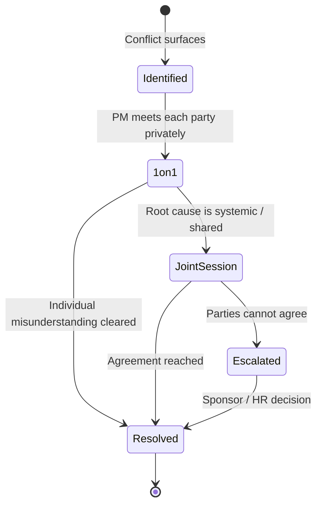

### Business Conversation Example

**Context:** Two developers have been deadlocked for two weeks on a database architecture decision. PM (Raj) facilitates a resolution.

**Raj (PM):** "Marco, Angie — before the Sprint Review, I want to close the NoSQL vs. SQL question. It's been open 2 weeks and it's blocking 3 stories. Can you each give me the 30-second version of your position?"

**Marco:** "NoSQL. Our query patterns are unpredictable. A relational schema will box us in as the product evolves — we'll be running migrations every quarter."

**Angie:** "I disagree. The reporting module needs structured joins. We have 4 analysts who write SQL. NoSQL means retraining them, new tooling, and operational complexity our DevOps team has never managed."

**Raj:** "Marco, you're concerned about long-term flexibility. Angie, you're concerned about short-term operational risk and skill set. Both are legitimate. Let me ask a different question — what's the first query we actually need to run?"

**Marco:** "The revenue dashboard — orders by region, product line, and time period."

**Angie:** "That's a textbook relational query."

**Raj:** "Marco, if the first 3 use cases are relational and the team knows SQL, what's the risk of starting with SQL and revisiting at the 6-month mark when we have real query patterns?"

**Marco:** "The risk is a migration at 6 months if we're wrong. But if the patterns stay relational, we avoided 6 months of NoSQL operational overhead."

**Raj:** "Angie, if we build a proper data access abstraction layer now, how hard is a migration at 6 months?"

**Angie:** "With a real abstraction layer — 2 weeks. Without it — a nightmare."

**Raj:** "Decision: SQL with an abstraction layer designed for migration. We revisit at month 6 with real data. Marco, you own the abstraction layer design. Angie, you own the schema. I'm logging this in the architecture decision record — neither the decision nor the rationale gets re-litigated before month 6."

**Marco:** "I can live with that."
**Angie:** "Agreed."

> **Why this works:** Raj doesn't arbitrate between opinions — he surfaces the underlying concerns (flexibility vs. operational complexity), reframes the decision around the first concrete use case, and finds a solution (SQL + abstraction layer) that de-risks both. He closes with explicit owners and a decision log to prevent re-opening. This is the interview answer to "how do you resolve technical disagreements" — you facilitate to a decision with assigned ownership, not pick a side.

> **Interview tip:** "When asked how you handle team conflict, say you triage first — not every conflict needs a meeting. A quick 1:1 often reveals that the conflict is a symptom of ambiguous requirements or unclear ownership. Fix the process gap and the interpersonal friction usually disappears. Only convene a joint session if the root cause is genuinely shared."

### Delegation Principles

| Delegation Rule | Why It Matters |
|---|---|
| Delegate ownership, not just tasks | Creates accountability, not just compliance |
| Match task complexity to skill level | Avoids under-challenge (disengagement) and overwhelm |
| Agree on checkpoints, not check-ins | Trust with visibility — not micromanagement |
| Share context, not just instructions | Enables judgment calls without constant escalation |

> **Interview tip:** "When asked how you build a high-performing team, reference Tuckman's stages and say you actively diagnose which stage the team is in. In Storming, your job is to establish norms and resolve ambiguity — not just manage tasks. In Performing, your job is to protect and enable, not direct."

---

## 6. Data Analysis & Storytelling

Project data — budget actuals, schedule variance, quality metrics — is collected continuously during execution. The PM's job is not just to collect it but to interpret it and communicate it in a form that drives stakeholder decisions. This section covers how to measure, analyze, and narrate project health.

### Why Data Storytelling Matters

PMs collect project data (budget, schedule, quality metrics, risks) but raw data rarely drives decisions. Data storytelling converts metrics into a narrative that prompts action.

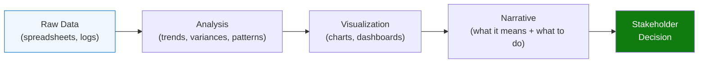

### Key Project Metrics

| Metric | Formula / Description | Signal |
|---|---|---|
| **Schedule Variance (SV)** | Earned Value − Planned Value | Negative = behind schedule |
| **Cost Variance (CV)** | Earned Value − Actual Cost | Negative = over budget |
| **Schedule Performance Index (SPI)** | EV ÷ PV | < 1.0 = behind schedule |
| **Cost Performance Index (CPI)** | EV ÷ AC | < 1.0 = over budget |
| **Burn Rate** | Actual spend ÷ time elapsed | vs. planned burn rate |
| **Milestone Completion Rate** | Milestones hit ÷ milestones due | % on-time delivery |

### Earned Value Management (EVM) Quick Reference

```
Planned Value (PV):   What we planned to have done by now (budgeted cost)
Earned Value (EV):    What we actually accomplished (budgeted cost of work done)
Actual Cost (AC):     What we actually spent to accomplish the work

SV = EV - PV       (positive = ahead of schedule)
CV = EV - AC       (positive = under budget)
SPI = EV / PV      (1.0 = on track; <1.0 = behind)
CPI = EV / AC      (1.0 = on budget; <1.0 = over)
```

### Storytelling Framework for Status Reports

```
STRUCTURE: Situation → Complication → Resolution (SCQA variant)

1. SITUATION:   "As of Week 8, we are on Day 56 of a 90-day project."
2. COMPLICATION: "The API integration milestone has slipped 4 days. SPI = 0.92."
3. QUESTION:    "Will this affect the go-live date?"
4. ANSWER:      "No — we have a 5-day buffer in the QA phase. Go-live remains August 20th.
                 Recovery plan: Add 1 dev to the API team for 2 weeks (cost: $12K)."
```

### Business Conversation Example

**Context:** PM (David) presenting Week 8 status to executive sponsor Sarah, whose project is running over budget on infrastructure.

**David (PM):** "Sarah, four sentences for your week-8 update. We're on Day 56 of 90. The infrastructure build is 12% over budget — CPI of 0.88. That is our one complication. Our schedule is healthy at SPI 1.02, and the August 20th go-live is not at risk."

**Sarah (Sponsor):** "Twelve percent over budget — what does that translate to in dollars, and why?"

**David:** "Eighteen thousand over on a $150K infrastructure line — $168K actual vs. $150K planned. Root cause: we underestimated cloud storage. The original estimate assumed 2TB; the content team is at 3.8TB. We didn't have final content volumes when we scoped."

**Sarah:** "Can we recover it?"

**David:** "Yes — two options. Option A: switch from on-demand to reserved cloud instances for the remaining 5 weeks, saving $11K and reducing the overrun to $7K — a 5% miss. Option B: defer the analytics module to Phase 2, which saves $15K and returns us to budget. The analytics module was a Phase 1 stretch goal, not a committed deliverable."

**Sarah:** "Which do you recommend?"

**David:** "Option A. It keeps all committed scope intact, and the $7K overrun is within the project's contingency reserve. I'd ask for approval on the reserved instance contract — it needs a 30-day commit, so I need a decision by Friday."

**Sarah:** "Approved. Send me the contract spec and I'll sign today. And David — this is exactly what I need in a status update. Problem, dollar amount, root cause, two options, your recommendation. If every PM gave me this, I'd have four fewer meetings a week."

**David:** "I'll keep this format for the remaining 4 weeks."

> **Why this works:** David applies SCQA in real time: Situation (Day 56 of 90), Complication (CPI 0.88, $18K over), Question (can we recover?), Answer (yes — two options with a clear recommendation). Every metric has a dollar translation and a root cause. He closes with a specific decision request and a hard deadline (Friday). The sponsor's reaction confirms what executive stakeholders want: data + recommendation + decision request — not raw metrics they have to interpret themselves.

> **Interview tip:** "When asked how you communicate project status, say you use data storytelling — not just metrics. You always pair a number with a narrative and a decision. 'CPI = 0.88' tells stakeholders nothing; 'We're 12% over budget on infra — here's why and here's the fix' enables a decision."

---

## 7. Project Closure

Project closure is often under-invested but critical for organizational learning and clean handoff.

### Closure Checklist

Project closure has three distinct layers. Each has different owners, different artifacts, and different risks when skipped.

| Closure Layer | Owner | Key Artifacts | Risk If Skipped |
|---|---|---|---|
| **Administrative** | PM | Signed acceptance, final budget, archived docs | Contractual disputes, audit failures |
| **Knowledge Transfer** | PM + Tech Lead | Run book, issues log, user training | Support team blind spots, repeat incidents |
| **People / Recognition** | PM + Sponsor | Retrospective, performance notes, celebration | Team attrition, no lessons captured for next project |

```
ADMINISTRATIVE CLOSURE:
[ ] All deliverables formally accepted by sponsor/stakeholder
[ ] Contracts closed (vendors, external resources)
[ ] Final budget reconciliation completed
[ ] Project documentation archived and accessible
[ ] Team members released and reassigned

KNOWLEDGE TRANSFER:
[ ] Retrospective / lessons learned documented
[ ] Run book / operations guide handed to support team
[ ] Known issues log transferred to BAU support
[ ] Training completed for end users

CELEBRATION:
[ ] Team contributions recognized formally
[ ] Sponsor/stakeholder thank-you communications sent
[ ] Individual accomplishments noted for performance reviews
```

### Retrospective (Lessons Learned) Format

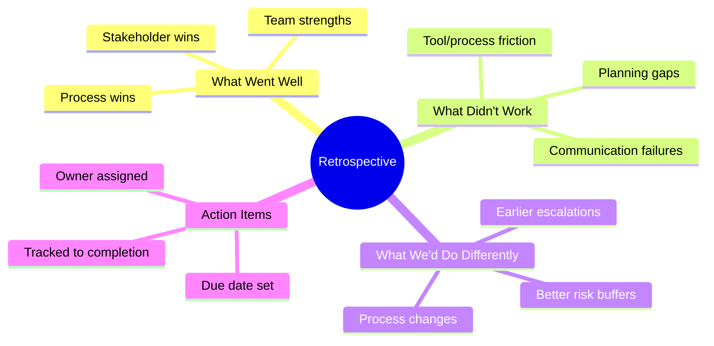

### Business Conversation Example

**Context:** Engineering Lead (Ben) wants to skip the retrospective to move everyone onto the next project faster.

**Ben (Eng Lead):** "Raj, the team is exhausted after 5 months on this. The next project kicks off Monday. Can we just send a lessons-learned email and call it done?"

**Raj (PM):** "I hear you on the energy level. Let me make the case for 90 minutes — not a full retrospective, just the structured debrief we agreed to in the charter."

**Ben:** "The charter is done. The project is done."

**Raj:** "The organization's next project isn't. On the payments integration last year, we skipped the retro. The ops team got a product with no run book and 3 months of undocumented architectural decisions. That cost us 6 weeks of BAU disruption. Same team, same problem, different project."

**Ben:** "What exactly do we need to capture?"

**Raj:** "Four things, 90 minutes total. What went well — so we replicate it. What didn't work — so we don't repeat it. One process change we commit to in the next project. And the run book for operations — that's 45 minutes of the session. The retro discussion is the other 45."

**Ben:** "And if someone can't make it?"

**Raj:** "I'll set up a Confluence page beforehand — people can comment async. The live session is for finalizing the process change and validating the run book. Six people for 90 minutes is 9 hours of team time. The ops disruption we're avoiding was 6 weeks. It's not a close call."

**Ben:** "OK. But Friday, not Monday. The team needs the weekend."

**Raj:** "Friday at 2pm. I'll send the agenda tonight — 3 topics, timed. People can pre-fill the retro board in advance so we're not starting cold."

**Ben:** "Deal."

> **Why this works:** Raj quantifies the cost of skipping (6-week BAU disruption vs. 9 hours of team time), names a specific prior incident, and scopes the request to 90 minutes with a clear structure. He separates the run book (mandatory operational artifact) from the retrospective discussion so Ben understands he's only being asked for 45 additional minutes. A PM who can make the business case for a retrospective signals they understand closure has organizational value beyond the individual project.

> **Interview tip:** "When asked how you close a project, say closure has three layers: administrative (contracts, docs, budget), knowledge transfer (handoff docs, run book, training), and people (retrospective, recognition). Most PMs do the admin layer but skip the people layer — that's where repeat problems originate."

---

## 8. Course 5 — Agile Project Management

Course 5 shifts from sequential, plan-driven project management to iterative, value-driven delivery. It covers the Agile mindset, values, and principles — then applies them through the Scrum framework, the most widely adopted Agile method in industry.

### Agile Philosophy

Agile is a **mindset** before it is a methodology. The Agile Manifesto (2001) established four core values:

| Agile Values | What It Means in Practice |
|---|---|
| **Individuals & interactions** over processes & tools | Face-to-face collaboration beats documentation overhead |
| **Working software** over comprehensive documentation | Deliver value early; document what's useful |
| **Customer collaboration** over contract negotiation | Engage customers continuously, not only at sign-off |
| **Responding to change** over following a plan | Plans are guesses; update them when reality changes |

The 12 Agile Principles expand on these values — key ones for PM interviews:
- Deliver working product frequently (2–4 week sprints)
- Welcome changing requirements even late in development
- Sustainable pace — the team cannot sprint indefinitely
- Simplicity: maximize the amount of work NOT done

**Agile Value Hierarchy (how to resolve conflicts between the values):**

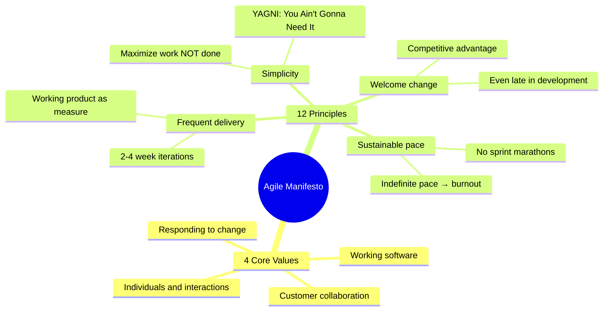

### Business Conversation Example

**Context:** IT Director (Linda) is skeptical about switching to Agile for a CRM replacement project with 200 integration points.

**Linda (IT Director):** "I keep hearing 'Agile' as the answer to everything. But this is a CRM replacement with 200 integration points and a hard regulatory filing deadline. How is Agile not just chaos?"

**PM (Sara):** "Completely fair concern. Agile is often misrepresented as 'no planning.' Let me reframe: Agile means your plan is a living document, updated as you learn — not a contract locked in at month 1. For 200 integrations, you absolutely need planning. The question is what kind."

**Linda:** "What does that mean concretely for this project?"

**Sara:** "On a pure Waterfall approach, you'd design all 200 integrations upfront over 3 months, build for 6 months, test for 3 months — and discover integration failures at month 9. On an Agile approach, you build and test the first 20 integrations in Sprint 1, learn what the CRM and the other systems actually do, and adjust the design for the next 20. You discover failures at week 2, not month 9."

**Linda:** "What about compliance documentation? The regulator expects full system specs with documented approval gates."

**Sara:** "That's exactly why most enterprise transformation projects are hybrid. The compliance architecture and systems design documentation are Waterfall-governed — full specs, milestone sign-offs. The implementation sprints are Agile — 2-week cycles, working integrations at the end of each cycle. You get the audit trail the regulator needs, and the early feedback loops that 200 integrations require."

**Linda:** "Has this model worked at this scale?"

**Sara:** "Salesforce CRM rollouts at financial services firms use this exact model. I can share two reference cases before the board meeting if that would help."

**Linda:** "Yes — send those through. And tell me: what does 'done' look like at the end of Sprint 1?"

**Sara:** "Sprint 1 done means the top 20 integrations by business criticality are connected and passing automated tests. We show them live in the Sprint Review — working software, not slide decks."

> **Why this works:** Sara reframes Agile from "no planning" to "responsive planning," and addresses the regulatory concern directly with a Hybrid answer rather than defending pure Agile. She converts an abstract methodology debate into a concrete risk comparison (discover failures at week 2 vs. month 9). The reference case request shows a PM who anticipates what executive stakeholders need for a board conversation, and the Sprint 1 definition of done shows she can make Agile tangible.

> **Interview tip:** "When asked to explain Agile, don't start with Scrum — start with the Manifesto. Agile is a set of values and principles; Scrum is one framework that implements them. The key insight interviewers want is that 'responding to change over following a plan' does NOT mean 'no planning' — it means plans are living documents updated as you learn, not contracts carved in stone at the start."

### Agile vs. Waterfall Decision Guide

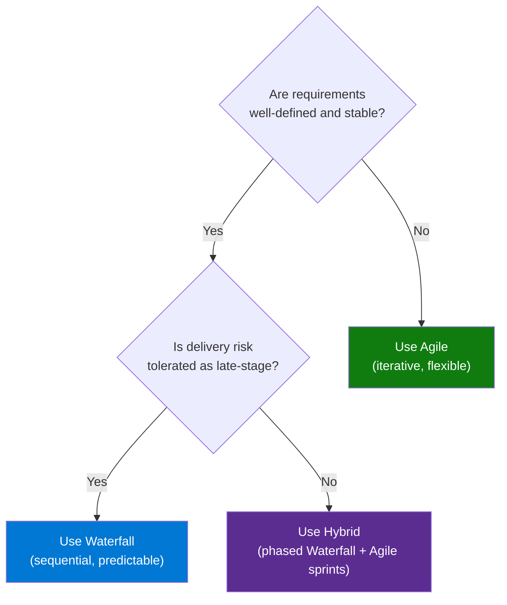

**When to choose each — by industry context:**

| Context | Best Fit | Rationale |
|---|---|---|
| Software product, SaaS, mobile apps | Agile / Scrum | Requirements evolve; fast feedback from users is critical |
| Construction, manufacturing, infrastructure | Waterfall | Physical deliverables; late changes are extremely costly |
| Regulated industries (healthcare, finance) | Waterfall or Hybrid | Compliance requires documented approval gates |
| Large enterprise transformation | Hybrid | Multiple workstreams: some fixed (compliance), some iterative (UI) |
| R&D / innovation / prototyping | Agile (or Kanban) | Discovery phase; requirements unknown until explored |

> **Interview tip:** "When asked Agile vs Waterfall, the answer is always 'it depends on two things: how stable the requirements are, and how much it costs to discover problems late.' If both costs are low — Agile. If both costs are high — Waterfall. If it's mixed — you need a hybrid, and you design the boundary."

---

## 9. Scrum Framework & Events

Scrum operationalizes Agile values through a precise structure: three roles, three artifacts, and five events. Every Scrum team knows exactly who owns what, what the outputs are, and when the synchronization points happen. This predictability enables both speed and quality.

### Scrum Overview

Scrum is the most widely adopted Agile framework. It organizes work into fixed-length **Sprints** (1–4 weeks, typically 2) and uses defined roles, artifacts, and ceremonies.

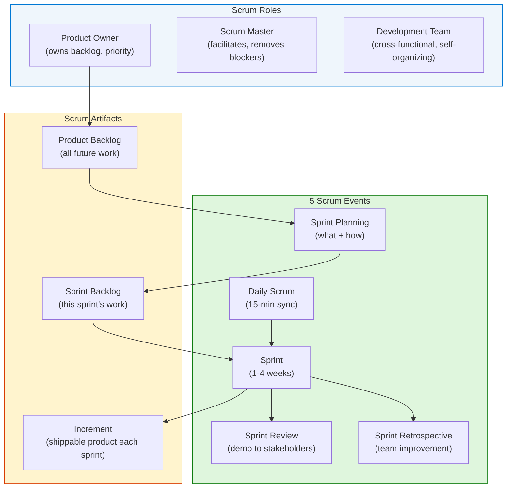

### 5 Scrum Events — Quick Reference

| Event | Duration | Purpose | Outcome |
|---|---|---|---|
| **Sprint Planning** | 2–4 hrs | Select backlog items for sprint; plan delivery approach | Sprint backlog + sprint goal |
| **Daily Scrum** | 15 min | Sync on progress, plans, blockers | Updated team awareness + impediment log |
| **Sprint Review** | 1–2 hrs | Demo working increment to stakeholders | Feedback incorporated into backlog |
| **Sprint Retrospective** | 1–1.5 hrs | Team reflects: what worked, what didn't, what to improve | Improvement action items |
| **Sprint** | 1–4 weeks | The work time-box — all other events occur within it | Potentially shippable increment |

### Product Backlog vs. Sprint Backlog

| Dimension | Product Backlog | Sprint Backlog |
|---|---|---|
| **Owner** | Product Owner | Development Team |
| **Scope** | All future work (ever-growing list) | This sprint's selected subset |
| **Horizon** | Long-term roadmap | 1–4 week commitment |
| **Ordered by** | Business value / priority | Implementation sequence |
| **Changes during sprint?** | Yes — PO can add/re-prioritize | No — sprint backlog is locked |

### Sprint Burndown Chart

```
Sprint Burndown (10 story points, 2-week sprint)

Points |
  10   |●
   8   |  ●  ← ideal line
   6   |    ●  ●
   4   |          ●  ← actual line
   2   |            ●  ●
   0   |_________________
       Day: 1  3  5  7  9
```

A burndown chart tracks remaining work over the sprint. If the actual line is above the ideal line, the team is at risk of not completing the sprint goal.

> **Interview tip:** "When asked to explain Scrum, structure your answer as Roles → Artifacts → Events — in that order. Then add: 'The most important insight is that Scrum is not just ceremonies; it's a feedback loop. Each sprint produces a working increment that gets reviewed, creating real stakeholder feedback every 2 weeks instead of at the end of a 6-month waterfall project.'"

---

## 10. Team Coaching in Agile

In Scrum, the Scrum Master does not manage work — they manage the conditions for the team to do their best work. This requires coaching skills: the ability to surface dysfunction, build self-organization, and gradually remove the scaffolding until the team is fully autonomous.

The Scrum Master is a servant-leader, not a project manager. Their role is to **coach** the team to self-organization, not to direct work.

### Coaching Techniques

| Challenge | Coaching Technique |
|---|---|
| Team over-commits in sprint planning | Ask: "What is your confidence level on each item?" Use velocity from prior sprints |
| Daily Scrum becomes a status report to SM | Redirect: team members talk to each other, not to the SM |
| Team blames external blockers for sprint failure | Facilitate root cause analysis; address systemic impediments |
| Team avoids retrospective action items | Make retro actions part of next sprint backlog — visible, prioritized |
| Product Owner keeps changing sprint scope | Educate on sprint goal protection; defer additions to product backlog |

### Business Conversation Example

**Context:** Scrum Master (Alex) running the Sprint 3 retrospective. The team committed 32 points but delivered 21 — the third consecutive sprint missing by a similar margin.

**Alex (Scrum Master):** "Before we close the retro, I want to spend 15 minutes on the commitment pattern. Three sprints in a row: we've committed 30 or more points and delivered between 20 and 24. Our measured velocity is 22 points. Something is happening in planning that we need to fix."

**Kai (Dev):** "We're optimistic. We genuinely think we can do the work. Then the sprint happens."

**Alex:** "Optimism is good. Systematic overcommitment makes the team feel like they're failing every sprint — even when the work is good. Kai, the authorization service story in Sprint 3 — what was your confidence level when you pulled it in?"

**Kai:** "Honestly, maybe 60%. The vendor API documentation was still in draft."

**Alex:** "So when you pulled that story in, there was a 40% chance it would not finish. Did we account for that in planning?"

**Kai:** "No. We just took it."

**Alex:** "Here's what I want to try in Sprint 4 planning. For each story we consider pulling in, the person taking it rates their confidence: high, medium, or low. If it's low, we either defer it or treat it as a stretch goal — we pull it last and only if everything else is done. We plan the committed work to 80% of velocity — 17 or 18 points. The remaining 4 or 5 points are stretch."

**Maya (Dev):** "Won't that make us look slower to the Product Owner?"

**Alex:** "You delivered 21 points last sprint on a 32-point commitment. That's a 66% hit rate. If you deliver 18 on an 18-point commitment, that's 100%. Which team looks better?"

**Kai:** "The second one."

**Alex:** "Sprint 4 — 80% committed, 20% stretch. We compare how it feels at the Sprint Review. Deal?"

**Maya:** "Deal."
**Kai:** "Let's try it."

> **Why this works:** Alex leads with data (three-sprint pattern, 22-point velocity vs. 30+ commitments) rather than intuition, invites the team to diagnose rather than lecturing them, and uses a specific story example (Kai's authorization service, 60% confidence) to make the coaching concrete. The 80/20 committed/stretch split is a practical, actionable technique. Maya's "won't we look slower?" question surfaces the real fear, and Alex answers with a metric comparison (66% vs. 100% hit rate) that reframes what delivery success means in Scrum.

> **Interview tip:** "When asked about Scrum Master challenges, name a specific anti-pattern and your technique. 'The team over-commits' → I anchor planning to historical velocity, not aspiration. 'Daily Scrum is a status report' → I redirect to peer-to-peer — team talks to team, not to me. Naming the anti-pattern and the technique shows you've done this, not just studied it."

### Velocity Tracking

```
Velocity = average story points completed per sprint

Sprint 1: 18 pts  (team learning, under-delivers)
Sprint 2: 22 pts
Sprint 3: 24 pts
Sprint 4: 23 pts
Sprint 5: 25 pts
──────────────────
Average: 22.4 pts/sprint

Use average velocity (not latest sprint) for sprint planning.
Never use velocity as a performance metric — it's a planning tool only.
```

> **Interview tip:** "When asked about Agile team challenges, describe velocity as a planning tool that the team owns — not a KPI for management to track. The moment velocity becomes a performance metric, teams inflate story points. Velocity's only valid use is 'how many points can this specific team sustain over time?'"

---

## 11. Course 6 — Capstone: Applying PM in the Real World

Course 6 is a synthetic application of all prior courses to a realistic project scenario. Learners produce:

1. **Project Charter** — scope, goals, stakeholders, deliverables, timeline
2. **Stakeholder Analysis** — influence/interest grid, communication plan
3. **Risk Register** — probability × impact scoring, mitigation plans
4. **Quality Management Plan** — quality standards, QA checkpoints, QC gates
5. **Status Reports with Data Storytelling** — metrics + narrative for stakeholders
6. **Retrospective / Lessons Learned** — structured close-out document

### Capstone Workflow

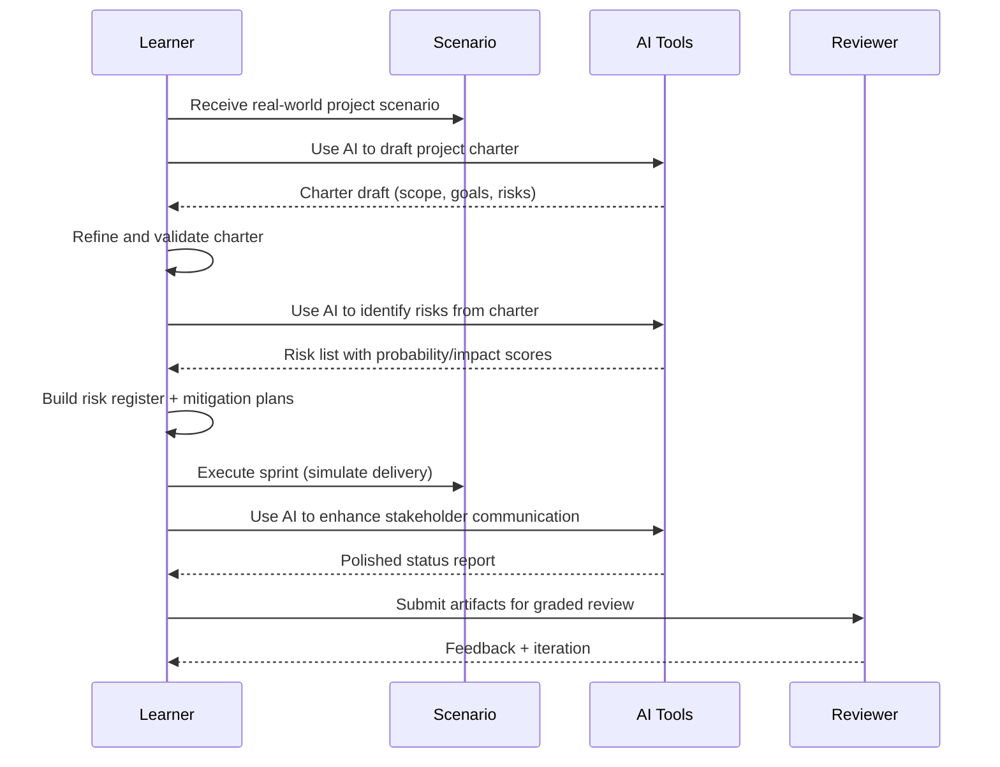

> **Interview tip:** "When asked about the Capstone or a real project you've delivered end-to-end, use the artifact list as your structure: charter → stakeholder analysis → risk register → quality plan → status reporting → retrospective. This signals that you understand a project has a complete delivery lifecycle, not just a 'build' phase. Most candidates skip closure and retrospective — naming them explicitly signals senior-level thinking."

---

## 12. AI Integration in Project Management

Course 6 explicitly covers using AI to augment PM workflows. This is a growing exam topic and interview differentiator.

### AI Use Cases in PM

| PM Task | AI Application | Tool Examples |
|---|---|---|
| **Charter drafting** | Generate scope statement, goals, stakeholder list from a brief | ChatGPT, Gemini, Copilot |
| **Risk identification** | Extract risks from project description; suggest mitigations | LLM prompt engineering |
| **Status report drafting** | Convert raw metrics into stakeholder narrative | LLM + data summary |
| **Meeting notes → actions** | Summarize meeting transcript into action items with owners | NotebookLM, Copilot |
| **Backlog grooming** | Suggest user story breakdowns from epics | AI PM tools |
| **Risk monitoring** | Flag schedule/budget variance patterns from project data | PM software with AI |

### AI Prompting for PMs (Examples)

```
CHARTER PROMPT:
"You are a project manager. Given the following project brief, generate a 
project charter with: (1) project goal statement, (2) in-scope/out-of-scope 
list, (3) top 5 stakeholders and their interest, (4) key risks, 
(5) success metrics. Brief: [paste brief here]"

RISK IDENTIFICATION PROMPT:
"Review this project plan and identify the top 10 risks. For each risk:
- Risk description
- Probability (Low / Medium / High)
- Impact (Low / Medium / High)
- Suggested mitigation
Plan: [paste plan here]"

STATUS REPORT PROMPT:
"Convert these raw project metrics into a 3-paragraph stakeholder 
status update for an executive audience. Be concise. 
Metrics: [SPI=0.94, CPI=1.02, milestone X completed, milestone Y delayed 3 days, 
next milestone Z due in 5 days, budget remaining $45K of $200K total]"
```

> **Interview tip:** "When asked about AI in PM, be specific: AI augments PMs — it doesn't replace judgment. The value is in the first draft and the pattern detection, not the final decision. A PM who uses AI to generate a risk list still has to validate each risk against the specific project context."

---

## 13. Comparison Tables

Quick-reference side-by-side tables for the core distinctions covered in Courses 4–6. Use these to answer "what's the difference between X and Y" interview questions with precision.

### Waterfall vs. Agile vs. Hybrid

| Dimension | Waterfall | Agile | Hybrid |
|---|---|---|---|
| **Requirements** | Fixed upfront | Evolving | Partially fixed |
| **Delivery** | End of project | Every sprint (2–4 weeks) | Phased / incremental |
| **Change tolerance** | Low — change control process | High — welcome changes | Medium |
| **Best for** | Construction, compliance, regulated industries | Software, product, innovation | Large programs with mixed workstreams |
| **Risk profile** | Late discovery of issues | Early feedback loop | Depends on hybrid structure |
| **PM role** | Command-and-control planner | Servant-leader facilitator | Context-dependent |
| **Team size** | Any | Small (3–9 per team) | Any |

### Quality Assurance vs. Quality Control (Detailed)

| Dimension | QA | QC |
|---|---|---|
| **Type of activity** | Proactive / process | Reactive / inspection |
| **When** | Throughout execution | At defined checkpoints |
| **What is examined** | How the work is being done | What was produced |
| **Goal** | Build quality in | Find and fix defects |
| **Owner** | PM + process owner | Tester / reviewer |
| **Agile equivalent** | Definition of Ready; coding standards | Definition of Done; sprint review |

### Scrum Master vs. Project Manager

| Dimension | Scrum Master | Project Manager |
|---|---|---|
| **Authority** | No — servant-leader | Yes — formal PM authority |
| **Focus** | Team health + Scrum process | Scope, schedule, budget |
| **Accountability for delivery** | Team self-organizes | PM is accountable to sponsor |
| **Change management** | PO manages backlog priority | PM manages change control |
| **Methodology** | Scrum only | Any — Waterfall, Agile, Hybrid |

---

## 14. PM Templates & Artifacts

Copy-ready templates for the three most common PM artifacts produced during project execution: the risk register, the status report, and the Agile Definition of Done. Adapt field names to your organization's tooling (Jira, Asana, MS Project, etc.).

### Risk Register Template

```markdown
| Risk ID | Risk Description | Probability | Impact | Risk Score | Mitigation | Owner | Status |
|---|---|---|---|---|---|---|---|
| R01 | API vendor delays integration by 2 weeks | Medium | High | 6 | Lock API spec early; set weekly check-in with vendor | PM | Open |
| R02 | Key developer leaves mid-project | Low | High | 4 | Document all designs; cross-train backup | Tech Lead | Open |
| R03 | Scope creep from business stakeholder | High | Medium | 6 | Change control process; weekly scope review | PM | Open |
```

### Status Report Template (SCQA Format)

```markdown
**Status Report — Week [N] of [Total]**
**Project:** [Name] | **PM:** [Name] | **Date:** [YYYY-MM-DD]

**SITUATION:** We are at Day [X] of [Y]-day project. Key milestone: [milestone name].

**COMPLICATION:** [What is at risk or has slipped — 1-2 sentences + 1 metric]

**QUESTION:** Will this affect the overall delivery date?

**ANSWER:** [Yes/No + why + recovery action with cost/timeline]

**Next Milestone:** [Name] — due [Date] | **Budget:** $[spent] of $[total] ([%]%)
**Action Items:** 
- [Action] | Owner: [Name] | Due: [Date]
```

### Definition of Done (Agile)

```
DEFINITION OF DONE — Development Team Agreement

A user story is "Done" when:
[ ] Code written and peer-reviewed
[ ] Unit tests written and passing (coverage ≥ 80%)
[ ] Integration tests passing
[ ] Code merged to main branch
[ ] Acceptance criteria verified by Product Owner
[ ] No critical or high-severity defects outstanding
[ ] Documentation updated (API docs, run book)
[ ] Deployed to staging environment
```

---

## 15. Best Practices

High-signal do/don't pairs for each major area of Courses 4–6. These are the most common interview differentiators — they signal whether a candidate has real delivery experience or just studied theory.

### Project Execution

- ✅ Track issues and risks in a shared log — visible to all team members
- ✅ Separate issues (happening now) from risks (might happen) in your tracker
- ✅ Use a change control process — never silently absorb scope changes
- ❌ Don't wait for status meetings to surface blockers — use async channels
- ❌ Don't conflate team velocity with team performance — they measure different things

### Quality Management

- ✅ Define quality standards before execution begins — not after a defect is found
- ✅ Include QC gates in the project schedule as milestones (not afterthoughts)
- ✅ Make acceptance criteria explicit: "the stakeholder confirms X" not "we think X is good"
- ❌ Don't let QA be a rubber stamp — audits must have teeth and follow-up
- ❌ Don't skip UAT because the schedule is tight — UAT failures in production cost 10× more

### Agile / Scrum

- ✅ Protect the sprint goal — defer new requests to the next sprint backlog
- ✅ Keep retrospective actions small and achievable — 1–3 items per sprint
- ✅ Use the Daily Scrum to surface blockers, not to report progress to the SM
- ❌ Don't treat velocity as a performance target — it distorts story point estimation
- ❌ Don't skip the Sprint Review — stakeholder feedback IS the feedback loop

### Team Leadership

- ✅ Diagnose team stage (Tuckman) before choosing your leadership style
- ✅ Delegate with context, not just task descriptions
- ✅ Celebrate small wins — sustained delivery requires sustained motivation
- ❌ Don't micromanage in the Performing stage — you erode trust and autonomy
- ❌ Don't avoid conflict — unresolved conflict metastasizes into attrition

---

## 16. Interview Talking Points

Model answers for the six most common PM interview questions arising from Course 4–6 content. Each answer is 3–5 sentences, uses the course's terminology, and includes a framing device (structure, contrast, or specific metric) that signals senior-level understanding.

### "How do you manage quality on a project?"

> Quality management is three things: planning, assurance, and control. In planning, I define measurable quality standards upfront — with the team and the stakeholder — before any work begins. During execution, I run QA: process audits, peer reviews, and standard adherence checks. At delivery checkpoints, I run QC: formal inspection of outputs against the standards we set in planning. The key distinction is that QA is proactive and QC is reactive — both are necessary, and skipping QA means your QC will always be finding surprises.

### "What's the difference between Agile and Scrum?"

> Agile is a mindset: a set of values and principles for delivering value iteratively and adapting to change. Scrum is a specific framework that implements Agile through defined roles (Product Owner, Scrum Master, Development Team), artifacts (Product Backlog, Sprint Backlog, Increment), and five events (Sprint Planning, Daily Scrum, Sprint Review, Sprint Retrospective, and the Sprint itself). You can be Agile without using Scrum — but Scrum is the most widely adopted Agile framework in practice.

### "How do you handle a team member who is underperforming?"

> First, I diagnose before I act — underperformance usually has a root cause: unclear expectations, skill gap, personal situation, or disengagement. I start with a 1:1 conversation focused on understanding, not judgment. I ask what's getting in the way and listen before drawing conclusions. Then I create a clear expectation (what "done" looks like, by when), offer support (training, pairing, removing blockers), and agree on a check-in cadence. I document the conversation and the agreement. If performance doesn't improve after support is provided, I escalate to the sponsor or HR as appropriate — never surprise-escalating.

### "How do you use data to tell a project story?"

> Raw metrics don't drive decisions — narratives do. My format is SCQA: Situation (here's where we are), Complication (here's the issue), Question (does this affect the outcome?), Answer (here's the resolution and what I need from you). Every metric I present comes with a "so what" and a recommended action. For example, I wouldn't say "CPI is 0.88" — I'd say "We're 12% over budget on the infrastructure build. Root cause: underestimated cloud storage costs. Recovery plan: use reserved instances, saving $8K over 3 months, returning us to budget by Month 5. I need your approval on the contract change."

### "Walk me through how you close a project."

> I close in three layers. First, administrative closure: all deliverables signed off by the stakeholder, contracts closed with vendors, final budget reconciled, and all documentation archived. Second, knowledge transfer: a run book handed to the operations team, a known issues log transferred to BAU support, and training completed for end users. Third, the people layer — often skipped, always costly to skip: a structured retrospective that captures what worked and what didn't, with owners and due dates on the improvement items, and formal recognition of team contributions. The retrospective is where the next project gets better.

### "What Agile coaching challenges have you managed?"

> The most common one is sprint overcommitment. Teams consistently pull in more than their velocity supports, then get demoralized when they can't deliver. My fix: use the team's historical velocity (not their aspirational velocity) for planning, and ask each item's owner to rate their confidence before finalizing the sprint. A 70% confidence rating on every item means you're setting the team up to miss. I also address the Daily Scrum-as-status-report anti-pattern — I physically leave the room or redirect so team members talk to each other, not to me.

---

## 17. Learning Resources

| Resource | Link | Type |
|---|---|---|
| YouTube — Part 2 (this video) | [https://www.youtube.com/watch?v=-84E_-aTpck](https://www.youtube.com/watch?v=-84E_-aTpck) | Video |
| YouTube — Part 1 | [https://www.youtube.com/watch?v=eZDkSNHaWh8](https://www.youtube.com/watch?v=eZDkSNHaWh8) | Video |
| Google PM Certificate — Coursera | [https://www.coursera.org/professional-certificates/google-project-management](https://www.coursera.org/professional-certificates/google-project-management) | Course |
| Google Career Certificates | [https://grow.google/certificates/project-management/](https://grow.google/certificates/project-management/) | Official |
| Agile Manifesto | [https://agilemanifesto.org](https://agilemanifesto.org) | Reference |
| Scrum Guide (official) | [https://scrumguides.org/scrum-guide.html](https://scrumguides.org/scrum-guide.html) | Reference |
| PMI — CAPM Certification | [https://www.pmi.org/certifications/certified-associate-capm](https://www.pmi.org/certifications/certified-associate-capm) | Certification |

---

*Last Updated: July 2026 | Source: Google — Project Management Full Course (Part 2)*
