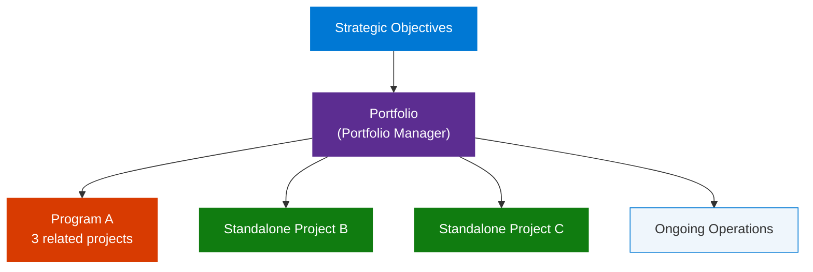
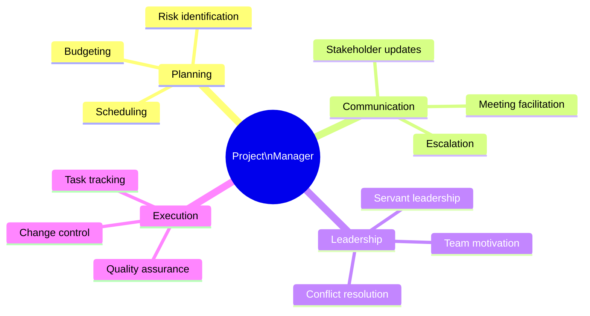
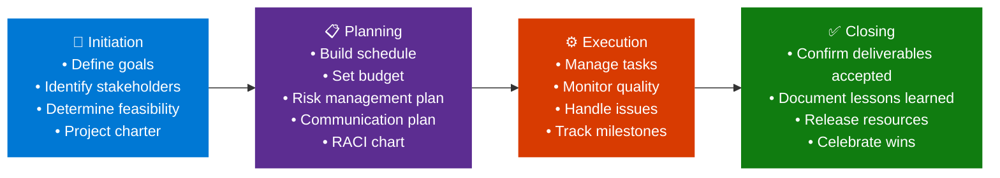
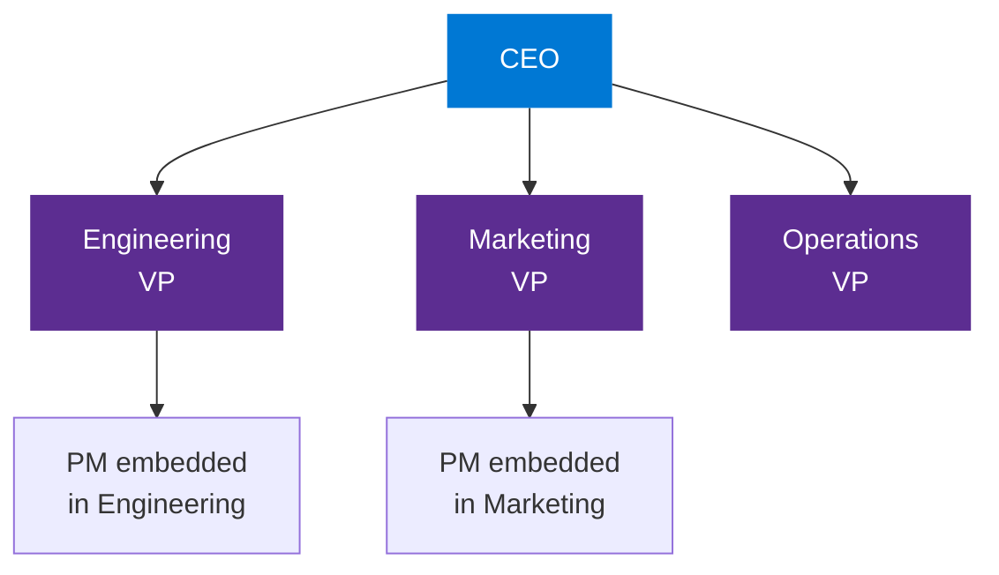
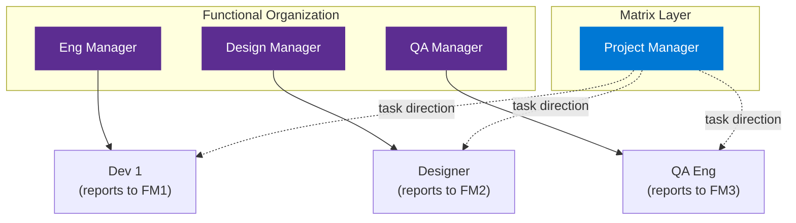
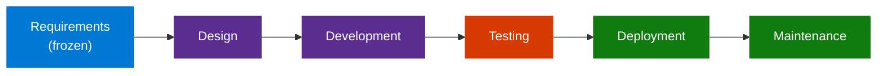
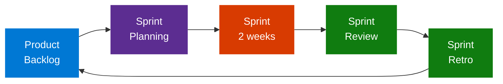
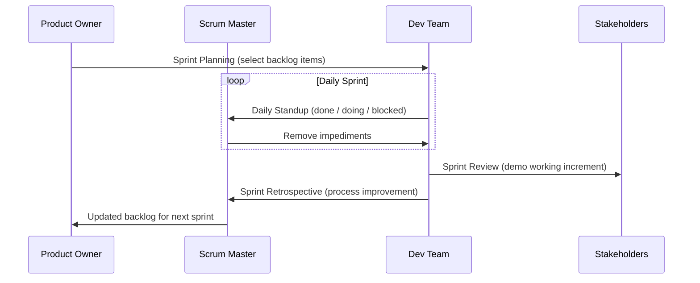
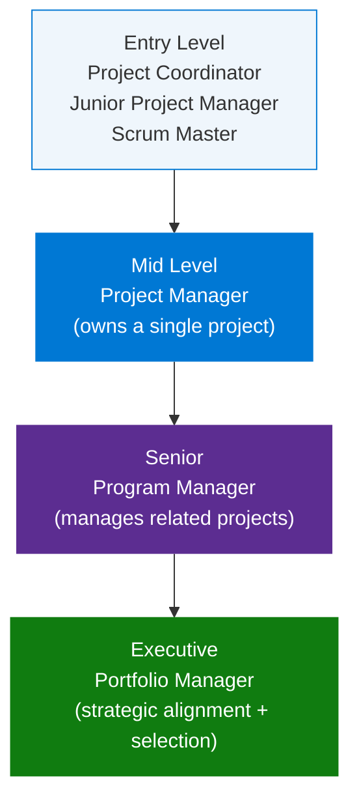

# Google Project Management — Foundations of Project Management

> **Source:** [YouTube — Project Management Full Course By Google (Part 1)](https://www.youtube.com/watch?v=eZDkSNHaWh8)
> **Channel/Event:** Google · Google Project Management Certificate · Course 1 of 7
> **Topic:** project management, PM life cycle, organizational structure, Waterfall, Agile, Scrum, RACI, stakeholder management
> **Key Claim:** The Google PM Certificate qualifies learners for 100+ hours of PMI education, preparing them for CAPM® certification and entry-level PM roles.

---

## Table of Contents

1. [Overview](#1-overview)
2. [Problem Statement](#2-problem-statement)
3. [Core Concepts](#3-core-concepts)
4. [PM Life Cycle](#4-pm-life-cycle)
5. [Organizational Structure & Culture](#5-organizational-structure--culture)
6. [PM Methodologies](#6-pm-methodologies)
7. [Roles & Career Progression](#7-roles--career-progression)
8. [Key Artifacts & Templates](#8-key-artifacts--templates)
9. [Tools & Platforms](#9-tools--platforms)
10. [Comparison Table — Waterfall vs Agile](#10-comparison-table--waterfall-vs-agile)
11. [Code Examples — PM Templates](#11-code-examples--pm-templates)
12. [Best Practices](#12-best-practices)
13. [Interview Talking Points](#13-interview-talking-points)
14. [Learning Resources](#14-learning-resources)

---

## 1. Overview

This is the first course in Google's 7-course Project Management Professional Certificate program. It covers the foundational terminology, roles, and frameworks every entry-level PM needs — the project management life cycle, organizational structure impacts, and an introduction to Waterfall and Agile methodologies. The course is 13 hours of instruction and is the prerequisite for all subsequent courses in the series. Completing the full 7-course program qualifies candidates for over 100 PMI education hours, accelerating eligibility for the CAPM® certification. Google and 150+ U.S. employers actively recruit from certificate graduates.

**Google PM Certificate — 7-course structure:**

| Course | Title | Duration | Focus |
|---|---|---|---|
| 1 | Foundations of Project Management | 13h | Life cycle, org structure, methodologies |
| 2 | Project Initiation | 15h | Charters, stakeholders, scope, tools |
| 3 | Project Planning | 23h | Schedule, budget, risk, communication |
| 4 | Project Execution | 26h | Quality, team dynamics, closing |
| 5 | Agile Project Management | 20h | Agile values, Scrum framework, coaching |
| 6 | Capstone | 38h | Real-world scenario; AI integration |
| 7 | Accelerate Your Job Search with AI | 6h | Resume, job search, interview prep |

> **Interview tip:** "The Google PM Certificate is a credible entry point for career switchers — it covers the full PM life cycle in a structured, vendor-neutral way. When referencing it in an interview, tie it to a specific skill: 'I learned risk management through Course 3, and applied that framework when I [real example].'"

---

## 2. Problem Statement

### Why Structured Project Management Matters

| Problem | Impact Without PM |
|---|---|
| No clear ownership | Tasks fall through cracks; unclear who decides |
| Scope creep | Budget and timeline overruns |
| Misaligned stakeholders | Rework, failed deliverables, loss of trust |
| Unmanaged risk | Project failures surface too late to recover |
| Poor communication plans | Teams work in silos; executives blindsided |
| No closing process | Lessons not captured; contracts left open |

> **Key Insight:** "Project managers are natural problem-solvers. They set the plan and guide teammates, and manage changes, risks, and stakeholders."

---

## 3. Core Concepts

### Project
A **project** is a temporary endeavor undertaken to create a unique product, service, or result. Unlike ongoing operations, projects have:
- A defined **start and end date** (they are not permanent)
- A **unique objective** (building a new checkout feature ≠ running the existing checkout)
- **Resource constraints** — people, budget, time are allocated specifically to it
- A **dedicated team** that may disband once the project closes

**Real-world example:** Migrating a company's database from on-premise SQL Server to Azure SQL Database is a project. Running the database day-to-day is an operation.

| Attribute | Project | Operation |
|---|---|---|
| Duration | Temporary (defined end) | Ongoing (no end date) |
| Goal | Unique deliverable | Repeatable process |
| Team | Assembled for the project | Permanent department |
| Success metric | Deliverable accepted | KPIs maintained |
| PM involvement | Full lifecycle management | Process optimization |

> **Interview tip:** "When an interviewer asks 'what is a project?', don't just say 'a temporary endeavor.' Add the uniqueness dimension: a project produces something that didn't exist before, and the team dissolves when it's done — both of which distinguish it from operations."

### Program
A **program** is a group of related projects managed in a coordinated way to obtain benefits that could not be achieved by managing them individually. Programs have a shared strategic goal that individual projects contribute to but cannot deliver alone.

**Example:** A "Digital Transformation Program" includes a CRM migration project, a mobile app project, a data warehouse project, and an employee training project — each is a project, but the transformative outcome only exists when all succeed together.

**Key distinctions:**

| | Project | Program |
|---|---|---|
| Scope | Single deliverable | Multiple related deliverables |
| Duration | Months to ~2 years | Multi-year |
| Management | PM owns scope/schedule/budget | Program manager owns benefit realization |
| Interdependencies | Internal to project | Cross-project; shared resources, shared risks |
| Success metric | Deliverable accepted | Business benefit realized |

> **Interview tip:** "Programs exist to capture benefits that require multiple projects working together. If a stakeholder asks 'why can't we just manage these as separate projects?' — the answer is: cross-project dependencies, shared resources, and the compound benefit that requires coordination at a higher level."

### Portfolio
A **portfolio** is the collection of programs, projects, and operational work selected and managed to achieve an organization's strategic objectives. Portfolio management is about choosing the *right* work — not just doing work right.

**Portfolio management decisions:**
- Which programs to fund vs. deprioritize (resource allocation)
- How to balance risk across all investments (high-risk innovation vs. low-risk maintenance)
- Whether a proposed project aligns with strategic goals before approving it
- How to kill or pause projects that no longer align with strategy



> **Interview tip:** "Portfolio management is strategic; project management is tactical. A portfolio manager says 'should we do this?' A project manager says 'how do we do this?' In an interview, frame portfolio decisions as trade-offs between strategic value, risk, and resource capacity."

### Project Manager (PM)
The person responsible for planning, organizing, and overseeing a project from initiation to closing. Core responsibilities:
- Define scope, goals, and deliverables
- Build and manage the project schedule
- Identify and mitigate risks
- Communicate with stakeholders
- Lead and motivate the team

**What makes PM different from other leadership roles:**

| Attribute | Project Manager | Functional Manager | Technical Lead |
|---|---|---|---|
| Authority source | Delegated from sponsor | Direct org authority | Technical expertise |
| Accountability | Project outcomes | Team performance | Technical quality |
| Resource control | Rarely owns resources | Owns the team | Owns tech decisions |
| Key skill | Influence without authority | People management | Deep technical depth |
| Time horizon | Project duration | Ongoing | Sprint/feature level |

**PM Core Competency Wheel:**


> **Interview tip:** "A key PM skill is 'influence without authority' — PMs rarely own their team members directly. When asked how you handle a team member not delivering, demonstrate this: 'I'd first understand the blocker privately, then escalate only if needed. I build accountability through clear expectations and regular check-ins, not hierarchy.'"

### Stakeholder
A **stakeholder** is anyone who has an interest in or is affected by the project's outcome. Stakeholder management is often the difference between a technically successful project and a delivered-but-rejected one — a PM who builds technically perfect software that users refuse to adopt has failed.

**Stakeholder types:**

| Type | Example | What they care about |
|---|---|---|
| **Sponsor** | VP of Engineering | Budget approval, ROI, executive visibility |
| **Customer / End User** | Internal team or paying customer | Usability, functionality, delivery date |
| **Team Member** | Developer, designer, analyst | Clear requirements, reasonable deadlines |
| **Executive** | CEO, CTO | Strategic alignment, risk, business impact |
| **External Partner** | Vendor, regulator, auditor | Contract terms, compliance, deliverables |
| **Negative stakeholder** | Competitor, displaced team | May actively resist the project |

**Stakeholder Grid (Interest × Influence):**

```
High    |  Keep Satisfied  |  Manage Closely  |
Influence|  (inform often)  |  (active partners)|
        |------------------|------------------|
Low     |    Monitor       |   Keep Informed  |
        |  (low touch)     |  (regular update) |
        |    Low           |       High        |
                            Interest
```

- **Manage Closely** (High influence + High interest): sponsor, key decision-makers — most PM time goes here
- **Keep Satisfied** (High influence + Low interest): executives — give them brief, data-driven updates
- **Keep Informed** (Low influence + High interest): end users — involve in requirements, testing
- **Monitor** (Low influence + Low interest): peripheral teams — periodic status email

> **Interview tip:** "When asked about stakeholder management, always mention the stakeholder grid. Showing that you prioritize where you invest your communication energy — rather than treating everyone the same — signals senior PM thinking. Also flag negative stakeholders: a team whose budget is being cut to fund your project is a stakeholder you need a strategy for."

### Triple Constraint (Iron Triangle)
The three interdependent constraints every project must balance:

```
         Scope
          /\
         /  \
        /    \
       /      \
   Time ——————— Cost
```

Changing one constraint always affects at least one of the others. A PM's job is to manage trade-offs transparently.

**Trade-off decision matrix:**

| If stakeholder says... | What it means | PM response |
|---|---|---|
| "Add this feature" (↑ Scope) | Cost ↑ or Time ↑ (or both) | "We can add it — here's the budget/timeline impact" |
| "Deliver 2 weeks early" (↓ Time) | Scope ↓ or Cost ↑ (add resources) | "We can cut Feature Y, or add 1 engineer at $X" |
| "Cut the budget by 20%" (↓ Cost) | Scope ↓ or Time ↑ | "Which features can we defer to Phase 2?" |
| "Ship on time, full scope" | Cost ↑ (crash the schedule) | "Possible with additional resources — approval needed" |

**Quality** is sometimes called the "fourth constraint" — sitting in the middle of the triangle. Compressing all three forces quality to suffer.

> **Interview tip:** "When a stakeholder demands more scope at the same cost and timeline, use the triple constraint to frame it as a choice: 'We can have all three — more scope, same cost, same time — if we reduce quality. Which would you prefer to compromise?' This reframes the impossible as a trade-off they own."

### RACI Chart
A responsibility assignment matrix:
- **R**esponsible — does the work
- **A**ccountable — owns the outcome; approves
- **C**onsulted — provides input; two-way communication
- **I**nformed — kept in the loop; one-way communication

**RACI rules:**
- Every task must have **exactly one A** — shared accountability = no accountability
- A task can have multiple Rs (team members sharing work)
- C requires two-way communication; I is one-way (push update only)
- Minimize C overuse — too many "consulteds" slow decisions

**Common RACI mistakes:**

| Mistake | Problem | Fix |
|---|---|---|
| Two people Accountable for one task | No clear decision-maker | Remove one A; give them C or I |
| Everyone is Consulted | Every decision becomes a committee | Reserve C for people whose input genuinely changes the output |
| PM is R on everything | PM becomes a bottleneck | Delegate R to team members |
| Sponsor never marked I | Sponsor gets surprised | Add Sponsor as I on key milestone tasks |

> **Interview tip:** "When building a RACI, I always validate with the team before finalizing. If someone is A and didn't agree to it, they won't act accountably. The RACI is a contract — get explicit sign-off, especially for cross-functional tasks where ownership is ambiguous."

---

## 4. PM Life Cycle

The Google PM approach defines **four phases** in the project life cycle:



### Phase Details

| Phase | Key Activities | Key Artifact |
|---|---|---|
| **Initiation** | Goal definition, stakeholder mapping, feasibility, cost-benefit | Project Charter |
| **Planning** | Schedule, budget, risk plan, communication plan, RACI | Project Plan |
| **Execution** | Task management, quality assurance, stakeholder updates, risk monitoring | Status Reports |
| **Closing** | Deliverable sign-off, retrospective, resource release, documentation | Closing Report |

> **Interview tip:** "Many PMs skip Closing — they deliver the product and move on. But formal closing includes confirming deliverable acceptance (signed off, not just 'done'), capturing lessons learned for future projects, and releasing resources cleanly. Skipping it means open contracts, lingering access, and lessons lost."

---

## 5. Organizational Structure & Culture

### Classic (Functional) Structure



- PMs have limited authority; resources controlled by functional managers
- PMs must influence without direct control
- Works well for stable, department-focused work

### Matrix Structure
- Team members report to both a functional manager AND a project manager
- **Weak matrix** — PM has coordinator role; strong functional authority
- **Strong matrix** — PM has significant authority, dedicated resources
- Requires clear RACI to avoid authority conflicts

**Matrix spectrum:**

| Dimension | Weak Matrix | Balanced Matrix | Strong Matrix |
|---|---|---|---|
| PM authority | Low (coordinator) | Moderate | High |
| Resource control | Functional manager | Shared | PM |
| Team dedication | Part-time, shared | Mixed | Full-time |
| PM title | Project coordinator | Project manager | Senior PM |
| PM decision-making | Advisory | Joint | Final |



> **Interview tip:** "In a matrix org, a PM's biggest challenge is competing priorities — the functional manager may pull your developer onto another project. The mitigation is getting resource commitments formalized in the project charter and escalating conflicts to the sponsor early rather than absorbing them silently."

### Project-Based (Projectized) Structure
- PM has full authority over the team
- Team members are dedicated to the project
- Common in consulting firms, construction, defense contracting

**Projectized vs. Functional comparison:**

| Dimension | Functional / Classic | Projectized |
|---|---|---|
| PM authority | Low — must negotiate | High — direct authority |
| Resource allocation | Shared across departments | Dedicated to the project |
| Team identity | "I'm in the Eng dept" | "I'm on Project Phoenix" |
| Best for | Stable, ongoing work | Large, complex, time-limited projects |
| Risk for team members | PM role is weak | Uncertainty after project ends |

> **Interview tip:** "Projectized structures maximize PM effectiveness — but team members face career risk when the project ends. A good PM manages this by documenting achievements and helping team members transition smoothly. Ignoring post-project planning is a morale risk that surfaces mid-project when people start job-hunting."

### Organizational Culture Impact on PM

| Culture Trait | PM Implication |
|---|---|
| Risk-averse culture | Build stronger risk mitigation plans; over-communicate |
| Hierarchical culture | Escalate through proper channels; document approvals |
| Collaborative culture | Invest in team-building; involve team in planning |
| Fast-moving culture | Prefer Agile; shorten planning cycles |

> **Interview tip:** "When asked 'how do you adapt your PM style to different organizations?' — map your answer to structure and culture, not just methodology. 'In a functional org with a risk-averse culture, I invest more in formal approval processes and documentation. In a projectized startup, I move faster with lighter artifacts but tighter verbal communication cadences.'"

---

## 6. PM Methodologies

### Waterfall

A **linear, sequential** approach where each phase is completed before the next begins. Requirements are defined upfront and changes are managed formally.



**Best for:** Construction, manufacturing, regulatory projects where requirements are stable and known upfront.

**Waterfall phase gate checklist (each phase requires sign-off before next begins):**

| Phase | Exit criterion |
|---|---|
| Requirements | Requirements doc approved by sponsor + stakeholders |
| Design | Architecture + design docs reviewed and signed |
| Development | All features coded; code review complete |
| Testing | All test cases pass; regression complete |
| Deployment | Go-live approval; rollback plan in place |

> **Interview tip:** "Waterfall's strength is predictability — stakeholders know exactly what they're getting and when. Its weakness is that problems discovered in testing cost 10× more to fix than problems found in design. If an interviewer asks when to use Waterfall, name concrete examples: government contracts with fixed deliverables, construction/infrastructure, FDA-regulated software — not software features."

### Agile

An **iterative, incremental** approach where work is delivered in short cycles (sprints). Requirements evolve through collaboration with the customer.



**Best for:** Software, product development, digital marketing — where requirements are unclear or likely to change.

**Agile Manifesto — 4 values:**

| We value... | Over... |
|---|---|
| Individuals and interactions | Processes and tools |
| Working software | Comprehensive documentation |
| Customer collaboration | Contract negotiation |
| Responding to change | Following a plan |

> **Interview tip:** "When discussing Agile, don't just name the values — explain the *why*. 'Working software over comprehensive documentation' doesn't mean no docs; it means docs that aren't reflected in a working system have no value. Customers don't use spec documents."

### Scrum (Agile Framework)

| Scrum Element | Description |
|---|---|
| **Product Owner** | Owns the backlog; prioritizes work |
| **Scrum Master** | Removes impediments; facilitates Scrum events |
| **Dev Team** | Self-organizing; delivers the increment |
| **Sprint** | Time-boxed iteration (1–4 weeks) |
| **Sprint Planning** | Team selects backlog items for the sprint |
| **Daily Standup** | 15-min sync: done, doing, blockers |
| **Sprint Review** | Demo to stakeholders; inspect the increment |
| **Sprint Retrospective** | Team reflects on process improvement |
| **Product Backlog** | Ordered list of all work; owned by PO |
| **Sprint Backlog** | Items selected for current sprint |
| **Definition of Done** | Shared criteria for "complete" |

**Scrum sprint flow:**



> **Interview tip:** "When asked about Scrum, always clarify the Scrum Master role — most people confuse it with project manager. A Scrum Master is NOT a PM. They don't assign work, they don't own the schedule, and they don't report to the sponsor. Their job is to protect the team from distractions, remove blockers, and coach Scrum adoption."

---

## 7. Roles & Career Progression



| Role | Scope | Key Responsibility |
|---|---|---|
| **Project Coordinator** | One project, support role | Administrative tasks, scheduling, documentation |
| **Junior PM** | One project | Owns a workstream under a senior PM |
| **Project Manager** | One project | Full delivery ownership — scope, schedule, budget |
| **Program Manager** | 3–10 related projects | Coordinates dependencies; benefits realization |
| **Portfolio Manager** | All projects in a division | Strategic prioritization; resource allocation |
| **Scrum Master** | Agile team | Process facilitation; impediment removal |

### PM Transferable Skills

| Skill | Why It Matters in PM |
|---|---|
| **Planning & organizing** | Foundation of all PM work |
| **Budgeting & cost control** | PMs own financial accountability |
| **Stakeholder communication** | Misaligned stakeholders = failed projects |
| **Risk identification** | Early risk detection prevents late surprises |
| **Change management** | Projects always encounter change |
| **Leadership without authority** | PMs rarely control resources directly |

> **Interview tip:** "For PM interview questions about transferable skills, always anchor to a concrete story: 'My background in [X] taught me [skill] — here's a specific time I used it as a PM.' Interviewers want evidence of behavior, not a list of skills."

---

## 8. Key Artifacts & Templates

### Project Charter

The project charter is the single document that formally authorizes the project. It includes:

| Section | Content |
|---|---|
| **Project Name** | Short, descriptive |
| **Summary** | One paragraph on what and why |
| **Goals (SMART)** | Specific, Measurable, Achievable, Relevant, Time-bound |
| **Deliverables** | Tangible outputs |
| **Scope** | In-scope and out-of-scope items |
| **Team** | Sponsor, PM, key team members |
| **Milestones** | Key dates with deliverable markers |
| **Budget** | High-level cost estimate |
| **Risks** | Top 3–5 identified risks |
| **Approval** | Sponsor sign-off |

> **Interview tip:** "A project charter is your authority document — it's what gives you the right to spend the budget and direct the team. Without it, everything you do is informal. When scope disputes arise, return to the charter: 'This is what we committed to deliver. If the ask goes beyond this, we need a change request and sponsor approval.'"

### RACI Chart

```
Task/Deliverable     | Sponsor | PM | Dev Lead | QA | Stakeholder
---------------------|---------|-----|----------|----|------------
Define requirements  |   A     |  R  |    C     |  C |     C
Build feature        |   I     |  A  |    R     |  C |     I
Test & QA            |   I     |  A  |    C     |  R |     I
Launch approval      |   A     |  C  |    C     |  C |     C
```

### Communication Plan

| Audience | Information | Frequency | Format | Owner |
|---|---|---|---|---|
| Executive sponsor | Budget, milestones, risks | Monthly | Dashboard | PM |
| Team | Tasks, blockers, priorities | Weekly | Standup + Slack | PM |
| Stakeholders | Status, demos, decisions | Bi-weekly | Status report | PM |
| End users | Rollout timeline, training | As-needed | Email + FAQ | PM |

> **Interview tip:** "Communication plan failure is the #1 cause of stakeholder surprise. When I build one, I ask each stakeholder: 'What do you need to know, how often, and in what format?' — then I hold to that contract. An executive who asked for monthly briefings shouldn't be receiving weekly emails."

### Risk Register

| Risk | Probability | Impact | Severity | Mitigation | Owner |
|---|---|---|---|---|---|
| Key dev unavailable | Medium | High | High | Cross-train; document | PM |
| Scope creep | High | High | Critical | Change control process | PM |
| Third-party delay | Low | Medium | Medium | Buffer in schedule | PM |

> **Interview tip:** "When discussing risk management, demonstrate proactive vs. reactive thinking. 'I identified scope creep as a high-severity risk and built a change control process before we started — so when scope requests came in Week 3, we had a mechanism to evaluate and approve or defer them rather than absorbing them silently.'"

---

## 9. Tools & Platforms

| Tool | Category | Use Case |
|---|---|---|
| **Asana** | Work management | Task tracking, milestones, team assignments |
| **Google Sheets** | Spreadsheet | RACI, budget tracking, risk register |
| **Google Docs** | Documentation | Project charter, communication plans |
| **Google Slides** | Presentation | Stakeholder status decks |
| **Google Gemini** | AI assistant | Draft project plans, summarize meeting notes |
| **Microsoft Project** | Scheduling | Gantt charts, resource leveling |
| **Jira** | Agile tracking | Sprint management, backlog, velocity |
| **Confluence** | Wiki | Team documentation, retrospective notes |

> **Interview tip:** "When asked about PM tools, the tool is not the answer — the process behind it is. Asana doesn't make you a good PM; knowing how to break work into clear tasks, set realistic deadlines, and track blockers does. The tool just makes that visible."

---

## 10. Comparison Table — Waterfall vs Agile

| Dimension | Waterfall | Agile |
|---|---|---|
| **Approach** | Linear, sequential | Iterative, incremental |
| **Requirements** | Fixed upfront | Evolve throughout |
| **Customer involvement** | Heavy at start + end | Continuous |
| **Delivery** | Single release at end | Working product each sprint |
| **Change tolerance** | Low — formal change requests | High — welcomed |
| **Documentation** | Heavy | Lightweight ("just enough") |
| **Team structure** | Specialized silos | Cross-functional, self-organizing |
| **Risk discovery** | Late (testing phase) | Early (each sprint) |
| **Best for** | Construction, compliance, known requirements | Software, innovation, unclear scope |
| **PM role** | Command-and-control | Servant leader, facilitator |
| **Tools** | MS Project, Gantt | Jira, Kanban board, Scrum board |
| **Google PM cert course** | Courses 1–4 | Course 5 |

> **Interview tip:** "Neither Waterfall nor Agile is universally better — the right choice depends on requirement stability, stakeholder engagement, and delivery expectations. Many real projects are hybrid: Waterfall for overall program governance (fixed budget, defined milestones) with Agile sprints for software delivery within each phase."

---

## 11. Code Examples — PM Templates

### Project Charter (Markdown Template)

```markdown
# Project Charter: [Project Name]

**Date:** YYYY-MM-DD  
**Sponsor:** [Name]  
**Project Manager:** [Name]

## Summary
[1 paragraph: what, why, for whom]

## Goals (SMART)
- [ ] Deliver X by [date] with Y quality metric
- [ ] Reduce Z by N% by [date]

## Scope
**In Scope:**
- Feature A, Integration B, Training C

**Out of Scope:**
- Legacy system migration
- International rollout

## Milestones
| Milestone | Target Date |
|---|---|
| Kickoff meeting | YYYY-MM-DD |
| Design approved | YYYY-MM-DD |
| MVP ready | YYYY-MM-DD |
| UAT complete | YYYY-MM-DD |
| Launch | YYYY-MM-DD |

## Budget
| Category | Estimate |
|---|---|
| Engineering | $X |
| Design | $X |
| Testing | $X |
| **Total** | **$X** |

## Risks
1. [Risk] — Mitigation: [Plan]
2. [Risk] — Mitigation: [Plan]

## Approval
Sponsor sign-off: _______________   Date: ___________
```

### RACI Quick-Builder (Spreadsheet Formula Pattern)

```
# In Google Sheets:
# Column A = Tasks
# Row 1 = Stakeholders
# Values: R / A / C / I
# Validation rule: exactly ONE "A" per row (one accountable per task)
# Conditional formatting:
#   R = green (#d4edda)
#   A = blue (#cce5ff)
#   C = yellow (#fff3cd)
#   I = grey (#e2e3e5)
```

### Risk Severity Matrix

```python
# Risk scoring formula
def risk_severity(probability: str, impact: str) -> str:
    score_map = {"Low": 1, "Medium": 2, "High": 3}
    score = score_map[probability] * score_map[impact]
    if score >= 6:
        return "Critical"
    elif score >= 3:
        return "High"
    elif score >= 2:
        return "Medium"
    else:
        return "Low"

# Examples:
# High prob × High impact = 9 → Critical
# Medium prob × High impact = 6 → Critical
# Low prob × Medium impact = 2 → Medium
```

---

## 12. Best Practices

### Initiation Phase
- ✅ Create a project charter before starting any work — it's your authority document
- ✅ Map ALL stakeholders early using a stakeholder grid (interest vs. influence)
- ✅ Define success criteria in SMART goal format
- ❌ Don't skip feasibility — optimism bias kills projects
- ❌ Don't start planning until the sponsor has signed the charter

> **Interview tip:** "The most common initiation mistake is jumping straight to planning before stakeholders have agreed on the goals. I always run a 'definition of success' session with the sponsor before touching a Gantt chart — if we can't agree on what done looks like, we can't plan to get there."

### Planning Phase
- ✅ Use the WBS (Work Breakdown Structure) to decompose work into manageable tasks
- ✅ Identify the critical path — the chain of tasks that determines the project end date
- ✅ Add 10–15% schedule buffer for unknown risks (contingency reserve)
- ✅ Get team members to estimate their own tasks — they know best
- ❌ Don't plan solo — team buy-in on the plan increases commitment

**Critical Path concept:**
```
Task A (3d) → Task B (2d) → Task D (4d)   ← Critical Path = 9 days
                ↓
             Task C (5d) → Task E (2d)    ← Non-critical = 7 days (2-day float)
```
Any delay on A→B→D delays the project. Task C has 2-day float — it can slip without impacting the end date.

> **Interview tip:** "Understanding the critical path means knowing which tasks you must protect. When a stakeholder asks to accelerate delivery, the lever is the critical path — adding resources or parallelizing critical tasks. Speeding up non-critical tasks is theater; it doesn't move the end date."

### Execution Phase
- ✅ Run a weekly status meeting with a standing agenda (done, doing, blocked)
- ✅ Track milestone burndown, not just individual tasks
- ✅ Escalate blockers within 24 hours — delays compound
- ❌ Don't approve scope changes without updating schedule and budget
- ❌ Don't confuse "completed tasks" with "progress" — tie status to deliverables

> **Interview tip:** "Execution is where PMs earn their keep. Planning is easy; execution is where scope creeps in, people get sick, dependencies slip, and stakeholders change their minds. The PMs who succeed in execution are those who separate signal from noise: they track milestones (not tasks), escalate blockers fast, and bring sponsors solutions not just problems."

### Stakeholder Management
- ✅ Communicate bad news early — surprises destroy trust
- ✅ Tailor message to audience: executives want status/risk; team wants clarity on tasks
- ✅ Use data storytelling (charts, trends) for executive updates
- ❌ Don't send one-size-fits-all status updates

> **Interview tip:** "The best PM communication rule: no surprises. If you know a milestone will slip, tell the sponsor 2 weeks before it slips — not the day of. Early warning gives decision-makers time to respond. Late warning makes you look like you lost control of the project."

---

## 13. Interview Talking Points

### "Walk me through the project management life cycle."

> The Google PM framework defines four phases: Initiation (define goals, build the charter, map stakeholders), Planning (schedule, budget, risk register, RACI, communication plan), Execution (manage tasks, monitor quality, handle scope changes, track milestones), and Closing (confirm deliverable acceptance, capture lessons learned, release resources). Each phase has specific artifacts and quality gates. I always ensure the charter is signed before moving from Initiation to Planning — that alignment prevents scope disputes later.

### "How do you decide between Waterfall and Agile?"

> I ask three questions: How well-defined are the requirements? How frequently will stakeholders want to see working output? What is the cost of a late course-correction? Waterfall suits compliance, construction, and fixed-contract projects where requirements are frozen and a single release is acceptable. Agile suits software and digital products where requirements evolve and iterative feedback accelerates value delivery. Many real projects are hybrid — I use Waterfall for the project structure and Agile for the delivery sprints.

### "What is a RACI chart and why does it matter?"

> A RACI assigns one of four roles per task per stakeholder: Responsible (does the work), Accountable (owns the outcome, approves), Consulted (provides input), and Informed (kept updated). The critical rule is exactly one Accountable per task — shared accountability means no accountability. I build the RACI at the start of Planning and review it with the team so everyone has explicit agreement on ownership before work begins.

### "How do you manage a stakeholder who keeps adding scope?"

> I start by acknowledging the request as a good idea — it usually is. Then I run a trade-off conversation: "Here's the impact on timeline, budget, and existing priorities. To add this, we'd need to remove X or extend by Y weeks. Which would you prefer?" This turns a scope negotiation into a business decision. I document the outcome in a change log so the decision is visible and reversible. Stakeholders who see trade-offs clearly tend to self-regulate scope requests.

### "What's the difference between a Project Manager, Program Manager, and Portfolio Manager?"

> A Project Manager owns a single project end-to-end — scope, schedule, budget, team, and stakeholder communication. A Program Manager oversees a collection of related projects, coordinating dependencies and managing the combined benefit realization that individual projects can't achieve alone. A Portfolio Manager operates at the executive level, selecting which programs and projects align with strategic goals and allocating resources across the portfolio. The higher you go, the less you manage tasks and the more you manage decisions, trade-offs, and strategy.

### "How do you handle a project that's behind schedule?"

> First, I identify whether it's on the critical path or a non-critical task — only critical path delays affect the end date. Then I look at options: fast-tracking (running tasks in parallel that were sequential), crashing (adding resources to critical tasks), or scope reduction (deferring lower-priority deliverables to a later phase). I present the trade-offs to the sponsor with data — "We can recover 2 weeks by adding 1 developer at $X, or we can defer Feature Y to Phase 2." I avoid the trap of just working the team harder — that's unsustainable and a morale risk.

---

## 14. Learning Resources

| Resource | Link | Type |
|---|---|---|
| YouTube — Part 1 | [Project Management Full Course By Google (Part 1)](https://www.youtube.com/watch?v=eZDkSNHaWh8) | Video |
| YouTube — Part 2 | [Project Management Full Course By Google (Part 2)](https://www.youtube.com/watch?v=-84E_-aTpck) | Video |
| Google PM Certificate (Coursera) | [coursera.org/professional-certificates/google-project-management](https://www.coursera.org/professional-certificates/google-project-management) | Course |
| Google Skills — Foundations | [skills.google — Foundations of PM](https://www.skills.google/paths/2272/course_templates/1255) | Course |
| YouTube Playlist | [Google PM Certificate Full Playlist](https://www.youtube.com/playlist?list=PLTZYG7bZ1u6puLWxUtqAjZkIB4dB_JFzk) | Playlist |
| PMI CAPM Certification | [pmi.org/certifications/certified-associate-capm](https://www.pmi.org/certifications/certified-associate-capm) | Certification |

---

*Last Updated: July 2026 | Source: Google — Project Management Full Course (Part 1) · Google PM Certificate Course 1*
