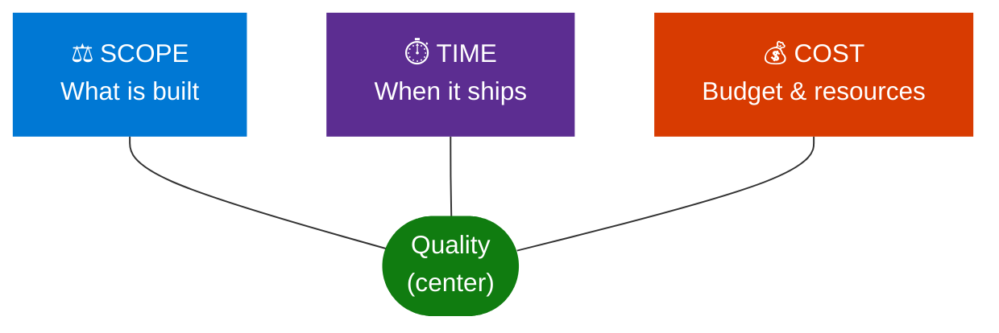
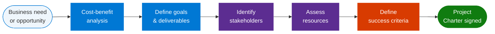
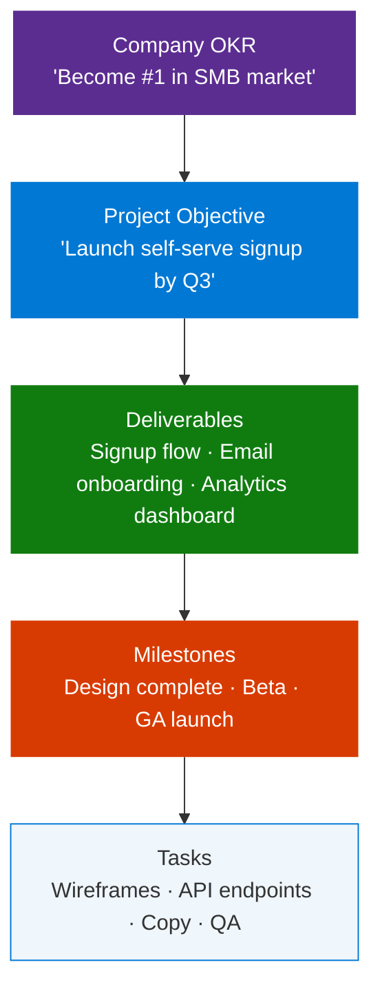
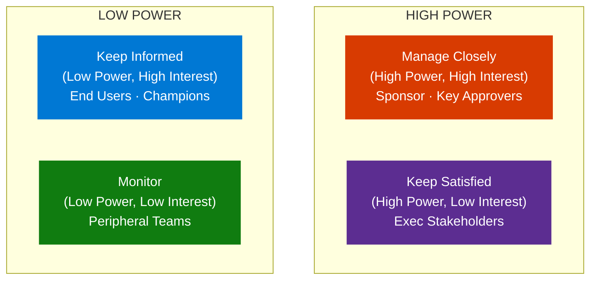
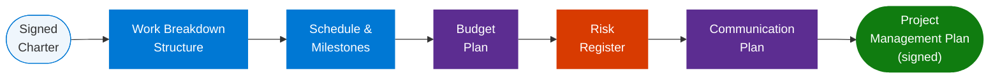
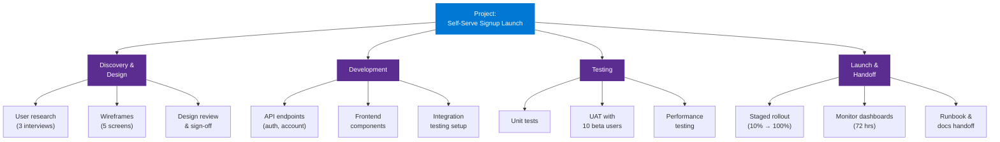
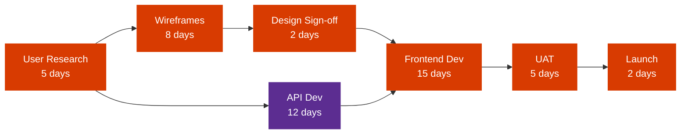
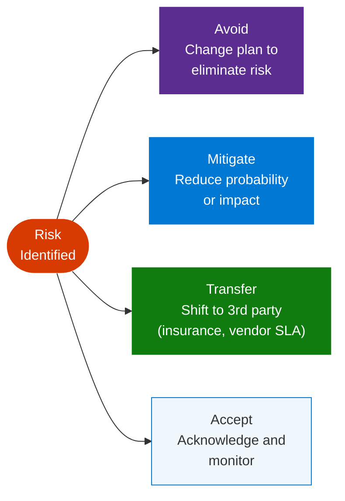
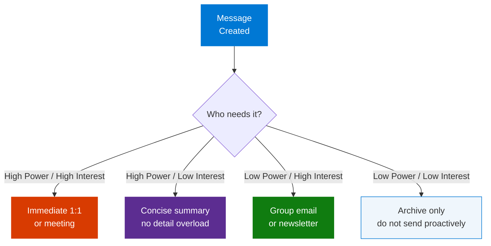

# Google Project Management — Part 2: Project Initiation & Planning

> **Source:** [YouTube — Project Management Full Course By Google (Part 2)](https://www.youtube.com/watch?v=-84E_-aTpck)
> **Channel/Event:** Simplilearn · Google Project Management Certificate · Courses 2–3 of 7
> **Topic:** project initiation, project planning, SMART goals, OKRs, scope management, stakeholder analysis, RACI, project charter, WBS, risk management, communication plan
> **Key Claim:** Proper initiation and planning prevent 80% of project failures — the charter and stakeholder map are the two most important PM artifacts before a single deliverable is produced.

---

## Table of Contents

1. [Overview](#1-overview)
2. [Problem Statement](#2-problem-statement)
3. [Core Concepts](#3-core-concepts)
4. [Project Initiation Phase](#4-project-initiation-phase)
5. [Defining Goals, Scope & Success Criteria](#5-defining-goals-scope--success-criteria)
6. [Stakeholder Management](#6-stakeholder-management)
7. [Project Charter](#7-project-charter)
8. [Project Planning Phase](#8-project-planning-phase)
9. [Work Breakdown Structure](#9-work-breakdown-structure)
10. [Scheduling & Milestones](#10-scheduling--milestones)
11. [Budget Planning](#11-budget-planning)
12. [Risk Management Plan](#12-risk-management-plan)
13. [Communication Plan](#13-communication-plan)
14. [Key Artifacts & Templates](#14-key-artifacts--templates)
15. [Comparison Tables](#15-comparison-tables)
16. [Code Examples — PM Templates](#16-code-examples--pm-templates)
17. [Best Practices](#17-best-practices)
18. [Interview Talking Points](#18-interview-talking-points)
19. [Learning Resources](#19-learning-resources)

---

## 1. Overview

Part 2 of the Google Project Management Certificate series covers the two most foundational phases of the PM lifecycle: **Initiation** and **Planning**. Initiation establishes why a project exists, who is involved, and what "done" looks like. Planning translates those answers into a concrete schedule, budget, risk framework, and communication cadence that the team can execute against.

Together, these two phases produce the "contract" between the PM, the sponsor, and the team — primarily the **Project Charter** and the **Project Management Plan**. Without them, execution becomes reactive and projects drift into scope creep, missed milestones, and budget overruns.

The Google program teaches these skills through the lens of real-world tools: Google Sheets for budgets, Asana for scheduling, and structured templates for stakeholder analysis and RACI charts.

### What This File Covers

| Phase | Key Artifacts | Key Techniques |
|---|---|---|
| **Initiation** | Project Charter, Stakeholder Register, RACI Chart | SMART Goals, OKRs, Cost-Benefit Analysis, Power-Interest Grid |
| **Planning** | WBS, Schedule/Gantt, Budget Baseline, Risk Register, Comms Plan | CPM, Earned Value, Risk Scoring, RACI |

> **Interview tip:** Interviewers often ask "where do you start on a new project?" The answer is Initiation, not planning. Start with the charter and stakeholder map — before writing a single line of schedule. This ordering signals PM maturity.

---

## 2. Problem Statement

### Why Projects Fail Without Proper Initiation & Planning

| Root Cause | Impact |
|---|---|
| Vague or unmeasured goals | Team works hard on the wrong thing |
| Missing stakeholder map | Key approvers discovered late, forcing rework |
| No scope baseline | Scope creep consumes 20–30% of unplanned effort |
| No risk register | First crisis arrives with no mitigation plan |
| No communication plan | Stakeholders feel out of the loop; trust erodes |
| Unrealistic schedule | Team burns out chasing an impossible deadline |

> **Key Insight:** "The cost of fixing a defect found during planning is 10× cheaper than fixing it during execution and 100× cheaper than fixing it after launch."

### Business Conversation Example

**Context:** A PM pushing back on a sponsor who wants to skip initiation and start development immediately to "save time."

> **Sponsor:** "We've been talking about this project for months. Can we just start building? I don't want to spend two weeks on paperwork."
>
> **PM:** "I understand — the pressure to move is real. But in our last project, we skipped the stakeholder mapping step and discovered Legal had a veto on the data retention design in week 6. That slip cost us 3 weeks and $24K in rework. I'm asking for 5 business days — not two weeks — to lock down the scope, the key approvers, and the top risks."
>
> **Sponsor:** "Five days seems like a lot just to document things we already know."
>
> **PM:** "Some of it we know, some we think we know. Last time we thought Legal was a 'Monitor' — turns out they were a 'Key Approver.' I'd rather surface that in Day 2 than in Week 6."
>
> **Sponsor:** "Fair. What do you need from me?"
>
> **PM:** "One hour for a charter review on Friday. If we align there, we go straight into planning Monday."
>
> **Sponsor:** "Done. Set it up."

**Why this works:** The PM didn't argue about process — they translated skipped initiation into a specific past cost ($24K, 3 weeks). The sponsor can weigh that against 5 days of initiation time. A vague "we need to plan properly" loses every time; a concrete cost from a real incident wins.

---

## 3. Core Concepts

### SMART Goals

A framework for turning fuzzy ambitions into measurable targets.

| Letter | Stands For | Bad Example | Good Example |
|---|---|---|---|
| S | Specific | "Improve the product" | "Reduce checkout abandonment" |
| M | Measurable | "Get more users" | "Increase DAU by 15%" |
| A | Attainable | "Become #1 in the world" | "Capture 5% of local market" |
| R | Relevant | "Build a cool feature" | "Add SSO to reduce support tickets" |
| T | Time-bound | "Soon" | "By Q3 2026" |

### Business Conversation Example

**Context:** An interview panel asks a PM candidate to evaluate a stated project goal and improve it.

> **Interviewer:** "Our team's goal is to 'improve customer satisfaction.' Is that a good goal?"
>
> **Candidate:** "It's a well-intentioned direction, but it's not a goal you can manage to. Let me run it through SMART. S — what specific aspect of satisfaction? Checkout, support response time, onboarding? M — how would we measure it, and what's the baseline? A — is a 2% improvement realistic, or 50%? R — which team owns it? T — by when? Without those answers, three different team members will build three different things and call them all 'improving satisfaction.'"
>
> **Interviewer:** "How would you rewrite it?"
>
> **Candidate:** "Once I had the data, I might say: 'Increase post-purchase NPS from 42 to 55 by December 31, by reducing average support ticket resolution time from 48 hours to 18 hours.' Now every letter passes — and every team member knows exactly what success looks like."
>
> **Interviewer:** "What if the business doesn't have the baseline data?"
>
> **Candidate:** "Then the first milestone is establishing the baseline — a 2-week measurement sprint before we start building. A SMART goal without a baseline is still a guess."

**Why this works:** The candidate didn't just recite the acronym — they applied it live to a real critique, showed why the vague version fails in practice, and offered a rewritten version. The follow-up question about missing baselines is the kind of real-world challenge interviewers use to test depth; handling it without flinching signals experience.

> **Interview tip:** When asked to critique a goal ("Is this a good goal?"), run it through SMART. If even one letter fails — usually M (not measurable) or T (no deadline) — the goal needs revision before the project starts. This framework instantly signals structured thinking.

### OKRs — Objectives and Key Results

A complementary goal-setting method used at Google, Intel, and most tech companies.

```
Objective (qualitative, inspiring):
  "Deliver a world-class onboarding experience"

Key Results (quantitative, measurable):
  KR1: Reduce time-to-first-value from 14 days to 3 days by Dec 31
  KR2: Increase 30-day retention from 62% to 75% by Dec 31
  KR3: Achieve NPS ≥ 50 from new users by Dec 31
```

### Business Conversation Example

**Context:** A PM facilitating a Q3 planning session where the VP wants to set goals but the team is still listing tasks, not outcomes.

> **VP:** "For Q3 I want us to 'work on onboarding improvements and ship the new dashboard.'"
>
> **PM:** "Those are solid areas of focus. Before we lock them in — can we frame them as outcomes rather than outputs? For example, instead of 'ship the new dashboard,' what business result does the dashboard achieve? Faster reporting? Fewer support escalations?"
>
> **VP:** "We want leaders to stop asking the data team for manual reports. That's costing us about 6 hours per analyst per week."
>
> **PM:** "That's a strong OKR. Objective: 'Give business leaders self-serve access to decision-ready data.' Key Result 1: Reduce manual report requests from 40 per week to under 5 by Sep 30. Key Result 2: 80% of dashboard users access it independently within 2 weeks of launch, with zero support tickets. Does that capture it?"
>
> **VP:** "Yes — and now I can actually tell if we succeeded."
>
> **PM:** "Exactly. The tasks — building the dashboard, training leaders — all feed those KRs. If we ship the dashboard and request volume doesn't drop, we know adoption needs more work."

**Why this works:** The PM redirected the conversation from outputs (shipping a dashboard) to outcomes (reducing analyst burden). The specific number — 6 hours per analyst — became the baseline for KR1. This is what OKRs force: measuring the result of the work, not just the existence of it.

> **Interview tip:** OKRs sit above SMART Goals — the Objective is aspirational, the KRs are SMART. Know the difference and when to use each.

### Triple Constraint (Iron Triangle)

The three competing dimensions every project must balance:



Rule: **Fix any two constraints and the third becomes variable.** If scope and cost are fixed, timeline will flex — or quality suffers.

| Fixed | Fixed | Variable | Common Scenario |
|---|---|---|---|
| Scope | Cost | Time | "Ship everything, but it might be late" |
| Scope | Time | Cost | "Hit the deadline, but we'll need more people" |
| Time | Cost | Scope | "Launch on budget and on time — cut features" |

### Business Conversation Example

**Context:** A product director requests a new feature addition two weeks before the scheduled launch, insisting the deadline cannot move.

> **Director:** "We need to add email digest notifications before launch. Our sales team is asking for it — it's a blocker for three enterprise deals."
>
> **PM:** "Adding email digests is meaningful work — the estimate is 8 days of engineering time. We're 10 days from launch. If we absorb this, we lose our QA buffer and go live with untested notification logic. I see three options: we push the launch 8 days to accommodate it properly; we keep the launch date and defer digest notifications to a fast-follow release in 3 weeks; or we increase the budget to bring in a contractor for $6,400 to run the feature in parallel."
>
> **Director:** "Can't we just rush it? The team can work faster."
>
> **PM:** "Rushing 8 days of work into 4 days doubles the defect risk and removes QA coverage entirely. If a critical bug hits at launch, the cost is higher than a 3-week delay. Which of the three options do you want to take to the sponsor?"
>
> **Director:** "Let's defer digest to the fast-follow. But can we at least announce it to the sales team as 'coming within 30 days'?"
>
> **PM:** "Yes — I'll draft the message for your review and we'll log this as a committed fast-follow in the change log."

**Why this works:** The PM never said "no" — they said "here are the trade-offs." Three options forced the director to own the decision, not the PM. Framing the rush option with a specific risk (doubled defects, no QA coverage) made the "safe" choice obvious without the PM being the blocker.

> **Interview tip:** When a stakeholder adds scope and refuses to move the deadline, ask "which constraint can flex — budget or scope?" Forcing the choice makes the tradeoff visible. Never silently absorb added scope — it always costs something.

### Scope Creep

Uncontrolled growth of project scope without adjusting time, cost, or resources.

**Common sources:**
- Verbal requests ("can you also add…?") not run through change control
- Stakeholders added late who have different expectations
- Gold-plating by team members who add unrequested features
- Ambiguous initial requirements

**Prevention:** Documented scope baseline in the charter + formal change request process.

**Change Request Process:**

```
1. Stakeholder submits change request (verbal or written)
2. PM documents: what is being requested + who is requesting it
3. PM runs impact analysis:
     - How many days does this add to the schedule?
     - How much does this cost in additional labor/tools?
     - What must be cut or deferred to accommodate?
4. PM presents options to sponsor:
     A. Accept change → update charter, schedule, and budget
     B. Defer to Phase 2 → log in backlog, do not execute now
     C. Decline → document decision and reason
5. Decision recorded in change log regardless of outcome
```

### Business Conversation Example

**Context:** A senior stakeholder mentions a new requirement informally after the standup, expecting it to be absorbed into the current sprint.

> **Stakeholder:** "By the way — while you have the dev team working on the login flow, could they also add 'remember me' across all subdomains? Shouldn't take more than an hour or two."
>
> **PM:** "Thanks for flagging it. I'll get a proper estimate — my instinct is it's more complex than it sounds because subdomain cookie scoping involves security review. Can I come back to you with the impact by end of day?"
>
> **Stakeholder:** "Sure, but it's a small thing."
>
> **PM:** [later that day] "I checked with the dev lead — it's 2.5 days of development, plus a security sign-off from the platform team that typically takes 3–5 business days. That puts us past our sprint deadline. Options: I raise a change request and we push the sprint end by 3 days, or we log it for Sprint 4 as a committed item. Which do you prefer?"
>
> **Stakeholder:** "Interesting — I didn't realize security was involved. Let's defer it to Sprint 4 so you don't break your sprint."
>
> **PM:** "Logged. I'll add it to the Sprint 4 backlog with your name as the requestor and the agreed inclusion date."

**Why this works:** The PM didn't reject the request or accept it on the spot. They bought time to get a real estimate, which turned "an hour or two" into a 6–8 day impact. Routing it through the change process — even informally — created a paper trail and gave the stakeholder a choice. When stakeholders own the decision to defer, they rarely feel blocked.

> **Interview tip:** Scope creep isn't always caused by bad stakeholders — it often comes from a PM saying "sure, no problem" to small requests that compound. The fix is making every change visible and costed, even minor ones. "It'll only take a day" × 20 requests = 3 weeks of unplanned work.

### Deliverable vs. Milestone

| Term | Definition | Example |
|---|---|---|
| **Deliverable** | A tangible output produced by the project | Signed contract, deployed feature, training deck |
| **Milestone** | A checkpoint marking completion of a phase or key deliverable | "Beta launched", "Design sign-off", "UAT complete" |
| **Task** | A unit of work needed to produce a deliverable | "Write API endpoint", "Conduct user interview" |

### Business Conversation Example

**Context:** A PM correcting a new team lead who marked a weekly status review as a "deliverable" in the project plan.

> **Team Lead:** "I've added the weekly status reviews as deliverables in the schedule — they're major outputs."
>
> **PM:** "I see what you're going for, but status reviews are milestones, not deliverables. A deliverable is a tangible output that someone receives and can use — a document, a deployed feature, a signed contract. A status review is a checkpoint that confirms whether we're on track to produce deliverables."
>
> **Team Lead:** "What's the practical difference if we're tracking both?"
>
> **PM:** "The sponsor signs off on deliverables — they're what we're contracted to produce. Milestones are internal checkpoints. If we list 'weekly review' as a deliverable, the sponsor might think it's a formal submission. It also distorts our WBS — the WBS is a scope tool, and a meeting is not scope."
>
> **Team Lead:** "Got it. So the weekly review should be a milestone, and the 'Design Specification Document' it reviews should be the deliverable?"
>
> **PM:** "Exactly. The document is what you deliver; the review is when you confirm it's accepted."

**Why this works:** The PM didn't just correct the error — they explained the practical consequence (sponsor confusion, WBS distortion) that makes the distinction matter. Connecting a terminology point to a real downstream risk is how you make abstract PM concepts stick with a team.

> **Interview tip:** The distinction between deliverable and milestone is a common interview trap. A deliverable is a thing you produce (a document, a feature, a signed contract). A milestone is a date when something is declared done. You can have a deliverable without a milestone, but a milestone without a deliverable is just a calendar entry.

---

## 4. Project Initiation Phase

### What Happens in Initiation



> **Interview tip:** Initiation is not just admin paperwork — it's the PM's first and most important alignment exercise. A project that reaches execution without a signed charter and agreed success criteria is already in trouble. When asked what makes a project succeed, lead with "clarity at the start, not heroics at the end."

### Cost-Benefit Analysis

Before committing resources, evaluate project viability:

```
Benefits:
  + Revenue generated or protected
  + Cost savings from automation
  + Intangible: brand value, employee satisfaction

Costs:
  - Direct: salaries, tools, licenses, infrastructure
  - Indirect: opportunity cost, training, change management

ROI = (Total Benefits - Total Costs) / Total Costs × 100
```

**Rule of thumb:** A project with ROI < 15% over 12 months should be escalated for sponsor decision, not run autonomously.

| Benefit Type | Measurable? | Example |
|---|---|---|
| **Direct revenue** | Yes | $200K new ARR from 500 new SMB customers |
| **Cost savings** | Yes | $80K/year from automating manual reports |
| **Risk reduction** | Partly | Avoid $500K fine from compliance gap |
| **Strategic value** | No (intangible) | Brand positioning, employee satisfaction |

### Business Conversation Example

**Context:** A PM presenting cost-benefit analysis to a CFO who is skeptical about approving a $120K internal tooling project.

> **CFO:** "This is a significant ask for an internal tool. Make the case."
>
> **PM:** "The current process requires 4 analysts to spend 6 hours each per week generating reports manually. At a fully-loaded cost of $85 per hour, that's $2,040 per week — $106K per year in labor spent on a task this tool eliminates. The build cost is $120K. Payback period is 13 months. After that, net savings of $106K annually."
>
> **CFO:** "What about implementation risk — what if adoption is low?"
>
> **PM:** "That's the main risk. We've mitigated it by including 2 of the 4 analysts in the design process, which typically improves adoption rates by 40–60% based on our last two tool rollouts. If adoption is below 50%, the payback period extends to 24 months — still a positive ROI, just slower."
>
> **CFO:** "What's the impact if we don't do this?"
>
> **PM:** "The analysts absorb 6 hours per week that could be redirected to higher-value work. We've been turning down 2–3 custom insight requests per quarter because there's no capacity. Those requests come from the revenue team."
>
> **CFO:** "Approved. Send me the formal proposal."

**Why this works:** The PM led with a quantified business case — not a feature list. The CFO's concern about adoption risk was anticipated and answered with a specific mitigation and a worst-case scenario. "What if we don't do this?" is a question every PM should be able to answer before the meeting starts.

> **Interview tip:** In a PM interview, framing a project's value as "benefits minus costs" — and citing both hard and soft benefits — shows business acumen, not just execution skill. Always be able to articulate why the project is worth doing, not just how you'd run it.

---

## 5. Defining Goals, Scope & Success Criteria

### Goal Hierarchy



> **Interview tip:** Goal hierarchy shows you can connect PM execution to business strategy. When asked "how do you align your project with company goals?", walk up the hierarchy: "My tasks feed deliverables, my deliverables hit milestones, my milestones meet the project objective, and the project objective supports the company OKR."

### Scope Statement Components

| Component | Question Answered | Example |
|---|---|---|
| In-scope | What will we build? | New signup flow for web only |
| Out-of-scope | What are we explicitly NOT doing? | Mobile app, existing user re-onboarding |
| Assumptions | What do we assume is true? | Design system exists; API team available |
| Constraints | What limits us? | Must launch before Q4 freeze; $150K budget |

> **Interview tip:** Out-of-scope items are as important as in-scope items. Explicitly listing what you are NOT building prevents stakeholders from assuming it's included. "We're not re-onboarding existing users in this phase" saves dozens of future conversations.

### Success Criteria

Must be measurable before the project starts:

```
✅ Good: "Checkout conversion rate ≥ 78% within 30 days of launch"
✅ Good: "Zero P0 bugs in production 2 weeks post-launch"
❌ Bad:  "Users find it easy to use"
❌ Bad:  "Stakeholders are happy"
```

### Business Conversation Example

**Context:** A PM running a kick-off meeting where the product owner says "success is when users love it" and the engineering lead says "success is shipping on time."

> **PM:** "Before we start building, I want us to agree on what 'done' actually looks like — in measurable terms. What would make this project a clear success in your eyes?"
>
> **Product Owner:** "Users should love the new checkout experience."
>
> **PM:** "That's the goal — let's make it measurable. What would 'love it' look like in data? Conversion rate? Return rate? Support tickets?"
>
> **Product Owner:** "Conversion rate. Right now it's 71%. If we can hit 78%, that's a win."
>
> **PM:** "Within what timeframe after launch?"
>
> **Product Owner:** "30 days post-launch."
>
> **PM:** "Good. Engineering, from your side — what defines success?"
>
> **Engineering Lead:** "Zero P0 bugs in the first 2 weeks after launch."
>
> **PM:** "Perfect. So our two success criteria are: checkout conversion rate ≥ 78% within 30 days, and zero P0 production bugs in the first 14 days. I'll document both in the charter — they become the criteria for formal project closure. If we ship on time but conversion doesn't move, the project is not yet successful."
>
> **Product Owner:** "That makes sense. It keeps us honest."

**Why this works:** The PM surfaced two very different success definitions and unified them into measurable, time-bound criteria. Without this conversation, engineering would have declared success at launch day; product would have withheld it until the conversion metric moved. Getting both criteria into the charter eliminates that confusion at close.

> **Interview tip:** When asked "how do you define project success?", answer with both output metrics (delivered on time/budget) AND outcome metrics (business results 30/60/90 days post-launch). PMs who only cite on-time delivery miss the business impact dimension.

---

## 6. Stakeholder Management

### Stakeholder Analysis

Step 1: List everyone with influence or interest in the project.
Step 2: Map them on a Power-Interest Grid.



### Business Conversation Example

**Context:** A PM proactively engaging the Head of Security — a High Power / Low Interest stakeholder — before a design review gate to prevent a last-minute veto.

> **PM:** "I know you don't need the day-to-day details on this project, but we have a design review in 3 weeks and your team's sign-off is required before we proceed to development. I wanted to bring you in now rather than at the gate, so there are no surprises."
>
> **Security Lead:** "What do I need to review?"
>
> **PM:** "Mainly the authentication design — we're implementing SSO via SAML 2.0 and there's a session token storage decision I want your team's input on before we finalize. I've flagged 3 specific design decisions that could have security implications. I'm not asking you to review the whole spec."
>
> **Security Lead:** "Send me those 3 items. I'll have feedback within 5 days."
>
> **PM:** "That's perfect — that gives us 10 days before the gate to incorporate changes if needed. I'll send them by tomorrow."
>
> **Security Lead:** "Good. I appreciate the heads up — usually we get called in at the last minute and have to block things."
>
> **PM:** "That's exactly what I'm trying to avoid. Your team's early input saves everyone two weeks."

**Why this works:** The PM didn't wait for Security to show up at the gate as a blocker. By proactively engaging the High Power / Low Interest stakeholder early, they removed the risk of a late veto and gave Security a specific, bounded ask (3 decisions, not the full spec). High Power / Low Interest stakeholders need to feel respected and focused — not buried in detail.

> **Interview tip:** The power-interest grid is a communication strategy, not just a categorization tool. "Manage Closely" stakeholders need frequent two-way dialogue. "Keep Satisfied" need filtered updates (executives don't want operational detail). Mapping incorrectly — over-communicating to low-interest stakeholders, under-communicating to high-power ones — is a common PM failure.

### Stakeholder Register Template

| Name | Role | Power | Interest | Engagement Level | Communication Preference |
|---|---|---|---|---|---|
| Priya S. | Executive Sponsor | High | High | Champion | Weekly email + monthly review |
| Dev Team Lead | Key Contributor | Medium | High | Supporter | Daily standup |
| Legal Team | Approver | High | Low | Neutral | Ad-hoc, milestone gates |
| End Users | Beneficiary | Low | High | Unaware → Supportive | Beta program, NPS surveys |

> **Interview tip:** A stakeholder's engagement level changes over the project lifecycle — someone who starts as "Unaware" needs to be moved to "Supportive" before launch through deliberate communication. Track engagement levels at each milestone, not just once at the start.

### RACI Chart

Assigns exactly one accountability per task across the team.

| Task | PM | Dev Lead | Design | QA | Sponsor |
|---|---|---|---|---|---|
| Project Charter | A | C | C | I | R |
| Architecture Design | I | A | C | I | I |
| UI Wireframes | C | I | A | I | I |
| Test Plan | C | C | I | A | I |
| Launch Approval | C | C | C | C | A |

**Rules:**
- **R**esponsible: does the work (can be multiple people)
- **A**ccountable: owns the outcome (exactly ONE per row)
- **C**onsulted: provides input before decision
- **I**nformed: notified after decision

### Business Conversation Example

**Context:** A PM mediating a dispute where both the Dev Lead and the QA Lead both believe they are accountable for the test sign-off decision.

> **Dev Lead:** "I signed off on the test results — I reviewed everything and I said we're ready to launch."
>
> **QA Lead:** "But I'm the one accountable for quality. I haven't signed off yet. The RACI says QA owns test plan — that includes sign-off."
>
> **PM:** "You're both right that you care about quality — but there's only one A per RACI row, and right now we have two, which is why we're in this room. Let me clarify the rows. QA Lead is A on 'Test Execution and Results' — you own the report, the defect log, and the sign-off that testing is complete. Dev Lead is A on 'Code Quality Gate' — you own the decision that the build is ready to hand to QA. The launch approval itself — that row — the A is the Sponsor."
>
> **QA Lead:** "So I have sign-off authority on testing complete, but not on launch?"
>
> **PM:** "Correct. You're a C on Launch Approval — your test sign-off is required as an input, but the go/no-go decision belongs to the Sponsor."
>
> **Dev Lead:** "That makes sense. I should have waited for QA's sign-off before escalating to the Sponsor."
>
> **PM:** "Exactly. I'll update the RACI document today to make the row boundaries clearer."

**Why this works:** The PM resolved the conflict by going back to the RACI as the source of truth rather than choosing sides. Clarifying row granularity (testing complete vs. launch decision) eliminated the ambiguity. A RACI dispute is almost always a sign that rows were defined too broadly — the PM's job is to decompose until accountability is unambiguous.

> **Interview tip:** If a RACI row has two A's, there's a governance gap. If it has no A, the task will drift. Always audit for these before the project starts.

---

## 7. Project Charter

The Project Charter is the single most important document in initiation — it formally authorizes the project and gives the PM authority to use resources.

### Charter Structure

```markdown
PROJECT CHARTER

Project Name:    [Name]
PM:              [Name]
Sponsor:         [Name]
Date:            [YYYY-MM-DD]
Version:         1.0

─── GOALS ──────────────────────────────────────────────
SMART Goal:      [1-sentence SMART goal]
OKR Alignment:   [Company OKR this project supports]

─── SCOPE ───────────────────────────────────────────────
In-Scope:        [Bullet list]
Out-of-Scope:    [Bullet list]
Assumptions:     [Bullet list]
Constraints:     [Budget cap, deadline, team size]

─── DELIVERABLES ────────────────────────────────────────
[List of concrete outputs]

─── SUCCESS CRITERIA ────────────────────────────────────
[Measurable outcomes — include baseline and target]

─── STAKEHOLDERS ────────────────────────────────────────
[Power-interest summary table]

─── RISKS (HIGH LEVEL) ──────────────────────────────────
[Top 3 risks at initiation]

─── APPROVALS ───────────────────────────────────────────
Sponsor:         _________________ Date: _______
PM:              _________________ Date: _______
```

### Business Conversation Example

**Context:** A PM presenting a project charter to the sponsor for signature, and the sponsor wants to move straight to detailed planning.

> **Sponsor:** "I've reviewed the charter. Can we skip to the project plan? I'd like to see the full schedule and budget breakdown."
>
> **PM:** "The charter is actually the prerequisite to the plan — I can't build a credible schedule until the charter is signed, because the scope and constraints in the charter are the inputs to the WBS and schedule. Right now, the charter defines a $150K budget and an October 3rd delivery. If those change, the whole plan changes."
>
> **Sponsor:** "Fair enough. I do have one issue — the success criteria say 'checkout conversion ≥ 78%.' I want that to be 80%."
>
> **PM:** "I can change it. Before I do — our current baseline is 71%, and the industry benchmark for a redesigned checkout flow is an 8–12% lift. 78% is at the top of that range; 80% would require a lift of 9 points, which is achievable but puts us in the top quartile of outcomes. I'd recommend keeping 78% and treating 80% as a stretch goal — that way we have a clear pass/fail threshold and an aspirational target."
>
> **Sponsor:** "Fine — 78% as the threshold, 80% as the stretch. I'll sign today."
>
> **PM:** "I'll update the charter with the stretch goal note and send the final version for your signature."

**Why this works:** The PM blocked the premature jump to planning by explaining the dependency: charter precedes plan. When the sponsor proposed a target change, the PM didn't just say yes — they provided context (baseline, industry benchmarks) so the decision was informed. The charter remains the authorization document, not a negotiation that stretches on indefinitely.

> **Interview tip:** The charter is not a plan — it's an authorization. The plan comes after the charter is signed. Confusing these two is a common PM interview mistake.

---

## 8. Project Planning Phase

### What Happens in Planning



> **Interview tip:** Planning produces artifacts — it's not just thinking. When an interviewer asks "how do you plan a project?", name the six outputs in order: WBS → Schedule → Budget → Risk Register → Comms Plan → PMP sign-off. Walking through the sequence shows you plan methodically, not instinctively.

---

## 9. Work Breakdown Structure

A hierarchical decomposition of the total project scope into manageable work packages.

> **Interview tip:** The WBS is built from deliverables, not activities. The top level is the project name. The second level is major deliverable categories. The lowest level — work packages — are small enough to estimate, assign, and complete in ≤2 weeks. If you can't estimate a task, it needs to be decomposed further.

### WBS Diagram



### WBS Rules

- **100% rule:** The WBS must capture 100% of the project scope. Nothing in; nothing out.
- **Work packages:** Lowest level items must be estimable, assignable, and completable in ≤2 weeks.
- **Deliverable-oriented:** WBS organizes by output, not by activity. "API endpoints" not "write code".

| Good WBS Practice | Bad WBS Practice |
|---|---|
| Decomposed by deliverable | Decomposed by department or person |
| Work packages ≤2 weeks | Tasks spanning months |
| 100% of scope captured | Some "assumed" work not documented |
| Deliverable-named nodes | Activity-named nodes ("Write code for auth") |

### Business Conversation Example

**Context:** A PM reviewing a WBS draft from a new team lead, where the structure is organized by department rather than by deliverable.

> **Team Lead:** "Here's the WBS — I organized it by team: Engineering tasks, Design tasks, QA tasks, and PM tasks."
>
> **PM:** "I can see the logic — it maps to how we're organized. But a WBS organized by team tells me who is busy; it doesn't tell me what the project will produce. If I ask the sponsor 'what will we deliver?', the answer should come from the WBS."
>
> **Team Lead:** "So how should I restructure it?"
>
> **PM:** "Organize by output: Discovery & Design, Backend API, Frontend, Testing, and Launch & Handoff. Each of those is a deliverable category — something we can point to and say 'this exists and someone can use it.' Within Discovery & Design, you'd have 'User research report', 'Wireframes — 5 screens', 'Design sign-off'. Each work package should be completable in under 2 weeks so it's estimable."
>
> **Team Lead:** "What happens to the Engineering tasks that span multiple deliverables?"
>
> **PM:** "They get split. 'API dev for auth' lives under Backend API. 'API integration testing' lives under Testing. The work package is the intersection of who does it and what it produces."
>
> **Team Lead:** "That makes sense — it also makes it clearer when something is actually done."
>
> **PM:** "Exactly. A department-organized WBS makes it hard to tell if 25% of 'Engineering tasks' is done. A deliverable-organized WBS shows '3 of 5 wireframes signed off' — that's a real status."

**Why this works:** The PM reframed the WBS as a scope visibility tool, not an org chart. By showing the team lead how deliverable-oriented structure gives cleaner status tracking, the correction became self-motivating — not just a rule to follow, but a tool that makes the team lead's own reporting easier.

> **Interview tip:** A common WBS mistake is organizing by team rather than by deliverable ("Engineering tasks", "Design tasks"). This obscures what the project will actually produce. Always organize by output — the WBS is a scope tool, not an org chart.

---

## 10. Scheduling & Milestones

### Gantt Chart Concept

```
Task                    | Week 1 | Week 2 | Week 3 | Week 4 | Week 5 | Week 6 |
─────────────────────────────────────────────────────────────────────────────────
User research           |████████|        |        |        |        |        |
Wireframes              |        |████████|████████|        |        |        |
Design review ◆         |        |        |    ◆   |        |        |        |
API development         |        |████████|████████|████████|        |        |
Frontend development    |        |        |████████|████████|████████|        |
UAT ◆                   |        |        |        |        |    ◆   |        |
Staged launch ◆         |        |        |        |        |        |   ◆    |
```

> **Interview tip:** A Gantt chart communicates timeline to stakeholders; the critical path communicates risk to the PM. Always share Gantts with leadership, but manage the project from the critical path. Tasks with float can slip without impacting the deadline — tasks on the critical path cannot slip at all.

### Critical Path Method (CPM)

The **critical path** is the longest sequence of dependent tasks — any delay here delays the project.



Critical path: A → B → C → D → E → F = **37 days**. API Dev (12 days) has **3 days of float**.

| Term | Definition | Example |
|---|---|---|
| **Critical Path** | Longest sequence of dependent tasks | A→B→C→D→E→F = 37 days |
| **Float / Slack** | Days a non-critical task can slip without delaying project | API Dev: 3 days of float |
| **Fast Tracking** | Overlap tasks that were sequential | Start Frontend Dev before Design Sign-off |
| **Crashing** | Add resources to shorten critical path tasks | Hire 2nd dev to cut Frontend from 15 → 10 days |

### Business Conversation Example

**Context:** A PM presenting schedule recovery options to the sponsor after a design sign-off delay pushed the project 5 days behind on the critical path.

> **Sponsor:** "We're 5 days behind. Launch is still October 3rd. How do we recover?"
>
> **PM:** "I've run the critical path. The delay hit Design Sign-off, which directly feeds Frontend Dev — both are on the critical path. I have two recovery options. Option 1 — Fast tracking: we start Frontend Dev now with 80% of the designs finalized, accepting that the remaining 20% may require rework. Risk: rework cost of approximately $4K if the last screens change significantly. Option 2 — Crashing: we bring in a contract developer for 2 weeks to run the remaining Frontend tasks in parallel with the dev team. Cost: $8,800. No rework risk."
>
> **Sponsor:** "What's the probability that the last 20% of designs change?"
>
> **PM:** "Based on what's outstanding — the error states and empty states — I'd estimate a 60% chance of minor changes, less than 10% chance of significant changes. If it's minor, the rework is under a day. So fast tracking has an expected cost of roughly $400–800 in rework vs. $8,800 for crashing. My recommendation is fast tracking with a flagged checkpoint when the final screens are approved."
>
> **Sponsor:** "Do that. Keep me posted if the rework risk increases."
>
> **PM:** "Agreed. I'll update the risk register and put a checkpoint on October 1st to confirm we're still on track for the 3rd."

**Why this works:** The PM didn't present "we'll work harder" — they named the specific critical path impact and offered two concrete recovery strategies with costs and risk probabilities. The sponsor could make a real trade-off decision. Quantifying the expected cost of fast tracking ($400–800) vs. crashing ($8,800) made the recommendation obvious and credible.

> **Interview tip:** "How do you recover a project that's behind schedule?" Answer: first identify the critical path. Then you have two levers — fast tracking (overlap tasks, adds risk) or crashing (add resources, adds cost). The wrong answer is "work weekends" — that's unsustainable and signals you don't use schedule management tools.

### Milestone Tracker

| Milestone | Target Date | Owner | Status |
|---|---|---|---|
| Project Charter signed | 2026-08-01 | PM | ⬜ Not started |
| Design sign-off | 2026-08-15 | Design Lead | ⬜ Not started |
| Alpha build ready | 2026-09-05 | Dev Lead | ⬜ Not started |
| UAT complete | 2026-09-19 | QA Lead | ⬜ Not started |
| Production launch | 2026-10-03 | PM | ⬜ Not started |

> **Interview tip:** Milestones have zero duration — they mark a moment in time, not a range. In a Gantt, they appear as diamonds (◆). This is a common misconception interviewers test for.

---

## 11. Budget Planning

### Budget Components

| Category | Items | Estimation Method |
|---|---|---|
| **Labor** | PM, Dev, Design, QA hours | Hourly rate × estimated hours |
| **Tools & licenses** | Asana, Figma, AWS | Actual quotes or market rates |
| **Contingency reserve** | Buffer for known risks | 10–20% of total budget |
| **Management reserve** | Buffer for unknown risks | 5–10% (sponsor-controlled) |

### Business Conversation Example

**Context:** A new engineering lead asks the PM if they can use the contingency reserve to cover unexpected cloud infrastructure costs that appeared mid-project.

> **Engineering Lead:** "We've hit $12K in unexpected AWS costs from higher-than-expected load testing traffic. Can we pull from the contingency reserve?"
>
> **PM:** "Yes — that's exactly what the contingency reserve is for. We have $18K in contingency and this was a known risk category (infrastructure cost variance). I just need to log it in the change log and update the EV tracking before I authorize the release."
>
> **Engineering Lead:** "There's also a potential $8K cost if we need to upgrade the database tier — we won't know until week 6."
>
> **PM:** "That one is different. If it's a known risk we identified in the register, it comes from contingency too. But if it's a new risk we didn't anticipate — an 'unknown unknown' — it comes from the management reserve, which is sponsor-controlled. I can't release that without sponsor approval."
>
> **Engineering Lead:** "The DB upgrade — we did discuss it in planning as a possibility, we just didn't quantify it."
>
> **PM:** "Then it's a known risk with an unquantified estimate — that qualifies for contingency. I'll add it as a logged risk with a range of $0–8K so we're tracking it. Let's confirm the actual need in week 6 before we allocate."
>
> **Engineering Lead:** "Makes sense. I didn't realize there were two different buckets."
>
> **PM:** "Most people don't. Contingency is the PM's budget for risks we planned for; management reserve is the sponsor's safety net for surprises neither of us saw coming."

**Why this works:** The PM explained the contingency vs. management reserve distinction not as a policy lecture but through two concrete decisions. The engineering lead left understanding not just what the rule is, but why the two buckets exist — which prevents the PM from being bypassed on reserve decisions in the future.

> **Interview tip:** The difference between contingency reserve and management reserve signals budget sophistication. Contingency is PM-controlled and planned for identified risks. Management reserve is sponsor-controlled and covers unknown unknowns — the PM must escalate to use it. Conflating them suggests you're not used to formal budget governance.

### Budget Tracking

```
Budget Baseline:     $150,000
Spent to Date:       $47,200
Committed (future):  $68,400
Remaining:           $34,400
Forecast at Completion: $154,700  ← 3.1% over budget — ALERT

Earned Value (EV):   $52,000   (work completed value)
Planned Value (PV):  $60,000   (work that should be done by now)
Schedule Variance (SV): EV - PV = -$8,000 → BEHIND SCHEDULE
Cost Variance (CV):  EV - AC = $52,000 - $47,200 = +$4,800 → UNDER BUDGET
```

**EV Formulas:**
- **CPI** (Cost Performance Index) = EV / AC → >1.0 is good
- **SPI** (Schedule Performance Index) = EV / PV → >1.0 is good

> **Interview tip:** Earned Value Management (EVM) is what separates "we're spending money" from "we're getting value for that spend." If CPI = 0.85, you're getting only 85 cents of value for every dollar spent — an early warning signal. Cite EV, CPI, and SPI in a budget conversation to immediately signal financial PM rigor.

---

## 12. Risk Management Plan

### Risk Register

| Risk | Probability | Impact | Score | Mitigation | Owner |
|---|---|---|---|---|---|
| Key dev resource leaves | Medium | High | 6 | Cross-train backup; document knowledge | Dev Lead |
| API dependency delayed | High | High | 9 | Negotiate SLA; mock API for parallel dev | PM |
| Scope expansion from stakeholders | High | Medium | 6 | Formal change request process; charter sign-off | PM |
| Performance SLA not met | Low | High | 3 | Load testing at week 4 | QA Lead |
| Budget overrun >10% | Low | High | 3 | Weekly EV tracking; contingency reserve approval flow | PM |

**Risk Scoring:** Probability × Impact on a 1–3 scale each → score 1–9.

### Business Conversation Example

**Context:** A PM running the weekly status review, raising a risk whose probability just changed from Medium to High after receiving an update from a third-party vendor.

> **PM:** "I need to flag a change to our risk register. Last week, the API dependency from the payment vendor was scored Medium probability / High impact — score 6. As of yesterday, the vendor has pushed their delivery date from September 5th to September 19th. That's 14 days past our integration window. The probability is now High. Score moves to 9."
>
> **Sponsor:** "What's the impact to our launch?"
>
> **PM:** "If we can't start integration until September 19th, we lose 12 of our planned 15 QA days. That risks a go-live with insufficient coverage. The mitigation plan we identified in the register — 'mock the API for parallel development' — is still viable. The dev team can build against the mocked endpoints now and switch to live when the vendor delivers."
>
> **Sponsor:** "How confident are we in the mock?"
>
> **PM:** "The vendor provided an OpenAPI spec — the mock will cover 90% of our integration surface. The remaining 10% is edge cases we'd catch in final integration testing. I'd recommend we proceed with the mock now and buy 3 days of schedule buffer by running QA on the mock in parallel."
>
> **Sponsor:** "Do it. And get a formal commitment date in writing from the vendor — I want it in the change log."
>
> **PM:** "I'll have the vendor confirmation and the updated risk register to you by end of day."

**Why this works:** The PM updated the risk register proactively — before the impact hit the schedule. They came with the mitigation already activated, not just the problem. Quantifying the impact (12 of 15 QA days lost) gave the sponsor a concrete picture. This is the difference between a PM who manages risk and one who reports it after the fact.

> **Interview tip:** A risk register is a living document — not a one-time planning artifact. Update it at every status review. When a risk's probability changes (e.g., the API vendor signals delays), the score changes and the mitigation response may need to change too. PMs who set the register once and forget it are caught off-guard by materialized risks.

### Risk Response Strategies



> **Interview tip:** "Accept" is a valid strategy — not every risk warrants mitigation. Low-probability, low-impact risks should be accepted and logged, not obsessed over. This shows maturity in risk thinking.

---

## 13. Communication Plan

### Communication Matrix

| Audience | Message | Channel | Frequency | Owner |
|---|---|---|---|---|
| Executive Sponsor | Status, budget, risks | Email + monthly review deck | Weekly email; monthly meeting | PM |
| Core Team | Tasks, blockers, decisions | Standup + Slack | Daily standup; async Slack | PM / Dev Lead |
| Extended Stakeholders | Milestone updates | Email newsletter | Bi-weekly | PM |
| End Users | Beta invite, feedback | Product email + survey | At beta launch; 2 weeks post-launch | Product |

### Business Conversation Example

**Context:** A senior engineer asks the PM why the executive sponsor receives a different (shorter) status update than the one shared with the core team.

> **Engineer:** "I noticed you send the sponsor a half-page summary while the team gets the full 3-page status report. Are we hiding something?"
>
> **PM:** "No — we're matching the message to the audience's decision-making level. The sponsor needs to know: are we on track, are there decisions they need to make, and are there risks above our threshold? That's the half page. They don't need the individual task statuses — that detail would bury the signal."
>
> **Engineer:** "But shouldn't they know everything?"
>
> **PM:** "If I sent the 3-page report to the sponsor, two things would happen. First, they'd stop reading it — executives who receive operational detail in weekly updates start ignoring PM communications. Second, they'd start asking questions about individual tasks, which pulls them into micro-management territory where they can't add value."
>
> **Engineer:** "What if something in the detailed report would concern them?"
>
> **PM:** "Anything above our risk threshold — a probability × impact score of 6 or higher, or a budget variance over 10% — goes into the executive summary automatically. The filter is based on decision authority, not information restriction. If it requires a sponsor decision, it goes up; if it requires a team decision, it stays at our level."
>
> **Engineer:** "That makes sense. So the communication plan tells you which issues escalate."
>
> **PM:** "Exactly — that's one of the key things the communication plan defines."

**Why this works:** The PM defused a "transparency" concern by explaining the communication plan as a decision-routing tool, not a filter that hides problems. Naming the specific escalation threshold (risk score ≥ 6, budget variance >10%) showed that the filtering is rules-based, not arbitrary.

> **Interview tip:** A communication plan answers four questions: who, what, how often, through which channel. Without it, the PM becomes the bottleneck for every information request. With it, stakeholders know when to expect updates — and stop asking for ad-hoc status meetings.

### Communication Best Practices



**Escalation path:** Team member → PM → Project Sponsor → Executive Steering Committee.

> **Interview tip:** Over-communication is as dangerous as under-communication. Executives who receive operational detail in every update start ignoring your messages. Match the message detail to the audience's decision-making level — executives need status + risk + decision requests; team members need tasks + blockers + context.

---

## 14. Key Artifacts & Templates

| Artifact | Phase | Purpose | Who Signs |
|---|---|---|---|
| **Project Charter** | Initiation | Authorizes project; defines goals, scope, constraints | Sponsor + PM |
| **Stakeholder Register** | Initiation | Maps all stakeholders by power, interest, engagement | PM |
| **RACI Chart** | Initiation | Assigns accountability for every task | PM + Team leads |
| **Work Breakdown Structure** | Planning | Decomposes scope into work packages | PM + Team |
| **Project Schedule / Gantt** | Planning | Timeline with milestones and critical path | PM |
| **Budget Baseline** | Planning | Approved cost plan; basis for EV tracking | Sponsor |
| **Risk Register** | Planning | Log of identified risks, scores, and mitigations | PM |
| **Communication Plan** | Planning | Who gets what info, how often, via which channel | PM |
| **Project Management Plan** | Planning | Master plan combining all above artifacts | Sponsor + PM |

> **Interview tip:** When asked "what documents does a PM produce?", distinguish between initiation artifacts (charter, stakeholder register, RACI) and planning artifacts (WBS, schedule, budget, risk register, comms plan). Confusing these signals you don't understand the PM lifecycle phases. The charter authorizes the project; the PMP plans the execution.

---

## 15. Comparison Tables

### Initiation vs. Planning

| Dimension | Initiation | Planning |
|---|---|---|
| **Primary question** | Should we do this project? | How exactly will we do it? |
| **Key artifact** | Project Charter | Project Management Plan |
| **Decision authority** | Sponsor | PM + Team |
| **Output** | Authorization to proceed | Approved schedule, budget, risk register |
| **Depth of detail** | High-level goals and constraints | Task-level breakdown with owners and dates |
| **Typical duration** | 1–2 weeks | 2–4 weeks (scales with project size) |

> **Interview tip:** You cannot "skip" initiation and jump to planning — the charter defines the scope that planning decomposes. PMs who start planning before a charter is signed often discover mid-project that the sponsor had a completely different vision of "done."

### Predictive (Waterfall) vs. Adaptive (Agile) Planning

| Dimension | Predictive (Waterfall) | Adaptive (Agile) |
|---|---|---|
| **Plan created** | Fully upfront | Rolling wave (sprint by sprint) |
| **Scope flexibility** | Fixed scope, fixed plan | Scope adapts each sprint |
| **Risk approach** | Detailed risk register upfront | Risks surfaced in retrospectives |
| **Budget style** | Fixed at planning | Time-boxed team cost per sprint |
| **Schedule artifact** | Gantt chart, CPM | Sprint backlog, velocity charts |
| **Best for** | Regulatory, construction, manufacturing | Software, innovation, fast-changing requirements |

> **Interview tip:** Choosing between Waterfall and Agile is not religious — it's a risk and requirements question. If requirements are fully known and change is expensive (e.g., regulatory compliance, hardware integration), use predictive. If requirements will evolve through user feedback, use adaptive. Most enterprise projects are hybrid — fixed milestones with adaptive execution within sprints.

### SMART Goals vs. OKRs

| Dimension | SMART Goals | OKRs |
|---|---|---|
| **Scope** | Single goal | Objective + 3–5 key results |
| **Time horizon** | Any | Quarterly (most common) |
| **Owner** | Individual or team | Team or company |
| **Grading** | Binary (met / not met) | 0.0 – 1.0 score; 0.7 is "good" |
| **Purpose** | Task-level clarity | Strategic alignment |
| **Used by** | PMs, individual contributors | Companies, departments, teams |

> **Interview tip:** Use SMART goals for task-level and project-level clarity. Use OKRs for quarterly strategic alignment across teams. If asked "do you use OKRs or SMART goals?", the correct answer is "both — OKRs set direction, SMART goals define the specific work packages to get there."

---

## 16. Code Examples — PM Templates

### Project Charter (Markdown Template)

```markdown
# Project Charter — [Project Name]

| Field | Value |
|---|---|
| Project Name | |
| PM | |
| Sponsor | |
| Start Date | |
| Target End Date | |
| Budget Cap | |

## SMART Goal
[One sentence: specific, measurable, time-bound goal]

## In Scope
- 
- 

## Out of Scope
- 
- 

## Success Criteria
| Metric | Baseline | Target | Measurement Date |
|---|---|---|---|
| | | | |

## Top Risks
| Risk | Probability | Impact | Mitigation |
|---|---|---|---|
| | | | |

## Approvals
Sponsor: ___________________  Date: __________
PM:      ___________________  Date: __________
```

### RACI Matrix (CSV)

```csv
Task,PM,Dev Lead,Design Lead,QA Lead,Sponsor
Project Charter,A,C,C,I,R
Architecture,I,A,C,I,I
UI Design,C,I,A,I,I
Development,C,R,C,I,I
Test Plan,C,C,I,A,I
UAT Execution,C,C,I,R,I
Launch Decision,C,C,C,C,A
```

### Risk Register (Python helper)

```python
from dataclasses import dataclass
from typing import Literal

@dataclass
class Risk:
    description: str
    probability: Literal[1, 2, 3]  # 1=low, 2=med, 3=high
    impact: Literal[1, 2, 3]
    mitigation: str
    owner: str

    @property
    def score(self) -> int:
        return self.probability * self.impact

    @property
    def priority(self) -> str:
        if self.score >= 6:
            return "HIGH"
        elif self.score >= 3:
            return "MEDIUM"
        return "LOW"

risks = [
    Risk("API dependency delayed", 3, 3, "Mock API + negotiate SLA", "PM"),
    Risk("Key dev resource leaves", 2, 3, "Cross-train backup", "Dev Lead"),
    Risk("Scope creep from stakeholders", 3, 2, "Formal change control", "PM"),
]

for r in sorted(risks, key=lambda x: -x.score):
    print(f"[{r.priority:6}] Score={r.score} | {r.description}")
    print(f"         Mitigation: {r.mitigation} | Owner: {r.owner}\n")
```

### Budget Tracker (Google Sheets formula equivalents)

```
Column A: Task
Column B: Planned Cost (Budget)
Column C: Actual Cost (AC)
Column D: Earned Value (EV) = % complete × Budget
Column E: Cost Variance (CV) = EV - AC   [positive = under budget]
Column F: CPI = EV / AC                   [>1.0 = cost efficient]

=SUM(B2:B20)    → Budget Baseline
=SUM(C2:C20)    → Actual Spend
=D20/C20        → Overall CPI
=IF(F20<0.9,"⚠️ OVER BUDGET","✅ ON TRACK")
```

---

## 17. Best Practices

### Initiation Phase

- ✅ Always get charter signed before any work starts — verbal sponsorship is not commitment
- ✅ Run a stakeholder identification workshop — don't rely on your own mental model
- ✅ Write success criteria with the sponsor, not for the sponsor
- ❌ Don't start planning before the charter is baselined — you'll plan the wrong scope
- ❌ Don't let "everyone is a stakeholder" — it means no one is accountable

> **Interview tip:** The most common initiation failure is skipping the stakeholder workshop. PMs who build the stakeholder register alone miss 30–40% of real stakeholders, especially silent approvers in legal, security, or finance who surface at the worst possible moment — right before launch.

### Planning Phase

- ✅ Build the WBS with the team, not alone — they know what's missing
- ✅ Add 10–20% contingency to every estimate that involves external dependencies
- ✅ Identify the critical path before communicating a deadline to leadership
- ✅ Create a communication plan for the project, not just ad-hoc emails
- ❌ Don't plan to the hour — granularity below half-day increments creates false precision
- ❌ Don't skip the risk register on "small" projects — that's where surprises are most painful

> **Interview tip:** Parkinson's Law says work expands to fill the time allotted. Adding buffer at each task instead of at the project level guarantees the project will overrun — everyone uses their buffer. Add a single project-level buffer, keep it visible, and manage it as a shared resource.

### Scope Management

- ✅ Document every stakeholder request as a formal change request with impact analysis
- ✅ When scope is added, remove something else or adjust time/cost (the Iron Triangle)
- ❌ Never say "yes" to scope informally without PM approval and charter amendment
- ❌ Don't let gold-plating slide — team-initiated extras carry the same risk as stakeholder creep

> **Interview tip:** Gold-plating — when engineers add unrequested features because "the user will love this" — is just as damaging as stakeholder-driven scope creep. Both consume time and budget outside the approved baseline. A strong PM culture treats any unapproved addition as a change request, regardless of who initiated it.

---

## 18. Interview Talking Points

### "Walk me through how you would kick off a new project."

> I start with initiation before touching any plan. First, I run a cost-benefit analysis to confirm the project is worth the investment. Then I co-write the project charter with the sponsor — goals, scope, constraints, success criteria, and top risks. I get the charter signed before any work starts because verbal sponsorship erodes the moment priorities shift. Only after the charter is approved do I move into planning with the team.

### "How do you prevent scope creep?"

> Three things: a signed scope baseline in the charter, a formal change request process (even a lightweight one on Slack), and a RACI chart that makes it clear who has the authority to approve scope changes. When a request comes in, I document it, run a quick impact analysis (what it adds to time and cost), and present options to the sponsor — add it and accept the tradeoff, defer it to a future phase, or decline. The key is making the cost of scope changes visible rather than absorbing them silently.

### "What's the difference between a risk and an issue?"

> A risk is a potential future event that hasn't happened yet — it has a probability and an impact, and you manage it proactively. An issue is a risk that has materialized — it's happening now and requires reactive resolution. I keep a risk register throughout planning and execution. When a risk converts to an issue, it moves to the issue log with an owner, resolution plan, and target close date.

### "How do you build a project schedule?"

> I start from the WBS — once I have all deliverables and work packages defined, I sequence tasks using dependency analysis (what must finish before this can start?). That gives me the critical path. I estimate task durations with the people doing the work, not alone. I add buffer at the project level, not at each task — that prevents the Parkinson's Law trap where every task expands to fill its allotted time. Then I set milestones at key deliverable points for stakeholder checkpoints.

### "How do you manage a stakeholder who keeps changing requirements?"

> I first figure out why — is it genuine business change, lack of alignment on goals, or anxiety about the outcome? If it's business change, I process it through formal change control with impact analysis. If it's alignment, I schedule a working session to re-baseline the success criteria. If it's anxiety, I increase communication cadence — weekly demos or a live dashboard often work better than written status updates for stakeholders who need to see progress to feel confident. The goal is to distinguish legitimate change from noise.

---

## 19. Learning Resources

| Resource | Link | Type |
|---|---|---|
| Project Management Full Course By Google [Part 2] | [YouTube](https://www.youtube.com/watch?v=-84E_-aTpck) | Video |
| Project Management Full Course By Google [Part 1] | [YouTube](https://www.youtube.com/watch?v=eZDkSNHaWh8) | Video |
| Google PM Certificate — Course 2: Project Initiation | [Coursera](https://www.coursera.org/learn/project-initiation-google) | Course |
| Google PM Certificate — Full Program | [Coursera](https://www.coursera.org/professional-certificates/google-project-management) | Certificate |
| PMI PMBOK Guide | [PMI.org](https://www.pmi.org/pmbok-guide-standards) | Standard |
| Google PM Certificate (Free) | [Google Grow](https://grow.google/certificates/project-management/) | Certificate |

---

*Last Updated: July 2026 | Source: Simplilearn — Google Project Management Full Course Part 2*
