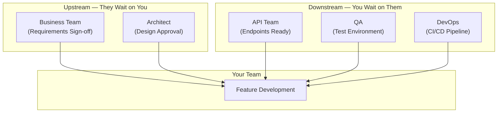
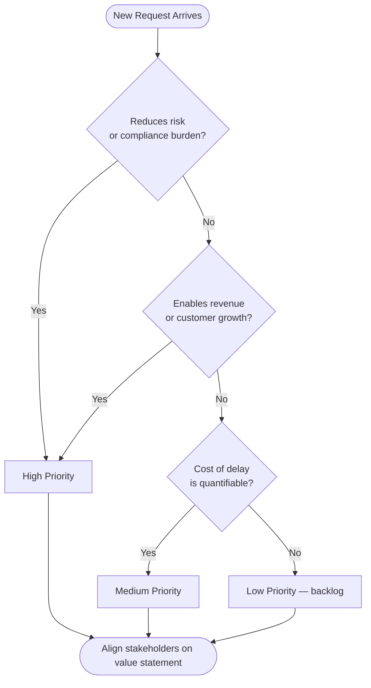
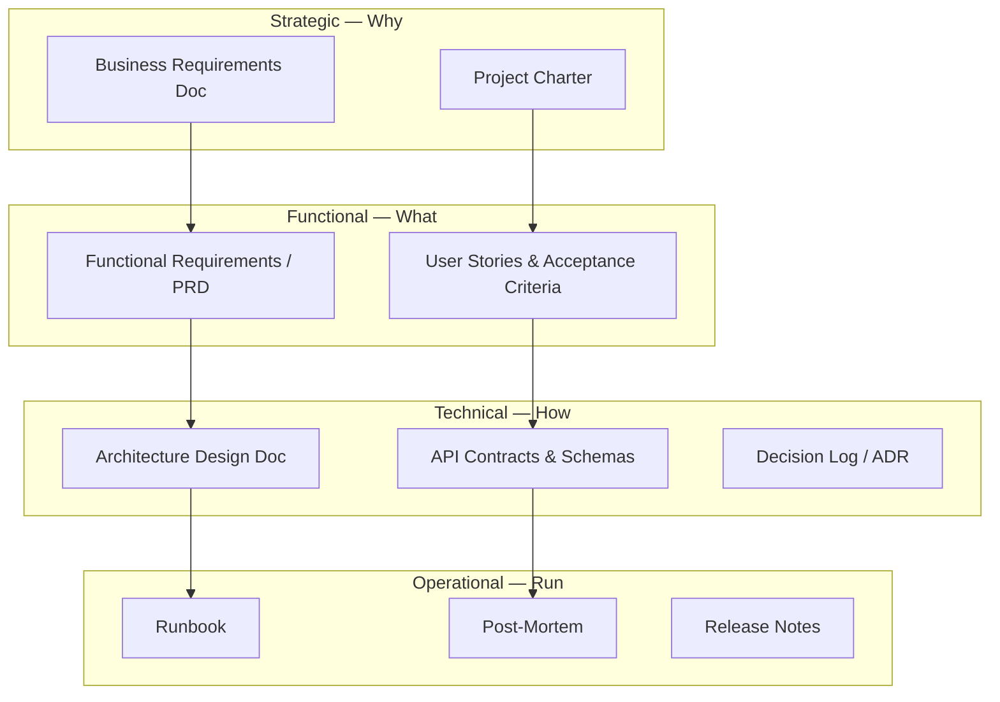
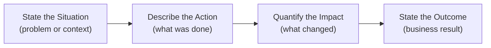
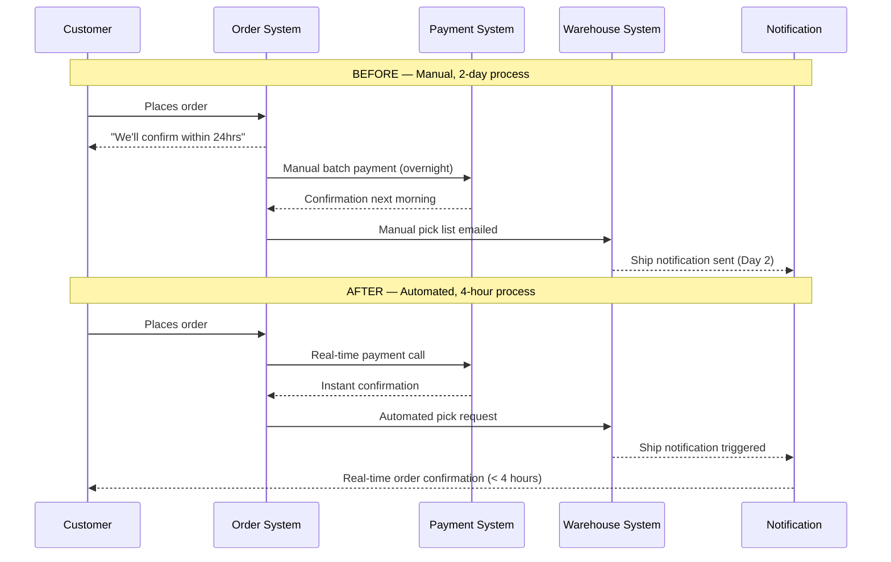
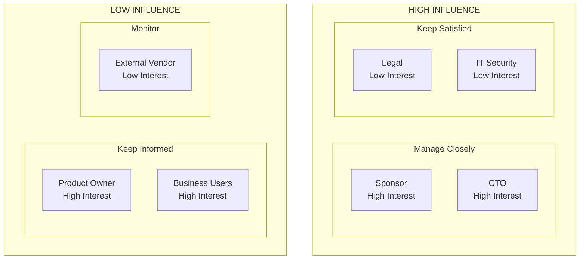
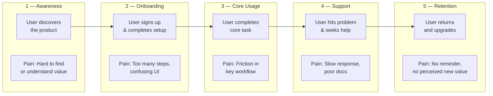
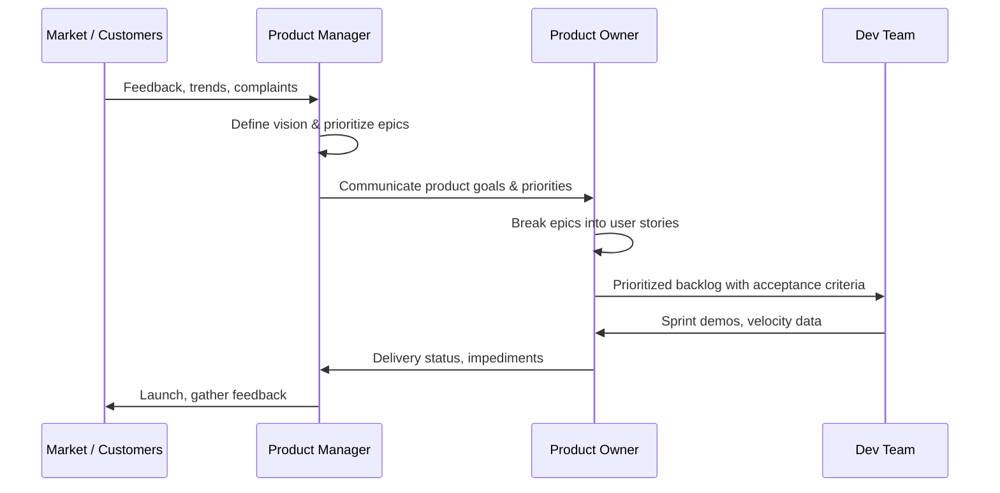
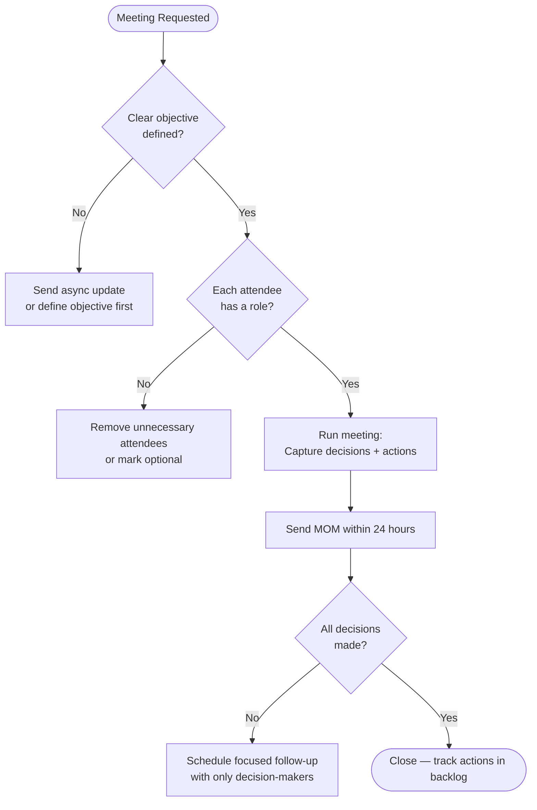
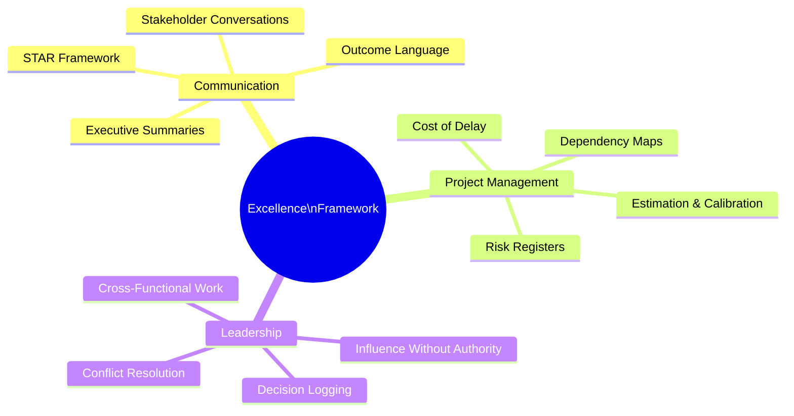

Based on your notes, the core themes appear to be:

* Communication Excellence
* Product Thinking
* Project & Program Management
* Stakeholder Management
* Documentation Discipline
* Outcome-Oriented Leadership
* SAFe/Agile Product Delivery
* Influencing Without Authority

I've organized the content into a structured learning and execution framework that can help improve both communication and project management skills.

# Communication & Project Management Excellence Framework

## 1. Understand Dependencies Before Taking Action

Dependencies define the critical path of every project. Missing them is the #1 cause of missed deadlines — not poor execution. Proactive dependency management separates reactive PMs from trusted delivery leaders.

### Upstream Dependencies

Teams or stakeholders waiting for your output.

Ask:

* Who is blocked because of me?
* What information do they need?
* What is the impact of delay?

### Downstream Dependencies

Teams whose output depends on your work.

Track:

* Dependency owners
* Expected delivery dates
* Risks
* Escalation paths

### Practice

Create a Dependency Map for every project.

| Dependency | Owner  | Impact | Due Date | Risk   | Status       | Escalation Path  |
| ---------- | ------ | ------ | -------- | ------ | ------------ | ---------------- |
| API Team   | Team A | High   | 10 Aug   | Medium | In Progress  | PM → Sponsor     |
| UX Design  | Team B | High   | 5 Aug    | Low    | Complete     | —                |
| Test Env   | DevOps | Medium | 8 Aug    | High   | Blocked      | PM → CTO         |

### Dependency Flow Diagram



### Escalation Path for Blocked Dependencies

```
Dependency at risk →
  Day 1:  Direct message to owner + log in risk register
  Day 2:  Raise as blocker in standup
  Day 3:  PM escalation with impact statement
  Day 5:  Sponsor / Program Manager escalation
          "If [dependency] is not resolved by [date], [impact on delivery]."
```

### Business Conversation Example

**Context:** A PM escalating a blocked API dependency to the sponsor before it hits the critical path.

> **PM:** "I wanted to flag something before it becomes a problem. We have a dependency on Team A's API endpoints — due August 10th, but as of today they're blocked on a vendor contract approval. If that slips by even 3 days, we lose our QA window and the August 20th go-live is at risk. I'd like your help opening a channel to the vendor's account manager. Can we get 15 minutes this week?"
>
> **Sponsor:** "What's the impact if we can't resolve it?"
>
> **PM:** "If the API is delayed past August 13th, we push go-live to September 3rd — a 2-week slip and approximately $80K in delayed revenue for that customer segment. I've already identified a workaround that gets us to partial launch on August 20th if needed, but we'd be shipping without the inventory sync feature. I'd rather not go that route."
>
> **Sponsor:** "Good. Send me the vendor contact. I'll make the call today."

**Why this works:** The PM raised the issue early, quantified the impact, came with a plan, and gave the sponsor a specific small action. No vague "we have a risk" — a named dependency, a named date, a named cost.

> **Interview tip:** "When asked how you handle cross-team dependencies, say: I maintain a living dependency register — owner, due date, risk level, and escalation path. I track it in every standup and escalate proactively with an impact statement before a dependency becomes a blocker. The key is making the cost of delay visible to everyone, not just the PM."

---

# 2. Focus on Business Value, Not Tasks

The difference between a task-doer and a value-driver is the question they ask before picking up any work. Task-thinkers ask "What should I build?" Value-thinkers ask "What outcome does this create, and is it worth the cost of delay?"

### The Shift in Thinking

| Task-Thinking ❌ | Value-Thinking ✅ |
|---|---|
| "What do they want?" | "Why do they need it?" |
| "When is it due?" | "What happens if we delay?" |
| "Is it done?" | "Did it move the metric?" |
| "The feature is complete." | "Conversion rate improved 12%." |
| "We added the report." | "Finance saves 3 hours/week of manual work." |

When discussing requirements, move beyond the task to the value.

### Risk Reduction

* Does it reduce operational risk?
* Does it improve security or compliance posture?
* What is the probability × impact of the risk it prevents?

### Scalability

* Will it support future growth?
* Can it handle 5× the current volume?
* Is there a single point of failure this addresses?

### Cost of Delay

Ask:

"If we don't do this now, what happens in 30 / 60 / 90 days?"

Examples:

* Revenue loss per week of delay
* Customer dissatisfaction / churn risk
* Competitor advantage if they ship first
* Regulatory penalty if deadline is missed

### Value Prioritization Flow



### Business Conversation Example

**Context:** A stakeholder submits a request to "add a new report." A value-focused PM/BA probes the why before accepting the task.

> **Stakeholder:** "We need a new monthly compliance report added to the dashboard."
>
> **PM/BA:** "Understood. Help me understand what's driving this — is there an audit finding, a new regulation, or a team that's currently doing this manually?"
>
> **Stakeholder:** "Finance pulls data from three different systems every month and builds it in Excel. It takes about 6 hours each time, and there have been errors."
>
> **PM/BA:** "So the real need is eliminating 6 hours of manual effort per month and reducing error risk — not necessarily a new UI report. If we automated the data consolidation and exported it in the format Finance already uses, would that solve it?"
>
> **Stakeholder:** "Yes, exactly."
>
> **PM/BA:** "That changes the scope from 'add a report' to 'automate a data consolidation workflow.' I'll write the requirement around the outcome — Finance saves 6 hours/month, errors drop to near zero — and we'll size the work against that value."

**Why this works:** The PM avoided accepting a solution ("add a report") before understanding the problem. The real requirement was automation and accuracy, not a UI element. This prevents building the wrong thing.

> **Interview tip:** "When asked how you prioritize, say: I use cost of delay as my primary filter. I ask: what is the weekly cost of NOT doing this? Revenue risk, compliance deadline, or competitive position. That number makes prioritization conversations with stakeholders factual, not political."

---

# 3. Build Strong Documentation Habits

Documentation is not overhead — it is the evidence trail that lets teams move fast without breaking things. Poor documentation is a tax paid repeatedly: in re-explained decisions, re-litigated requirements, and post-incident finger-pointing.

## Documentation Structure

### Categorize

Separate documents into:

* Business Requirements
* Functional Requirements
* Technical Design
* Decision Logs
* Meeting Notes
* Runbooks

### Standardize Templates

Every document should contain:

1. Objective
2. Background
3. Requirements
4. Risks
5. Dependencies
6. Decisions
7. Actions

### Stage-Based Documentation

Document at each stage:

| Stage       | Documentation   | Owner           | Purpose                           |
| ----------- | --------------- | --------------- | --------------------------------- |
| Discovery   | Requirements    | BA / PM         | Capture what to build and why     |
| Design      | Architecture    | Tech Lead       | Record how it will be built       |
| Development | Technical Notes | Dev Team        | Capture implementation decisions  |
| Testing     | Test Results    | QA              | Evidence of quality gate          |
| Deployment  | Release Notes   | DevOps / PM     | Communicate what changed          |
| Post-launch | Runbook / Retro | Team            | Operations and lessons learned    |

This creates evidence and traceability.

### Documentation Hierarchy



### Business Conversation Example

**Context:** A development team wants to skip requirements and go straight to coding. The PM explains the real cost of skipping documentation.

> **Dev Lead:** "Can we skip the BRD this time? The stakeholder said they'll just answer questions as we go. We're already behind."
>
> **PM:** "I hear you on the timeline pressure. On the last project where we tried that approach, we spent 3 weeks in development, then the business told us we'd misunderstood two core requirements. We rebuilt those features — it cost us more time than the BRD would have taken. The document isn't the goal; shared understanding is. The BRD is just the evidence that we have it."
>
> **Dev Lead:** "So what do you actually need from us?"
>
> **PM:** "Nothing at this stage — I'll own the BRD with the BA. What I need from you is 30 minutes in the design review to confirm the technical approach matches the requirements before we start building. That's the checkpoint, not a document review."
>
> **Dev Lead:** "That works."

**Why this works:** The PM linked documentation to a real past cost, reframed the document as a means (shared understanding) not an end, and reduced the ask on the dev team to gain agreement without conflict.

> **Interview tip:** "When asked about your documentation approach, say: I treat documentation as a communication artifact, not an admin task. Each document answers a different audience's question — the BRD answers the sponsor's 'why', the FRD answers the dev team's 'what', and the runbook answers ops's 'how do we recover.' I write the minimum to enable that audience, not the maximum."

---

# 4. Use Outcome-Oriented Communication

Activity-based communication tells people what you did. Outcome-based communication tells people what changed because of what you did. Executives and stakeholders care only about the second kind. This single shift is the most impactful upgrade a PM or BA can make to their communication style.

Avoid:

❌ Activity-Based Updates

"We completed API development."

Use:

✅ Outcome-Based Updates

"The API integration reduced processing time by 40%, enabling faster customer onboarding."

### Activity vs. Outcome Language

| Situation | Activity Language ❌ | Outcome Language ✅ |
|---|---|---|
| Feature shipped | "We launched the payment module." | "Customers checkout in 2 steps vs 5 — cart abandonment down 18%." |
| Bug fixed | "We resolved the login timeout bug." | "Login reliability improved to 99.9%, eliminating 200 support tickets/week." |
| Process change | "We automated the approval workflow." | "Approval cycle time dropped from 5 days to 4 hours, unblocking 3 downstream teams." |
| Integration done | "API integration is complete." | "Real-time inventory sync reduced overselling incidents from 12/month to 0." |
| Report built | "Dashboard is live." | "Finance team saved 6 hours/week; manual reporting errors dropped to zero." |

### Communication Formula

Situation → Action → Impact → Outcome

**Situation:** Customer onboarding was taking 3 days — causing churn at the trial stage.

**Action:** Implemented automated validation workflow replacing 4 manual approval steps.

**Impact:** Reduced manual intervention by 70%; freed 2 FTE for higher-value work.

**Outcome:** Onboarding time reduced from 3 days to 4 hours; trial-to-paid conversion up 22%.

### Outcome Communication Flow



### Business Conversation Example

**Context:** A PM delivers a sprint review update to the CTO. First attempt uses activity language; second applies the outcome formula.

> **PM (first draft — activity-based):** "This sprint we completed the payment gateway integration, fixed 14 bugs, and deployed to staging."
>
> **CTO:** "So are we on track?"
>
> **PM (revised — outcome-based):** "This sprint's work means customers can now complete checkout in two steps instead of five. We expect cart abandonment to drop 15–20% based on what we saw in the beta cohort. We also resolved the session timeout issue that was generating 40 support tickets a week — that's now zero."
>
> **CTO:** "What's left before go-live?"
>
> **PM:** "One item: fraud detection integration goes in next sprint. Without it we can launch for low-risk transactions but not high-value orders. The decision is whether to do a phased launch — low-risk orders on August 20th, full launch after fraud detection on September 3rd — or hold everything. I'd recommend the phased approach: it gets us two weeks of real user data before full launch."

**Why this works:** The PM translated technical completion into business impact, anticipated the next question, and offered a recommendation with rationale — moving from reporter to advisor in the same conversation.

> **Interview tip:** "When asked to describe a project you led, always structure it as: 'The problem was X. We did Y. The result was Z — measured by [metric].' If you can't name the metric, you don't own the outcome. Practice translating every update into: '[Action] enabled [audience] to [do something] [X% faster / cheaper / more reliably].'"

---

# 5. Apply STAR Framework for Communication

STAR is the universal structure for communicating impact in any high-stakes conversation. It works equally well for interviews, executive updates, project retrospectives, and escalation summaries — because it forces specificity rather than vagueness.

### Situation

What was happening? Set the context — business problem, constraint, or risk.

### Task

What needed to be achieved? Your specific responsibility in that situation.

### Action

What did **you** do? Be specific about your decisions, not the team's.

### Result

What changed? Quantify where possible — time saved, cost reduced, risk eliminated.

Use this for:

* Client communication
* Leadership updates
* Interviews
* Project reviews

### STAR vs. Other Communication Frameworks

| Framework | Best for | Key Differentiator |
|---|---|---|
| **STAR** (Situation-Task-Action-Result) | Interviews, retrospectives, escalation stories | Forces specific personal action + measurable result |
| **SBAR** (Situation-Background-Assessment-Recommendation) | Ops or clinical escalation | Emphasizes recommendation, not historical result |
| **SCQA** (Situation-Complication-Question-Answer) | Executive slide decks | Story arc format; great for presentations |
| **SAO** (Situation-Action-Outcome) | Short Slack / email updates | Minimal format; drops the task layer |

### STAR in Practice

**Situation:** Our customer data migration was 3 weeks behind due to an unplanned vendor API dependency.

**Task:** As delivery lead, I was responsible for recovering the timeline without additional headcount or budget.

**Action:** I mapped critical path dependencies, identified two features deliverable without the vendor API, and negotiated a phased delivery with the sponsor — Phase 1 on the original date, Phase 2 two weeks later. I set up daily vendor syncs to track API readiness.

**Result:** Phase 1 shipped on time. Phase 2 delivered 10 days ahead of the revised estimate. The vendor relationship improved — they adopted our integration checklist for other clients.

### Business Conversation Example

**Context:** An interview question — "Tell me about a time you managed a project that was going off track."

> **Interviewer:** "Tell me about a time you managed a project that was going off track."
>
> **Candidate:**
>
> **Situation:** "We were 3 weeks into a 10-week customer portal migration when we discovered the vendor's API had a rate limit we hadn't accounted for — it would have caused data sync failures for 40% of customers during peak hours."
>
> **Task:** "As the delivery lead, it was my responsibility to resolve this without extending the deadline or going back to the customer for more budget."
>
> **Action:** "I called a rapid design session with the architect and evaluated two options: caching frequently accessed data to reduce API calls, or batching sync jobs to off-peak hours. I recommended caching — faster to build and reduced API calls by 60%. I got sponsor approval the same day, restructured the sprint backlog, and sent the customer a brief update explaining we'd identified and resolved a technical constraint proactively."
>
> **Result:** "We delivered on the original date. The caching layer also improved overall portal response time by 35% — which wasn't in scope but became a talking point in the next renewal conversation."

**Why this works:** The candidate owns the decision ("I recommended", "I got approval"), quantifies the risk (40% of customers), and closes with an unplanned positive outcome — signalling judgment, not just execution.

> **Interview tip:** "In a STAR story, 'Action' is where most candidates underperform — they say 'we did X' instead of 'I decided X.' Interviewers are evaluating your judgment and initiative, not your team's. Make 'I' statements for decisions and actions, even when the work was collaborative."

---

# 6. Explain Through Scenarios

People understand stories better than processes. A scenario makes abstract workflows concrete by putting a real actor through a real sequence of events. This is how senior communicators make complex integrations understandable to non-technical audiences.

Instead of:

"We integrated three systems."

Say:

"When a customer places an order, System A validates the request, System B processes payment, and System C generates shipment details."

### Scenario-Based Communication

1. **Current State** — Who is the actor, what do they do today, where does it break?
2. **Pain Point** — What goes wrong, takes too long, or costs money?
3. **Proposed Solution** — What changes? How does the actor's journey improve?
4. **Future State** — Walk through the same scenario with the new solution in place.

### Scenario: Order Processing — Before vs. After



### Business Conversation Example

**Context:** A PM explaining a complex three-system integration to a non-technical Operations Director in a steering committee.

> **Operations Director:** "Can you explain in plain terms what you're actually changing and why it matters to our ops team?"
>
> **PM:** "Absolutely — let me walk you through what your team experiences today, and then what they'll experience once this is live.
>
> Today, when a customer calls to check their order status, your agent opens three different screens — the order system, the payment system, and the warehouse system — and manually cross-references them. That takes about 4 minutes per call. If the data across those systems doesn't match, your agents have to escalate.
>
> After this goes live, all three systems talk to each other in real time. Your agent sees one unified screen — order placed, payment confirmed, shipment dispatched, current location. That call becomes 90 seconds, not 4 minutes, and escalations drop because the data is always consistent."
>
> **Operations Director:** "And if the integration fails?"
>
> **PM:** "We've built a fallback. If real-time sync fails, your agents get a warning flag and fall back to the current three-screen process until we resolve it. No customer call goes unanswered — they just go back to the manual path temporarily."

**Why this works:** The PM never used the word "integration" — they described what the user (the agent) does today versus tomorrow. The fallback answer was ready because good scenario thinking includes the failure path.

> **Interview tip:** "When presenting a solution to a non-technical audience, always start with: 'Let me walk you through what a customer experiences today, and then what they'll experience after.' This grounds abstract technical work in human impact and makes your change tangible — far more memorable than a list of features."

---

# 7. Stakeholder Mapping

Stakeholder mapping is the foundation of influence without authority. If you don't know who cares, who decides, and who can block you — your communication is random, not strategic.

Your notes mention:

* Persona Mapping
* Stakeholder Mapping
* Influence Mapping

## Stakeholder Matrix

| Stakeholder     | Interest | Influence | Communication Frequency | Strategy             |
| --------------- | -------- | --------- | ----------------------- | -------------------- |
| Sponsor         | High     | High      | Weekly                  | Manage closely       |
| Product Owner   | High     | Medium    | Daily                   | Collaborate actively |
| Business Users  | Medium   | Low       | Bi-weekly               | Keep informed        |
| IT Security     | Low      | High      | Monthly / ad hoc        | Keep satisfied       |
| External Vendor | Low      | Low       | As needed               | Monitor              |

### Communication Strategy

High Influence + High Interest → Manage closely

High Influence + Low Interest → Keep satisfied

Low Influence + High Interest → Keep informed

Low Influence + Low Interest → Monitor

### Stakeholder Influence Map



### Influencing Without Authority — Tactics

| Tactic | When to Use |
|---|---|
| **Data-backed proposal** | When decision-makers need evidence, not opinion |
| **Pilot first** | When stakeholders are risk-averse — prove it small before scaling |
| **Find the champion** | Identify one high-influence stakeholder who benefits and let them advocate internally |
| **Name the cost of inaction** | When inertia is the blocker — quantify what "do nothing" costs per week |
| **Escalate with impact statements** | When peer-level influence fails — never escalate without framing the business impact |

### Business Conversation Example

**Context:** A PM proactively engaging an IT Security lead (High Influence, Low Interest) early to prevent a late-stage blocker.

> **PM:** "Hi Sarah — I know security isn't directly in the loop on this project, but I wanted to get 20 minutes with you early rather than at the end. We're building a customer-facing portal that will handle PII and payment tokens. I'd rather surface any concerns now than find out in UAT we've missed something."
>
> **Security Lead:** "Most teams don't come to me until the architecture is locked. What's the data classification?"
>
> **PM:** "PII — names, addresses, order history — and tokenized payment data. We're using the vendor's payment SDK so no raw card data touches our systems."
>
> **Security Lead:** "My main concerns will be session management and data retention. Can you share the architecture doc when it's ready? I'd also want to sign off on the data flow diagram before you move to development."
>
> **PM:** "Absolutely. I'll book a 30-minute architecture review with you in two weeks. I'll also add you as optional on the design review — visibility without pulling you into every sprint ceremony."
>
> **Security Lead:** "That works."

**Why this works:** The PM initiated the conversation, brought specifics (PII, payment tokens), and managed the Security lead's time respectfully. A potential late-stage blocker was converted into a structured review checkpoint.

> **Interview tip:** "When asked about managing stakeholders without authority, say: I invest heavily in the 'Keep Satisfied' quadrant early — the high-influence stakeholders who don't seem engaged. They're the ones who derail projects at the last minute with concerns that could have been addressed weeks earlier. I surface and log their concerns upfront, even if they're not active participants."

---

# 8. User Journey & Heat Mapping

Before designing solutions, understand where users actually struggle — not where you think they struggle. Heat mapping and journey analysis replace assumption-driven design with evidence-driven design.

### User Journey

Map:

Awareness → Usage → Support → Retention

For each stage identify:

* User Goals
* Pain Points
* Opportunities

### Full User Journey Map



### Heat Mapping

Identify high-friction areas by looking for:

* High volume of support tickets (topic × frequency)
* Manual steps embedded in a digital workflow
* Long cycle times between process steps
* Repeated user errors at the same point in a flow

| Area | Evidence of Friction | Priority |
|---|---|---|
| Onboarding / signup | 40% drop-off at step 3 | High |
| Approval workflow | 3-day manual review bottleneck | High |
| Report generation | Finance team runs manually every Friday | Medium |
| Password reset | 200 support tickets/month | Medium |

Focus project investments:

* High-friction areas
* Frequent complaints
* Manual processes
* Delays

Build where friction is highest — that's where automation and UX investment delivers the highest measurable ROI.

### Business Conversation Example

**Context:** A PM running a discovery session with business users to identify pain points before writing a single requirement.

> **PM:** "Before we talk about what to build, I want to understand where things break down today. Can you walk me through what happens from the moment a new supplier submits an application to the moment they're approved and active in the system?"
>
> **Business User:** "They fill out the online form and it lands in my inbox. I check it against our compliance list manually — that takes about an hour per supplier. Then I email Finance for credit check approval."
>
> **PM:** "How long does Finance usually take?"
>
> **Business User:** "Anywhere from 2 days to 2 weeks depending on their workload. There's no tracking — I just chase them by email."
>
> **PM:** "What happens if the supplier follows up asking for their status?"
>
> **Business User:** "I have to go back to Finance and ask. Sometimes I don't know the status myself."
>
> **PM:** "So the highest-friction points are: the manual compliance check, the untracked Finance handoff, and the lack of status visibility for both you and the supplier?"
>
> **Business User:** "Exactly. And the supplier experience is bad — they wait weeks with no communication."

**Why this works:** The PM walked in with no solution — just a journey map and follow-up questions on delays and handoffs. The pain points emerged from the conversation rather than a pre-built assumption, making the eventual requirements far more grounded.

> **Interview tip:** "When asked how you identify what to build next, say: I start with the heat map — where do users fail, complain, or abandon? Support ticket volume, drop-off analytics, and time-in-step data tell me where the real pain is, independent of what stakeholders think they want. Build where friction is highest, and you rarely go wrong."

---

# 9. Product Manager vs Product Owner

These two roles are frequently confused — even by the people in them. The confusion creates misaligned expectations, accountability gaps, and friction between strategy and execution.

### Product Manager

Focus:

* Market research
* Customer needs
* Product vision
* Business strategy

Question:
"Are we building the right product?"

### Product Owner

Focus:

* Backlog
* Prioritization
* Sprint execution
* Team alignment

Question:
"Are we building the product right?"

### Full Comparison

| Dimension            | Product Manager                         | Product Owner                           |
|----------------------|-----------------------------------------|-----------------------------------------|
| **Time horizon**     | 6–18 months (roadmap, strategy)         | Current sprint (backlog, stories)       |
| **Primary audience** | Executives, customers, market           | Development team, scrum ceremonies      |
| **Key artifacts**    | Product roadmap, business case, OKRs    | Sprint backlog, user stories, AC        |
| **Success metric**   | Market share, revenue, NPS              | Velocity, story completion, quality     |
| **Decisions**        | What to build and when                  | How to build and in what order          |
| **Authority**        | Strategic — influences investment       | Tactical — owns backlog prioritization  |
| **In SAFe**          | Manages the Program Backlog (epics)     | Manages the Team Backlog (stories)      |

### How PM and PO Work Together



### Business Conversation Example

**Context:** A newly joined PM clarifying role boundaries with an existing PO to prevent overlap and accountability gaps.

> **PM:** "I want to get us aligned on how we split responsibilities before we start — I've seen this cause friction in other teams. The way I'm thinking about it: I own the roadmap, business case, and stakeholder communication. You own the backlog, sprint planning, and day-to-day developer interactions. Does that match how you see it?"
>
> **PO:** "Mostly yes — but sometimes stakeholders come directly to me with priority changes mid-sprint. How do we handle that?"
>
> **PM:** "Good question. Any priority change that affects this sprint or the next goes through me first. I'll evaluate it against current roadmap commitments. If it's genuinely urgent, we agree on what to descope before I tell you to swap it in. You should never absorb a priority change without a corresponding descope."
>
> **PO:** "That works. What about technical dependencies the dev team surfaces during sprint — like when a story turns out to need architecture changes?"
>
> **PM:** "That's yours to assess with the tech lead. If it changes the release date by more than a sprint, bring me in. Otherwise handle it at backlog level and flag it in the weekly update."

**Why this works:** The PM initiated the boundary conversation early, used concrete scenarios instead of abstract principles, and positioned the PO as an empowered decision-maker — not an order-taker. This prevents the most common PM/PO friction: unowned priority changes and scope surprises.

> **Interview tip:** "When asked about PM vs PO, say: PM is the 'why and what' — market validation, vision, roadmap. PO is the 'when and how' — sprint backlog, story detail, team ceremonies. In SAFe, the PM owns the Program Backlog (epics) and the PO owns the Team Backlog (stories). The critical handoff is ensuring the PO has enough context to make sprint-level decisions without running back to the PM every day."

---

# 10. Meeting Effectiveness Framework

Bad meetings are the most expensive tax on knowledge workers. A 1-hour meeting with 8 people costs 8 person-hours. If 4 of those people didn't need to be there and no decision was made, those 8 hours generated zero value. Meeting discipline is a leadership skill.

### Before Meeting

Define:

* Objective — what decision or outcome is needed by the end?
* Decisions needed — list them explicitly in the invite
* Participants required — only people who own an action or must make a decision

### During Meeting

Capture:

* Key discussion points
* Decisions (with rationale)
* Risks surfaced
* Action items (owner + due date)

### After Meeting

Send:

#### MOM Template

**Objective:** Agree on API integration approach for Phase 1 by [date].

**Decision**

* API approach approved: REST over gRPC for external integrations (rationale: team expertise + vendor compatibility)
* Phase 1 scope locked — no additional endpoints before Aug 10

**Actions**

| Action | Owner | Due Date |
|---|---|---|
| Design REST API contract | Raj | Friday Aug 9 |
| Review architecture doc | Team A | Monday Aug 12 |
| Confirm vendor API availability | Vendor PM | Wed Aug 7 |

**Risks**

* Vendor API may slip — escalation path: PM → CTO by Aug 8 if no confirmation

### Meeting Effectiveness Flow



### Business Conversation Example

**Context:** A meeting has drifted off-topic into a technical debate. The PM redirects it back to the stated decision.

> **[20 minutes in — the meeting has shifted into a debate about database architecture; no decision has been made]**
>
> **PM:** "I want to bring us back to the reason we're here today, which is to decide the API integration approach so the dev team can start on Monday. The database architecture question is important, but it's a separate decision that needs the tech lead and architect. Can I take that as an action item for a separate session this week and refocus on the API question?"
>
> **Attendee:** "But the API choice affects the database design."
>
> **PM:** "You're right — they're connected. Here's what I propose: we make the API decision today based on what we know, and flag 'pending database architecture review' as a risk in the MOM. The tech lead can confirm or adjust the API choice after Thursday's architecture session. Does that unblock us for today?"
>
> **Tech Lead:** "Yes, I'm fine with that."
>
> **PM:** "Good. So — REST vs. gRPC. Let's get to a decision in the next 10 minutes."

**Why this works:** The PM named the drift, acknowledged the valid connection, bridged it with a concrete risk log entry, and set a time boundary. The meeting ended with a logged decision — not just a conversation.

> **Interview tip:** "When asked about meeting culture, say: I apply one rule before every meeting invite — 'what decision do we need by the end?' If I can't answer that, I send an async update instead. My MOM always has three sections: decisions made, actions with owners and dates, and risks surfaced. If you don't track actions with owners, meetings are conversations, not commitments."

---

# 11. Communication Checklist for Leaders

Senior leaders are judged by the quality of their communication as much as the quality of their decisions. This checklist forces the communicator to view every update through the receiver's lens, not the sender's.

Before sending any update ask:

### Is it Relevant?

Why should the audience care? If you can't state why this matters to *them* specifically, revise before sending.

### Is it Outcome-Focused?

What changed because of what the team did? Not what the team did — what changed.

### Is it Clear?

Can a non-technical person understand it in one read? Remove jargon. If you must use it, explain it in parentheses.

### Is it Actionable?

What needs to happen next? Who owns it? By when?

### Is it Concise?

Can it be said in fewer words? If your executive summary is over 200 words, it's not a summary.

### Checklist Applied: Before and After

**Draft update (fails checklist):**
> "The team has completed integration of the payment gateway module with the order management system using REST APIs and has resolved all P1 defects identified in SIT. We are now in UAT with business users testing various scenarios."

**Checklist analysis:**

| Check | Result | Issue |
|---|---|---|
| Relevant? | Fail | No context for why the audience cares |
| Outcome-Focused? | Fail | Describes activity, not outcome |
| Clear? | Fail | "SIT", "UAT", "P1 defects" — unexplained jargon |
| Actionable? | Fail | No next step or owner stated |
| Concise? | Partial | 58 words; can be tighter |

**Revised update (passes checklist):**
> "Payment integration is complete and checkout launch is on track for Aug 20. Business team is testing this week — sign-off needed by Aug 15 to hold the date."

### Business Conversation Example

**Context:** A PM coaching a junior BA whose stakeholder update fails the checklist — teaching the thinking pattern, not just fixing the draft.

> **BA:** "Here's my draft for the steering committee: 'The integration testing phase has been completed with 98% test pass rate. Defect density is within acceptable thresholds and the team is preparing for UAT entry.'"
>
> **PM:** "Let's run it through the checklist. Is it relevant — does it tell the steering committee whether we're on track to launch?"
>
> **BA:** "I think so — they want to know where we are."
>
> **PM:** "What they actually want to know is: are we on track, and do they need to do anything? Your update doesn't answer either. Is it outcome-focused?"
>
> **BA:** "It mentions the test pass rate..."
>
> **PM:** "That's an internal QA metric. The outcome is: can we proceed to UAT, and does that keep our go-live date? Is it clear? 'Defect density within acceptable thresholds' — would the CFO understand that?"
>
> **BA:** "Probably not."
>
> **PM:** "Try this: 'Testing is complete and we're on track for the August 20th launch. Business team UAT begins Monday — sign-off needed by August 15th to hold the date.' Relevant, outcome-focused, clear, actionable, 28 words instead of 45."
>
> **BA:** "That says the same thing in half the words."
>
> **PM:** "Exactly. And leadership will read it. They don't read the first version."

**Why this works:** The PM walked through each criterion before offering the rewrite. The BA learned a thinking pattern — not just how to fix this update, but how to write the next one without coaching.

> **Interview tip:** "When asked about your communication style as a leader, say: I write for the reader, not the writer. Before I send any status update to leadership, I ask five questions: Is it relevant to them? Is it about outcomes, not activity? Can a non-technical person read it once and understand it? Does it tell them what to do next? And could I cut it by 30%? If I fail any of those, I revise."

---

# 12. Personal Development Roadmap

Skill development in communication, project management, and leadership is not linear — it compounds. The most effective practitioners don't just learn tools; they build a practice of deliberate repetition applied to real work.

### Communication Skills

Practice:

* Executive summaries — write one for every project update, even internal ones
* Storytelling — use STAR or Situation → Action → Impact → Outcome for every high-stakes conversation
* STAR framework — rehearse one story per project, with specific numbers
* Presentation skills — present to a peer first, then to the room
* Stakeholder conversations — practice difficult conversations with a mentor before the real one

### Project Management Skills

Practice:

* Risk management — maintain a risk register on every project, even small ones
* Dependency tracking — draw the dependency map before starting any sprint
* Resource planning — use 3-point estimating (best / likely / worst) and compare to actuals
* Estimation — track your estimates vs. actuals every sprint to calibrate judgment
* Prioritization — use cost of delay or WSJF on every backlog grooming session
* Cost of delay analysis — practice quantifying "what happens if we skip this?"

### Leadership Skills

Practice:

* Influencing without authority — lead a working group outside your direct team
* Conflict resolution — use the COIN model (Context → Observation → Impact → Next step)
* Decision making — document your reasoning when you make a call, not just the decision
* Mentoring — teach what you know; it reveals what you don't
* Cross-functional collaboration — volunteer to coordinate across two teams for one sprint

### Skill Development Map



### 90-Day Development Sprint

| Week  | Focus                  | Practice Activity                                                             |
|-------|------------------------|-------------------------------------------------------------------------------|
| 1–2   | Outcome language       | Rewrite 3 past project updates using Situation → Action → Impact → Outcome    |
| 3–4   | Stakeholder mapping    | Build a full stakeholder map for your current project                         |
| 5–6   | STAR stories           | Prepare 3 STAR stories with measurable results                                |
| 7–8   | Dependency management  | Create a dependency register for an active workstream                         |
| 9–10  | Documentation          | Audit one project's doc set against the 7-element template                    |
| 11–12 | Leadership challenge   | Lead a cross-functional working group for one sprint                          |

### Business Conversation Example

**Context:** A PM in a career development conversation with their manager, applying the sprint-based development approach.

> **Manager:** "What are your development goals for the next quarter?"
>
> **PM:** "I've identified three gaps based on recent feedback. First, executive communication — I give too much detail in steering committee updates. Second, dependency management — I got caught off-guard last sprint by a QA environment dependency I hadn't tracked. Third, influencing without authority — I struggled to get the vendor team aligned without the sponsor stepping in."
>
> **Manager:** "Good self-awareness. How are you planning to address them?"
>
> **PM:** "I'm treating it like a sprint cycle. For the next two weeks I'm focused only on outcome-based communication — I'm rewriting my last three project updates using the Situation → Action → Impact → Outcome format and getting your feedback on them. The following two weeks, I'm building a full dependency register for the new project and comparing it against what actually blocks us mid-sprint."
>
> **Manager:** "And the influencing piece?"
>
> **PM:** "I'm not ready to address that one yet — I need to understand whether it was a relationship gap or a skills gap. I'm going to observe how the senior PM handled the vendor alignment on Project X and debrief with her first. I don't want to practice the wrong thing."

**Why this works:** The PM arrived with a self-assessment, a prioritized plan, and a specific reason for deferring the third item — demonstrating the calibrated thinking managers associate with senior potential.

> **Interview tip:** "When asked about your professional development, say: I treat skill-building like a sprint — I pick one skill per 2-week cycle, practice it on real work, and measure before and after. For communication, I keep a 'before/after' folder of updates I've rewritten. For PM skills, I compare my estimates to actuals at the end of every sprint. Deliberate practice on real work builds calibration faster than any course."

---

## Golden Rule

**Don't communicate what the team did. Communicate what changed because of what the team did.**

This single shift — from activity-based communication to outcome-based communication — will significantly improve both your project management effectiveness and executive communication skills.

| Activity Language | Outcome Language |
|---|---|
| "We completed the sprint." | "We shipped the payment flow — checkout is now live for all users." |
| "We held 12 stakeholder meetings." | "Stakeholder alignment is confirmed; no scope changes expected in Phase 2." |
| "We fixed 47 bugs." | "System reliability improved to 99.8%; critical bug reports dropped to zero." |
| "We wrote the runbook." | "Ops team can now recover from any P1 incident in under 30 minutes without engineering support." |
