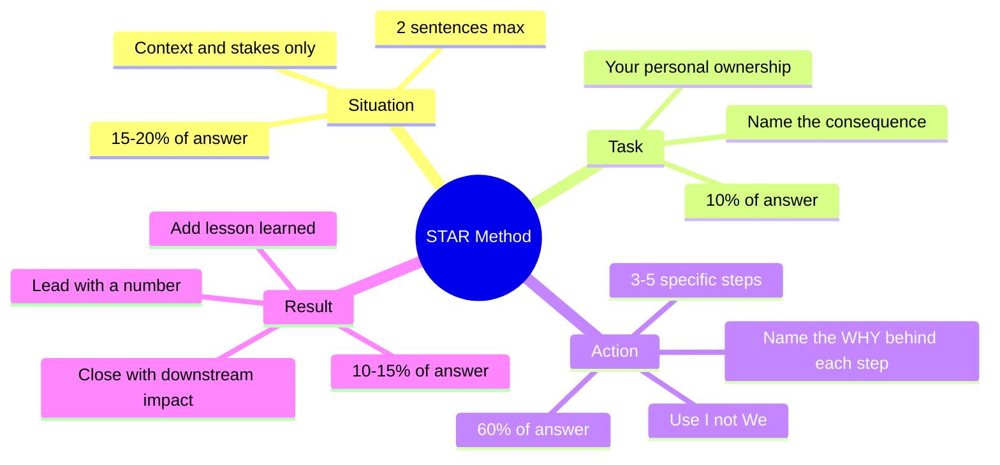
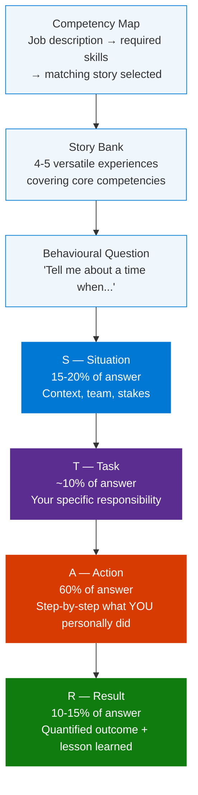

# STAR Method for Behavioural Interview Questions

> **Source:** [YouTube — STAR METHOD FOR BEHAVIOURAL INTERVIEW QUESTIONS! (PASS YOUR INTERVIEW!)](https://www.youtube.com/watch?v=xulpDyBxDgk)
> **Channel:** CareerVidz / How2Become
> **Topic:** Behavioural interviewing, STAR method, interview preparation, soft skills, storytelling
> **Key Claim:** Structured STAR answers are the single most reliable way to pass competency-based interviews — because they force specificity, demonstrate self-awareness, and make results measurable.

---

## Table of Contents

1. [Overview](#1-overview)
2. [Problem Statement](#2-problem-statement)
3. [Core Concepts — The STAR Framework](#3-core-concepts--the-star-framework)
4. [Architecture — STAR Answer Structure](#4-architecture--star-answer-structure)
5. [Time Allocation Per Component](#5-time-allocation-per-component)
6. [How It Works — Building a STAR Story](#6-how-it-works--building-a-star-story)
7. [Behavioural Question Categories](#7-behavioural-question-categories)
8. [Sample STAR Answers](#8-sample-star-answers)
9. [Advanced Techniques](#9-advanced-techniques)
10. [Comparison Table — Unstructured vs STAR](#10-comparison-table--unstructured-vs-star)
11. [Common Mistakes and Fixes](#11-common-mistakes-and-fixes)
12. [Preparation Framework](#12-preparation-framework)
13. [Interview Talking Points](#13-interview-talking-points)
14. [Learning Resources](#14-learning-resources)

---

## 1. Overview

The STAR method (Situation, Task, Action, Result) is a structured framework for answering behavioural interview questions — the "Tell me about a time when..." style questions that dominate competency-based hiring processes. It transforms vague recollections into tight, evidence-backed narratives that give interviewers exactly what they need to assess past performance as a predictor of future behaviour. The method is used across all seniority levels and industries, but is especially critical for PM, leadership, and cross-functional roles where soft skills are evaluated as rigorously as technical ones. Mastery of STAR means walking into any interview with a pre-built bank of stories that can be adapted to any competency question in real time.



### Business Conversation Example

**Context:** A career coach debriefing a candidate the day after a failed PM interview, identifying why the STAR structure broke down.

> **Coach:** "Tell me how you answered the leadership question yesterday."
>
> **Candidate:** "I talked about the time I coordinated a platform migration. I explained the background for a while, then got into what the team did, and said it went really well in the end."
>
> **Coach:** "How long did you spend on the background?"
>
> **Candidate:** "Maybe 3 minutes? The context was complicated — 4 teams, a legacy system, a tight timeline."
>
> **Coach:** "And how long total was the answer?"
>
> **Candidate:** "About 4 minutes, I think."
>
> **Coach:** "That's your problem. You spent 75% of the answer on Situation and barely touched Action or Result. The interviewer's rubric is almost entirely scored on what *you* did and what changed as a result. They gave you 4 minutes and you gave them 30 seconds of evidence. Let's rebuild it right now — what was the specific thing *you* personally owned in that migration?"
>
> **Candidate:** "I was the one who built the rollback plan and communicated the cutover sequence to 3 product teams."
>
> **Coach:** "That's your Task and Action in two sentences. Now — what was the measurable result?"
>
> **Candidate:** "Zero incidents at cutover. And we were the first team in the division to complete a migration of that scale under 8 weeks."
>
> **Coach:** "That's your Result. That answer is now 60 seconds of pure evidence. Situation takes 15 seconds. You just went from failing to strong hire on the same story."

**Why this works:** The coach used specificity to expose the structural failure — not vague feedback like "be more structured," but an actual time audit (75% on Situation, 30 seconds of evidence). The candidate already had all the ingredients; the STAR lens simply repositioned them. This is the most common coaching intervention: same story, radically different weighting.

> **Interview tip:** "Think of STAR as a camera lens: Situation is the wide shot (context), Task is the medium shot (your role), Action is the close-up (what you specifically did), and Result is the screen grab they'll remember. Most candidates spend too long on the wide shot and run out of film before the close-up."

---

## 2. Problem Statement

### Why Unstructured Answers Fail

Behavioural questions catch candidates off guard because they require storytelling, not knowledge recall. Most candidates either over-explain context and run out of time before reaching results, or give generic "we" answers that hide their personal contribution.

| Problem | Interviewer Impact |
|---|---|
| No clear structure — rambling narrative | Interviewer loses track of what you actually did |
| Over-indexing on Situation — 80% context, 20% action | Demonstrates poor communication prioritisation |
| "We did X" — no individual ownership visible | Can't assess your specific competency |
| No quantified result | Answer is unmemorable and unverifiable |
| Memorised script that sounds robotic | Perceived as lacking authenticity or adaptability |
| Negative results not reframed | Signals poor self-awareness |

### Business Conversation Example

**Context:** A senior PM coaching a junior analyst the week before her first behavioural interview, using a real answer draft to show why unstructured answers fail.

> **Analyst:** "Here's how I'd answer 'Tell me about a time you influenced a team.' — 'At my last job, I worked with the engineering team on a feature. We had a lot of discussions and eventually got everyone aligned and the feature shipped successfully.'"
>
> **PM:** "Okay — who specifically did you influence, and what were they resisting?"
>
> **Analyst:** "The tech lead didn't want to build the feature the way the business wanted it. He thought his approach was better architecturally."
>
> **PM:** "And what did *you* do about it?"
>
> **Analyst:** "I set up a session where both sides presented their approach with pros and cons. Then I proposed a compromise — we used the tech lead's architecture but with a thin compatibility layer so the business UI could stay as planned."
>
> **PM:** "And what was the result?"
>
> **Analyst:** "Feature shipped on time. Tech lead later told me it was the cleanest solution he'd built that quarter."
>
> **PM:** "You just answered the question properly. But your draft didn't say *any* of that. 'We had discussions and got aligned' is unfalsifiable — any candidate can say that. What you just told me has a specific conflict, a specific action you personally took, and a specific outcome. That's the difference between an answer that passes and one that gets you hired."
>
> **Analyst:** "So I should tell the longer version?"
>
> **PM:** "No — you should tell the *right* version. Same length, but 60% of it is what you specifically did. Not 'we discussed.' 'I proposed a compatibility layer and ran a structured comparison session.'"

**Why this works:** The PM used Socratic questioning — not lecturing — to surface the candidate's real story, which was buried under vague language. This is the exact failure mode unstructured answers create: the candidate had strong evidence but hid it behind team language and non-specific verbs. The PM's intervention names the precise gap: "unfalsifiable" vs. specific, verifiable action.

> **Key Insight:** "Behavioural interviewing is based on the premise that the most accurate predictor of future performance is past behaviour in similar situations." — MIT Career Advising & Professional Development

---

## 3. Core Concepts — The STAR Framework

### Situation

The context or background of the specific event. Ground the interviewer in what was happening — the team, the challenge, the stakes. Keep it brief; this is setup, not the story. 15–20% of your answer at most. Do not explain the company history, industry background, or anything that doesn't directly set up the challenge. Two sentences is the target.

**What good looks like:**

```
"At [Company], in [month/quarter], [team/context] was facing [specific challenge]
— with [timeline/stake] on the line."
```

**Pitfalls:** Over-indexing on Situation is the #1 structural mistake. If you're still talking about context at the 60-second mark of a 2-minute answer, you've already failed on time allocation.

> **Interview tip:** "If the interviewer asks 'what was the context?' after you've already answered, your Situation was too vague. Aim for: one sentence on *who* was involved, one sentence on *what* was at stake, then move immediately to Task."

---

### Task

Your specific responsibility or goal within that situation. Clarify what *you* personally owned — not what the team was doing. This distinguishes your role from the broader group. Use "I was responsible for..." not "we were supposed to...". ~10% of your answer.

**What good looks like:**

```
"I was responsible for [specific deliverable or decision]
— and if unresolved, [consequence: missed deadline / customer impact / revenue risk]."
```

**Pitfalls:** Candidates confuse Task with Action. Task is *what you needed to do*; Action is *how you actually did it*. Keep Task to 1 sentence — just name the ownership and the stakes.

> **Interview tip:** "Interviewers use Task to check scope: was this a meaningful problem you owned, or were you a minor contributor? A strong Task statement names a clear accountability ('I owned the delivery timeline') with real consequences ('a 2-week slip would have cost the Q3 deal')."

---

### Action

The heart of the answer — spend 60% of your total response time here. Describe the specific, deliberate steps *you* personally took to address the task. This is where competencies are demonstrated — problem-solving, leadership, communication, decision-making. Use "I" statements throughout. Give 3–5 concrete steps in sequence.

**What good looks like:**

```
"First, I [concrete step 1] because [reasoning].
 Then, I [concrete step 2] — which involved [specific approach].
 I also [step 3], specifically by [how].
 When [obstacle] arose, I [how you adapted]."
```

**Pitfalls:** "I communicated proactively" and "I worked cross-functionally" are unfalsifiable. Every action must name the *what* specifically: "I set up a 15-minute async Slack check-in every morning for the 6 engineers on the integration track."

> **Interview tip:** "Senior candidates are identified in the Action step — by specificity and by the reasoning they surface. Don't just say what you did; say *why* you chose that approach over the alternative. 'I chose a written decision memo over a verbal ask because I needed a paper trail for the VP' signals strategic thinking, not just activity."

---

### Result

The measurable outcome. Lead with quantified metrics (%, $, time saved, score improvement) wherever possible. If the result wasn't fully positive, pivot to what you learned — a growth narrative beats a failure narrative. 10–15% of your answer. Always close with a lesson or downstream impact.

**What good looks like:**

```
"As a result, [quantified outcome] — [metric: %, $, time, score].
 Additionally, [secondary positive outcome].
 I learned [specific lesson] which I now apply by [ongoing behaviour change]."
```

**Pitfall:** "Everything worked out great" is the worst possible result statement. Even a successful outcome needs a number to be credible and memorable. If you can't remember the exact figure, proxy it: "roughly 40% faster," "about $12K in savings," "the team went from 2 to 7 on the satisfaction survey."

### Business Conversation Example

**Context:** A mock interview session — an interview coach plays the interviewer, and the candidate practices using each STAR component deliberately for a Google PM role.

> **Interviewer:** "Tell me about a time you had to make a difficult prioritisation decision."
>
> **Candidate:** "At Vertex Labs in Q2 last year, we had 3 feature requests from 3 different enterprise clients — all marked urgent by the account team, all competing for the same 2 engineers in our sprint. [SITUATION]"
>
> **Interviewer:** "And what was your role?"
>
> **Candidate:** "I was the PM who owned the roadmap for that quarter. The final call on feature prioritisation was mine, and I had to defend it to all 3 account executives. [TASK]"
>
> **Interviewer:** "How did you decide?"
>
> **Candidate:** "I built a 1-page decision framework: revenue at risk per feature, estimated build effort, and the contractual penalty exposure per client. Feature B had a $40K penalty clause if not delivered by June 30th — the others didn't. I put Feature B at the top, communicated the rationale to all 3 AEs with the same document, and offered a revised ETA with a mitigation for the deprioritised items. [ACTION]"
>
> **Interviewer:** "Did all three clients accept it?"
>
> **Candidate:** "Two accepted immediately. The third pushed back — they wanted their feature moved up regardless. I escalated to the CRO with the same decision doc. The CRO aligned with my recommendation. Feature B shipped June 27th, penalty avoided. The two deprioritised features shipped in July, no relationship damage. [RESULT]"
>
> **Interviewer:** "Strong. You naturally walked through each component. The $40K anchor was particularly effective — made the trade-off concrete."

**Why this works:** The candidate labelled each STAR component out loud during practice — unusual in a real interview, but useful for training. The dialogue shows how each component serves a function: Situation frames stakes, Task names ownership, Action demonstrates the decision framework, Result closes with a number and a resolution. The $40K penalty turns an abstract "prioritisation" story into a decision under real financial consequence.

> **Interview tip:** "The Result is the interviewer's anchor — the one phrase they'll write in their notes. Make it a number. 'We delivered on time' is forgettable. 'We shipped on schedule and NPS for the new feature was 74 — 18 points above our historical average' is the sentence they'll remember when comparing candidates."

---

## 4. Architecture — STAR Answer Structure



### Interview Session Flow

```mermaid
sequenceDiagram
    participant JD as Job Description
    participant C as Candidate
    participant I as Interviewer

    JD->>C: Signals required competencies before interview
    Note over C: Maps JD skills to story bank (4-5 prepared stories)

    I->>C: Tell me about a time you led under pressure
    Note over C: Selects relevant story; frames with STAR
    C->>I: S: Sets context — 2 sentences max
    C->>I: T: States personal ownership — 1 sentence
    C->>I: A: Walks through specific actions — 60% of response time
    C->>I: R: Delivers metric + lesson — shipped on time, NPS +22pts

    I->>C: Follow-up: How did you handle the pushback from engineering?
    Note over C: Same story, pivot emphasis to negotiation/influence
    C->>I: Adapts existing story to highlight relevant sub-skill

    I->>C: Tell me about a time you failed
    Note over C: Selects a story with learning arc; leads with lesson
    C->>I: R first (advanced): I once missed a deadline by 2 weeks
    C->>I: S + T + A: Explains what happened and what I changed
    C->>I: R revisited: Since then, I have added X to my process — zero recurrences
```

---

## 5. Time Allocation Per Component

| Component | Time Share | What to Cover | What to Skip |
|---|---|---|---|
| **Situation** | 15–20% | Team size, project stakes, timeline pressure | Company history, industry background, unrelated context |
| **Task** | ~10% | Your specific ownership, the gap you were filling | What others were doing simultaneously |
| **Action** | 60% | Step-by-step decisions, tools used, people influenced | Generic statements ("I worked hard", "I communicated") |
| **Result** | 10–15% | Numbers, timeline, recognition, lesson learned | Vague outcomes ("it went well", "everyone was happy") |

### Business Conversation Example

**Context:** A career coach running a timed mock session, stopping a candidate mid-answer to correct time allocation in real time.

> **Coach:** "Go. 'Tell me about a time you led a project through significant scope change.'"
>
> **Candidate:** "Sure. So this was at DataCo — we were building an internal analytics platform for the finance team. The project started in January, had a budget of $200K, and involved 6 engineers across two locations. The finance team originally came to us because their old Excel-based reporting was taking 3 hours a week per analyst, and they had 12 analysts, so that's 36 hours of lost analyst time weekly. The business case was solid but the technical scope was initially underestimated because—"
>
> **Coach:** "Stop. How long have you been talking?"
>
> **Candidate:** "Maybe 45 seconds?"
>
> **Coach:** "65 seconds. And you've only covered Situation. You haven't said what *you* owned or what *you* did. At this rate you'll hit 2 minutes before the interviewer learns anything about you specifically. Cut Situation to 2 sentences and get to Task."
>
> **Candidate:** "Okay — 'At DataCo in Q1, we were building an analytics platform when the finance team doubled the scope midway through the sprint. I was the PM and I owned the scope negotiation and revised delivery plan.' That's it?"
>
> **Coach:** "Perfect. That's 10 seconds. Now go straight to your first specific action."
>
> **Candidate:** "I ran a 2-hour scope triage session with the finance director and engineering lead. We ranked every new requirement by business value vs. build effort. I cut 8 low-value requirements from the sprint and moved them to a Phase 2 backlog. We finished Phase 1 on schedule, 3 weeks after the scope change hit."
>
> **Coach:** "That's a 90-second answer instead of a 4-minute one. Same story. 100% more impact."

**Why this works:** The coach intervened with a timer — not opinion, but data. The candidate's error was a common one: spending 65 seconds on context that deserves 10. By demonstrating the corrected version in real time, the coach made the time allocation tangible. The ratio matters: 15-20% Situation, 60% Action. Any inversion of that ratio fails the structural test.

> **Interview tip:** If you're running out of time, always cut Situation — never cut Action or Result. The interviewer needs to see *what you did* and *what happened*, not the full backstory.

---

## 6. How It Works — Building a STAR Story

### Step 1 — Read the Job Description Before Prep

Extract every competency named or implied:

```
Job Description signal → Competency → Story to prepare

"cross-functional collaboration"  → Teamwork / Influence   → Story: led 3-team sprint
"ambiguous requirements"          → Problem-solving         → Story: defined scope from scratch
"stakeholder communication"       → Communication upward    → Story: exec alignment in crisis
"data-driven decisions"           → Analytical thinking     → Story: A/B test that changed roadmap
"shipped under pressure"          → Delivery / Resilience   → Story: Q3 launch at risk
```

### Step 2 — Build a Story Bank of 4–5 Versatile Experiences

Each story should be adaptable to multiple question types by shifting emphasis:

```
Story: "Saved $23K by introducing a QA checklist"

→ Adaptable to:
  "Tell me about a time you improved a process"   → Emphasise the analysis + implementation
  "Tell me about a time you showed initiative"    → Emphasise that no one asked you to do it
  "Tell me about a time you influenced without authority" → Emphasise getting team buy-in
  "Tell me about a quantifiable impact"           → Lead with the $23K result
```

### Step 3 — Draft Each Story with STAR Structure

```
Story Template:

SITUATION:
  "At [Company], in [timeframe], [team/context] was facing [specific challenge]."

TASK:
  "I was responsible for [specific ownership] — [what would happen if unresolved]."

ACTION:
  "First, I [concrete step 1] because [reasoning].
   Then, I [concrete step 2] — which involved [specific approach].
   I also [step 3], specifically by [how you did it].
   When [obstacle arose], I [how you adapted]."

RESULT:
  "As a result, [quantified outcome] — [metric].
   Additionally, [secondary outcome].
   I learned [specific lesson] which I now apply by [ongoing behaviour]."
```

### Step 4 — Practice Delivery (Not Memorisation)

- Aim for 1–2 minutes per answer
- Practice out loud, not in writing — pacing and confidence are tested, not grammar
- Record yourself and check: Do you say "we" more than "I"? Cut or rephrase.
- Practice with follow-up questions: interviewers will probe your stories

### Business Conversation Example

**Context:** A PM mentor helping a mentee build her story bank 5 days before a senior PM interview at a fintech company.

> **Mentor:** "Let me see the job description. [Reading] They've used 'cross-functional alignment' 4 times, 'data-driven decisions' twice, and 'delivered under ambiguity' once. Do you have stories that map to each of those?"
>
> **Mentee:** "I think so — I have the platform migration story, the customer churn analysis, and the time we launched the beta with incomplete specs."
>
> **Mentor:** "Great — let's map them. Migration story: what's the primary competency it demonstrates?"
>
> **Mentee:** "Leadership? I coordinated 4 teams."
>
> **Mentor:** "Closer to 'cross-functional alignment' — that's the JD's language. Frame it that way when you open the answer: 'I led alignment across 4 teams.' Not 'I coordinated.' Coordinate sounds passive. Align sounds intentional. Next — churn analysis. What did you actually do?"
>
> **Mentee:** "I built the analysis, found the top 3 drop-off points, and got the retention team to change their outreach sequence."
>
> **Mentor:** "That's a 'data-driven decision' story and an 'influencing without authority' story in one. What was the result?"
>
> **Mentee:** "30-day churn dropped from 18% to 11% over the next quarter."
>
> **Mentor:** "That number just became your hook. Lead with it if you use Reverse STAR: 'I once reduced 30-day churn by 7 points using data most people in the team were ignoring — here's how.' Now for the beta launch under ambiguity — what was incomplete?"
>
> **Mentee:** "We didn't have final compliance sign-off, and 2 of 8 features were still in QA."
>
> **Mentor:** "That's ambiguity. What did you decide and why?"
>
> **Mentee:** "I launched the 6 compliant features and held back the other 2 with a 3-week follow-on release plan. Got legal to sign off on a scoped launch."
>
> **Mentor:** "Perfect. Three stories, mapped to three JD signals, each with a number. You're ready."

**Why this works:** The mentor treated the JD as a scoring rubric — which it is. She matched each story to the exact language the hiring team used, then pushed the mentee to sharpen the framing ("align" vs. "coordinate") and identify the result metric. Candidates who don't do this step walk in with stories that are technically true but misaligned to what the interviewer is scoring for.

> **Interview tip:** "The four-step build process is not optional — candidates who skip Step 1 (JD analysis) walk in with stories that don't match what the interviewer is scoring on. Read the job description, extract the competency words, then select and frame your stories to those exact signals. A story about teamwork framed as 'working together' is weaker than the same story framed as 'influencing without authority' when that's what the JD signals."

---

## 7. Behavioural Question Categories

| Category | Typical Prompt | Key Competency Tested |
|---|---|---|
| **Leadership** | "Tell me about a time you led a team through change" | Influence, vision, decisiveness |
| **Conflict** | "Describe a disagreement with a coworker or manager" | Emotional intelligence, communication |
| **Problem-solving** | "Tell me about a time you solved a complex problem" | Analytical thinking, creativity |
| **Failure** | "Tell me about a time you made a mistake" | Self-awareness, accountability, learning |
| **Pressure / Delivery** | "Tell me about a time you worked under a tight deadline" | Resilience, prioritisation |
| **Initiative** | "Tell me about a time you went above and beyond" | Ownership, proactivity |
| **Collaboration** | "Describe a time you worked cross-functionally" | Teamwork, stakeholder management |
| **Data / Decision** | "Tell me about a time you made a data-driven decision" | Analytical rigour, communication |
| **Communication** | "Tell me about a time you had to explain something complex" | Clarity, audience adaptation |
| **Influence** | "Tell me about a time you persuaded someone without authority" | Influence, empathy, logic |

### Business Conversation Example

**Context:** A mock interview panel — an interview coach plays the interviewer for a Director of Product role, asking questions across 3 behavioural categories.

> **Interviewer:** "Tell me about a time you made a decision with insufficient data."
>
> **Candidate:** "I'll use the Data/Decision category — at MedTech in Q3, we needed to choose between two API vendors with incomplete performance benchmarks. The market window closed in 4 weeks. I was the PM who owned the vendor selection."
>
> **Interviewer:** "What data did you have?"
>
> **Candidate:** "We had pricing, contract terms, and 3 customer references each. What we didn't have was production load data — neither vendor had shared it. I ran 2-day proof-of-concept sprints with both vendors using synthetic load tests at 80% of our expected peak. Vendor A failed at 70% load; Vendor B held to 95%. I selected Vendor B and documented the incomplete data explicitly in the decision memo so the risk was visible to leadership."
>
> **Interviewer:** "What was the result?"
>
> **Candidate:** "Launched on time. Zero API incidents in the first 90 days. The CTO later used the POC framework as a standard for all future vendor selections."
>
> **Interviewer:** "Now — tell me about a conflict with a team member."
>
> **Candidate:** "Conflict category — this is a different story. My tech lead and I disagreed on release timing for a security patch. He wanted 2 more weeks of testing; our enterprise client had a contractual SLA for the fix within 14 days. I had to balance his quality concerns against a $60K penalty clause."
>
> **Interviewer:** "How did you resolve it?"
>
> **Candidate:** "I asked him to define the minimum test coverage he needed to feel confident. He said 85% regression coverage. We were at 72%. I negotiated 3 extra days — enough to reach 84% — and documented the 1% gap as an accepted risk signed off by the product director. Patch shipped on day 13. No incidents."
>
> **Interviewer:** "You categorised each question before answering. Is that deliberate?"
>
> **Candidate:** "Yes — knowing the category tells me which story to pull and which competency to emphasise in the Action."

**Why this works:** The candidate demonstrated category awareness explicitly — naming which question type triggered which story. This meta-skill shows preparation depth. More importantly, each answer is tightly matched to its competency: "Data/Decision" gets a data-driven process and a number; "Conflict" gets a specific disagreement, a measurable constraint ($60K penalty), and a negotiated resolution. The interviewer's final question confirmed the candidate's deliberate mapping was noticed and valued.

> **Interview tip:** "Map every story in your bank to a category in this table *before* the interview. When a question lands, you should be able to identify its category in 2 seconds, pull the matching story, and begin framing. If you hesitate for more than 5 seconds before starting, you haven't mapped your stories to competencies. The category is your trigger — the story is your ammunition."

---

## 8. Sample STAR Answers

### Example 1 — Leadership Under Pressure (PM role)

**Question:** "Tell me about a time when you led a cross-functional team through a difficult situation."

> **S:** "In Q3 at Acme Corp, our product launch was 3 weeks out and our engineering lead unexpectedly went on medical leave — leaving a team of 8 without a technical decision-maker."
>
> **T:** "As PM, I had no authority over engineering headcount, but I was accountable for the launch timeline and quality bar."
>
> **A:** "First, I mapped all in-flight technical decisions — found 4 that were blockers. I paired each with the most senior available engineer and set up a 15-minute daily async check-in in Slack to surface blockers without adding meeting load. I escalated resource risk to the VP with a written decision memo — not a verbal ask — which got a contractor onboarded within 4 days. I also moved our QA phase 2 days earlier by cutting 3 low-priority features from scope, which I negotiated with the product director using impact vs. effort data."
>
> **R:** "We launched on schedule. Customer NPS for the new feature was 74 — 18 points above our historical average. The memo template I created for escalation is now used by 3 other PMs on the team."

---

### Example 2 — Failure / Learning Arc

**Question:** "Tell me about a time you made a mistake and how you handled it."

> **S:** "In my second year at a startup, I underestimated the complexity of a third-party API integration and committed to a 2-week delivery to the business team."
>
> **T:** "I was the sole engineer-PM on the initiative, so the miss was entirely on my estimation and communication."
>
> **A:** "When I hit blockers at day 5 and realised we'd need 4 more weeks, I immediately called a meeting with stakeholders — not an email — and brought a revised plan with three scope options: full feature in 4 weeks, 80% feature in 2 weeks, or MVP in 1 week. I owned the miss directly without hedging. We chose the 2-week path."
>
> **R:** "We shipped in 13 days. More importantly, I introduced a 'spike estimation' step for any external dependency work — a time-boxed 2-day investigation before committing timelines. That practice has been adopted across our team and has reduced estimate variance by approximately 40%."

---

### Example 3 — Influence Without Authority

**Question:** "Describe a time when you persuaded others to follow your recommendation."

> **S:** "Our analytics team and product team were deadlocked on whether to invest engineering cycles in a new reporting dashboard vs. a customer-facing feature. Both were high priority and we had capacity for only one in the quarter."
>
> **T:** "I had no decision authority — I was a PM peer of the analytics lead — but I could see the trade-off data more clearly than the debate was surfacing."
>
> **A:** "I pulled 90 days of support tickets and quantified the customer-facing feature's impact: 23% of tickets were caused by the problem it would solve. For the dashboard, I surveyed 5 internal users and found it would save roughly 3 hours/week across the analytics team — about 156 hours/quarter. I built a one-page decision memo framing it as 'customer value per engineering week' — and brought both leads together to review it rather than advocating in separate rooms."
>
> **R:** "The data made the customer feature the clear winner. Both leads agreed and the debate closed in a single 30-minute session. The feature shipped in 6 weeks and reduced the support ticket category by 19%."

> **Interview tip:** "Notice the pattern in all three examples: the Action section is 3–5 specific sentences, every sentence names a concrete tool or action (Slack check-ins, written memo, one-page decision frame), and the Result leads with a number. When your STAR answers match this pattern, interviewers score you 'strong hire' — not because the story is impressive, but because the structure proves you communicate clearly under pressure."

---

## 9. Advanced Techniques

### Technique 1 — Lead With the Result ("Reverse STAR")

Instead of building to the result, open with it to immediately demonstrate impact:

```
Standard: S → T → A → R
Reverse:   R hook → S → T → A → R revisited

Example:
"I once reduced our customer onboarding time from 14 days to 3 — let me tell you how.
At [Company], our enterprise onboarding was entirely manual..."
```

Best used when: the result is striking and quantified, the audience is senior, or you want to signal confidence early.

### Technique 2 — Pivot a Story to a Follow-Up

Interviewers probe STAR answers with follow-up questions. A single story can answer 3–4 sub-questions by shifting the emphasis:

```
Original: "Led cross-functional launch under pressure"

Follow-up: "How did you handle the conflict with design?"
→ Pivot: "In that same situation, design had a different vision for the UI..."

Follow-up: "What would you do differently?"
→ Pivot: "If I could redo it, I'd have involved QA 1 week earlier to surface integration risk..."
```

### Technique 3 — Quantify Everything (Or Proxy It)

When you don't have exact numbers, use credible proxies:

```
Instead of: "we improved team morale"
Say:        "survey scores went from 6.2 to 8.1 out of 10"

Instead of: "it saved time"
Say:        "cut the process from ~3 hours to ~45 minutes for a team of 12"

Instead of: "customers responded well"
Say:        "renewal rate that quarter was 94% — 6 points above the prior period"
```

### Technique 4 — Reframe Negative Results

If the outcome wasn't fully positive, always close with a learning that led to a process change:

```
❌ "Unfortunately the project was cancelled."
✅ "The project was cancelled due to budget cuts — outside my control.
    What I took from it was [specific lesson], which I applied in [next situation] and it resulted in [positive outcome]."
```

### Business Conversation Example

**Context:** A senior PM coaching a peer on using Reverse STAR in a panel interview for a VP Product role, where the candidate needs to command attention from the first sentence.

> **Coach:** "Read me how you'd currently open your 'biggest impact' story."
>
> **Candidate:** "So at my last company, we had a problem with enterprise customer churn. I noticed the pattern in the data and built an analysis that identified the root cause. I then worked with the retention team to change their outreach sequence, and over the following quarter, churn dropped."
>
> **Coach:** "That's Standard STAR. You buried the impact at the end. For a VP-level panel, you have 10 seconds to signal that you belong in the room. Try opening with the result."
>
> **Candidate:** "I once cut enterprise churn by 7 percentage points in a single quarter — let me tell you what I found in the data."
>
> **Coach:** "Better. Now what happens if the interviewer asks a follow-up right after?"
>
> **Candidate:** "I continue with the Situation?"
>
> **Coach:** "Yes, but you've already won the attention. Now when you say 'we had 18% 30-day churn and I identified 3 drop-off points none of the retention team had looked at,' the context lands differently — they're listening harder because you already proved the outcome. Try the whole thing now, using the Reverse format."
>
> **Candidate:** "I cut enterprise churn from 18% to 11% over one quarter. At the time, our retention team was running a generic 30-day outreach campaign to all churned accounts. I pulled 6 months of product usage data and found 3 specific actions that predicted churn 14 days in advance. I built a model and worked with the retention team lead to retarget their outreach to those signals. We reduced 30-day churn from 18% to 11% — recovering roughly $340K in ARR that quarter."
>
> **Coach:** "Notice what happened: the opening metric made them lean in, so the explanation of *how* you did it carried more weight. That's Reverse STAR working correctly."

**Why this works:** The coach demonstrated the precise psychological mechanism — opening with a quantified result primes the listener to receive the explanation as credibility evidence, not just background. The candidate's before/after demonstrates that the same story, restructured, becomes significantly more compelling. The $340K ARR anchor is specific enough to be verifiable and memorable in a competitive panel process.

> **Interview tip:** "The four techniques in this section separate good STAR answers from exceptional ones. In a competitive process where multiple candidates use STAR, the differentiator is usually Technique 1 (Reverse STAR — hook them with a metric) and Technique 2 (Pivot — showing one story can cover multiple angles). Use Reverse STAR when the result is extraordinary; use the Pivot when follow-up probes come at you, to show depth rather than scrambling for a second example."

---

## 10. Comparison Table — Unstructured vs STAR

| Dimension | Unstructured Answer | STAR-Structured Answer |
|---|---|---|
| **Opening** | "So there was this project where we..." | "At [Company] in Q3, I was responsible for..." |
| **Individual ownership** | "We worked together to..." | "I specifically led the X component by doing..." |
| **Action depth** | "I helped out and communicated a lot" | "I did X, then Y, then escalated Z by doing..." |
| **Quantified result** | "It went well and everyone was happy" | "NPS rose 18 pts; delivered 2 weeks early" |
| **Time allocation** | Random — often 70% context, 30% action | Intentional: 60% action, 15% result |
| **Adaptability** | One-use story | Same story pivoted to 3–4 competency angles |
| **Confidence signal** | Hesitant, narrative wanders | Structured, decisive, evidence-led |
| **Memorability** | Forgettable — no anchor metric | Anchor metric ("$23K savings") makes it stick |

### Business Conversation Example

**Context:** A mock interview debrief — a candidate just answered a leadership question and the coach is walking through the STAR comparison table live, highlighting the exact gaps.

> **Coach:** "Let me play back what you said and tell me which column it belongs in — structured or unstructured. Opening: 'There was a project at my previous job where things got complicated.' Column?"
>
> **Candidate:** "Unstructured. No company, no timeframe, no stakes."
>
> **Coach:** "Correct. Now try it structured."
>
> **Candidate:** "'At Nova Payments in Q4, our go-live was at risk when two key engineers left 6 weeks before launch.' That work?"
>
> **Coach:** "Company, timing, specific risk. That's the structured column. Next — you said 'I worked with the team to figure out the solution.' Column?"
>
> **Candidate:** "Unstructured. 'Worked with the team' is 'we' language and says nothing about what I specifically did."
>
> **Coach:** "Right. Structured version?"
>
> **Candidate:** "'I hired a contractor through our approved vendor list within 48 hours and personally ran the knowledge transfer sessions for 3 days.'"
>
> **Coach:** "Now the Result: you said 'the launch went well.' That's the worst possible result statement. What actually happened?"
>
> **Candidate:** "We launched 2 days late but under budget. And the quality score in the first 30-day post-launch audit was 94% — the highest the platform team had seen."
>
> **Coach:** "94% quality score. That's your anchor. 'Launched 2 days late against a 6-week risk window, 94% quality score on the post-launch audit' — that's memorable. Can you see how your draft answer could have been given by anyone who heard the story second-hand?"
>
> **Candidate:** "Yes. None of it was verifiable."
>
> **Coach:** "Every sentence in your Action should be specific enough that I could ask 'what was the contractor's day rate?' and you'd know. That's the test."

**Why this works:** The coach ran a live column-by-column comparison between the candidate's actual answer and the structured version — making the table from this section tangible rather than abstract. The "could be said by someone who heard it second-hand" test is a powerful quality bar: if the answer passes that test, it's generic. The 94% quality score example shows how a real number transforms an unmemorable result into an anchor.

> **Interview tip:** "When prepping for an interview, read your draft STAR answer and ask: 'Could this have been said by someone who didn't do the work?' If yes, it's unstructured. Every sentence in your Action section should be verifiable — specific enough that the interviewer could ask a follow-up ('what format was the decision memo?') and you'd have a real answer."

---

## 11. Common Mistakes and Fixes

| Mistake | Why It Fails | Fix |
|---|---|---|
| **Using "we" throughout** | Hides your personal contribution | Replace with "I" — if team credit needed: "I led the team to..." |
| **Too much Situation** | Leaves no time for the substance | Cap Situation at 2 sentences max |
| **Vague action** | "I communicated well" is unfalsifiable | Name the specific action: "I set up a 3-slide exec brief sent every Friday at 4pm" |
| **No quantified result** | Unmemorable and unverifiable | Every story needs at least one number, even a proxy |
| **Memorised script** | Sounds robotic; falls apart under follow-ups | Memorise the structure and anchors; improvise the narrative |
| **Choosing the wrong story** | Demonstrates a different skill than asked | Map each question to a specific competency; match story to that competency |
| **Negative result, no lesson** | Signals lack of self-awareness | Always close with what you changed as a result |
| **Hypothetical answer** | "I would handle it by..." — not behavioural | Pivot to a real example: "That reminds me of a situation where..." |

### Business Conversation Example

**Context:** A peer coaching session — two PM friends doing mock interviews, with one catching the other making 3 common mistakes in a single answer.

> **Reviewer:** "You made 3 mistakes in that answer. Can I call them out?"
>
> **Candidate:** "Please."
>
> **Reviewer:** "First: you opened with 'we had this product that wasn't performing well.' That's unstructured. No company, no timeframe, and 'not performing well' means nothing to a scorecard. What was actually happening?"
>
> **Candidate:** "Our activation rate was 23% — industry average was 45%."
>
> **Reviewer:** "Lead with that. '23% activation rate against a 45% industry average' is a problem statement. Second mistake: 'I helped the team redesign the onboarding.' What specifically did *you* do?"
>
> **Candidate:** "I led a 3-week discovery sprint — 12 user interviews, built a journey map, identified the exact drop-off point at step 4, and wrote the new onboarding specification."
>
> **Reviewer:** "That's 4 specific actions. 'Helped the team redesign' hides all of that. Never use 'helped' — it signals you were a passenger. Third mistake: 'and it really improved.' What improved, by how much, by when?"
>
> **Candidate:** "Activation rate went from 23% to 41% in 8 weeks."
>
> **Reviewer:** "That's within range of industry average in 2 months. That's a strong result. You had all of this — you just buried it under vague language. Try the whole answer again."
>
> **Candidate:** "At Clearpath in Q1, our onboarding activation rate was 23% against an industry average of 45%. I was the PM who owned the onboarding experience. I led a 3-week discovery sprint — 12 user interviews, a full journey map, identified a critical drop-off at step 4. I rewrote the onboarding specification based on those findings. 8 weeks after the redesign shipped, activation hit 41%."
>
> **Reviewer:** "That's the answer. Same story. Zero vague language."

**Why this works:** Peer review is often more effective than solo prep because a second listener immediately flags the gaps the speaker is blind to. The reviewer used precise diagnostic language — not "be more specific" but "that's 4 specific actions you hid behind 'helped.'" Each correction mapped directly to a mistake in the table: "we" vs. "I", vague action, missing result. The final rebuild demonstrates how the structural fix is minimal in effort but transformative in impact.

> **Interview tip:** "Run through this table as a checklist during mock practice. Record yourself answering a question, then replay it and flag every mistake from this list. The most common one to catch: 'we' instead of 'I'. Count your we vs. I ratio — in a well-structured STAR answer, every Action verb should have 'I' as the subject. If 'we' outnumbers 'I', reframe every sentence."

---

## 12. Preparation Framework

### The Story Bank Matrix

Build before your interview. Aim for 4–5 stories that cover the full competency grid:

```
Story Bank (4-5 stories minimum):

┌─────────────────────────────────────────────────────────────────┐
│  Story                  │ Core Competency  │ Backup Competency  │
├─────────────────────────┼──────────────────┼────────────────────┤
│  Cross-functional launch│ Leadership       │ Conflict, Delivery │
│  Process improvement    │ Initiative       │ Problem-solving    │
│  Stakeholder escalation │ Communication    │ Influence, Risk    │
│  Failed project / miss  │ Self-awareness   │ Accountability     │
│  Data-driven decision   │ Analytical think │ Persuasion         │
└─────────────────────────────────────────────────────────────────┘
```

### Pre-Interview Checklist

```
STORY BANK:
[ ] 4-5 stories drafted in STAR format
[ ] Each story has at least one quantified result
[ ] Every story uses "I" — not "we"
[ ] Stories cover: leadership, conflict, failure, initiative, collaboration

RESEARCH:
[ ] Job description read — competency keywords extracted
[ ] Each competency matched to a story from the bank
[ ] Company values / leadership principles reviewed (Amazon LPs, Google SPIDR, etc.)

DELIVERY:
[ ] Practiced out loud (not just in writing)
[ ] Each story clocked at 90 seconds–2 minutes
[ ] Prepared for 2–3 follow-up probes per story
[ ] Negative story has learning arc — not just the failure
```

### Competency-to-Question Quick Reference

```
Leadership Principles / Competency → Likely Question Trigger

Bias for Action     → "...moved fast without all the information"
Ownership           → "...took responsibility for something outside your role"
Customer Obsession  → "...prioritised the customer against internal pressure"
Dive Deep           → "...used data to change a decision"
Earn Trust          → "...rebuilt trust after a setback"
Deliver Results     → "...hit a goal despite obstacles"
Invent & Simplify   → "...improved a process or found a creative solution"
Think Big           → "...proposed an idea that changed direction"
```

### Business Conversation Example

**Context:** A mentor helping a candidate prepare a story bank for an Amazon L6 Senior PM loop, with 4 hours until the first interview.

> **Mentor:** "You've got 4 interviews this afternoon. Let's map your 5 stories to Amazon's LPs. First: what's your strongest story?"
>
> **Candidate:** "The supply chain analytics project — I built a forecasting model that reduced stock-outs by 31%."
>
> **Mentor:** "That covers Dive Deep — you went into the data and found something no one else had. It also covers Deliver Results — a 31% reduction is a concrete outcome. That story can serve 3 different questions. What's story 2?"
>
> **Candidate:** "The time I escalated a vendor risk 8 weeks before it became a launch blocker. I identified it early and built an alternative sourcing plan."
>
> **Mentor:** "That's Bias for Action — you moved without being asked and without complete information. How early did you escalate?"
>
> **Candidate:** "8 weeks out. Most PMs would've flagged it at 2 weeks."
>
> **Mentor:** "Say '8 weeks before the standard escalation window' — that makes the speed quantifiable. Now story 3 for Ownership?"
>
> **Candidate:** "I took over a failing integration project that wasn't mine — the original PM had left and there was no handover documentation."
>
> **Mentor:** "Perfect for Ownership — you took responsibility beyond your formal role. How did it end?"
>
> **Candidate:** "Shipped 3 weeks late, but recovered to within 1 week of the original deadline by the end of Q2. Zero customer complaints."
>
> **Mentor:** "Close with that — 'recovered to within 1 week of the original deadline.' That frames a late delivery as a recovery story, which is Earn Trust, not just Ownership. You've now covered 5 LPs with 3 stories. Don't use all 3 in the same interview — save rotation for the loop."

**Why this works:** The mentor treated story preparation as an LP coverage matrix — not just "what are your stories?" but "which LPs do they cover, and can you serve multiple questions from one story?" The precise language coaching ("8 weeks before the standard escalation window" vs. "early") shows how framing determines which LP is scored. The final observation — don't exhaust your stories in one interview — is loop management, not just story prep.

> **Interview tip:** "For Amazon Leadership Principle (LP) interviews, this competency-to-question map is essential. Each LP maps to 2–3 common question triggers. Prepare at least one story per LP — ideally one that covers 2 LPs so your bank of 5 stories covers all 16. When the interviewer asks 'Tell me about a time you had to make a decision with incomplete data,' that's Bias for Action + Dive Deep. Lead your answer with the data you *did* have, not the data you lacked."

---

## 13. Interview Talking Points

### "What is the STAR method and why does it work?"

> STAR is a structured answer format — Situation, Task, Action, Result — that maps directly to how interviewers are trained to evaluate competency. It works because it forces specificity: you can't fake a quantified result or a detailed action sequence. When I use it, I spend about 60% of my answer on Action — that's where the interviewer learns what I actually did and how I think.

### "How do you prepare STAR stories before an interview?"

> I read the job description first and extract every competency signal — words like "cross-functional," "ambiguous," "data-driven," or "delivered under pressure." Then I build a story bank of 4–5 versatile experiences from my career, and map each to 2–3 competencies so I can pivot the same story depending on what's asked. I practice out loud, not in writing — the goal is natural delivery, not recitation.

### "What makes a STAR answer stand out to interviewers?"

> Three things: a quantified result, individual ownership ("I" not "we"), and a learning arc if the result wasn't fully positive. Interviewers hear dozens of vague answers — one specific metric like "reduced onboarding from 14 days to 3" anchors the whole story and makes it memorable. I also prepare for follow-up probes, since the best interviewers will dig into one story for 10 minutes.

### "How do you handle a behavioural question when you don't have a perfect example?"

> Two options: first, check if a different story in my bank partially covers the competency — I can often pivot emphasis. Second, if I genuinely have no direct experience, I briefly acknowledge it and pivot to the closest real parallel: "I haven't led a team of 50, but I did own a cross-functional workstream of 8 where the same dynamics applied." Hypothetical "I would do X" answers are the last resort — real examples always land better.

### "Can you use the same story for multiple questions?"

> Absolutely — and that's the point of building versatile stories. A single story about a cross-functional launch can answer questions about leadership, conflict, delivery, communication, and initiative — just by shifting where I put the 60% Action focus. I prepare each story to be pivotable to at least 2 competency angles so I'm never caught without a good answer.

### "How do you handle the 'Tell me about a time you failed' question?"

> This is actually one of the best questions to prepare for because a strong answer demonstrates self-awareness and a learning mindset — both of which many candidates fail to show. I pick a genuine failure, own it completely without hedging or blaming others, explain exactly what I'd do differently, and close with a concrete process change I've implemented since. The result of the story becomes the lesson, not the failure itself.

### Business Conversation Example

**Context:** An interviewer testing meta-awareness of interview technique, asking a PM candidate directly about how she prepares for behavioural interviews — a question some candidates stumble on because it's recursive.

> **Interviewer:** "How do you typically prepare for behavioural interviews?"
>
> **Candidate:** "I start with the job description — I extract the competency signals: words like 'cross-functional,' 'data-driven,' 'under ambiguity.' Those tell me what the interviewers are scoring for. Then I build a story bank — usually 5 stories that each map to 2 or 3 competencies so I can pivot the same story depending on what's asked."
>
> **Interviewer:** "And how do you structure the answers themselves?"
>
> **Candidate:** "I use STAR — Situation, Task, Action, Result. The Situation and Task together take about 20% of the answer. I put 60% into Action — that's the part that demonstrates the actual competency. The Result closes with a number where I can find one. If the result wasn't positive, I close with the lesson and what I changed as a result."
>
> **Interviewer:** "What if you don't have a perfect example for a question?"
>
> **Candidate:** "Two paths: first, check if a story from my bank partially covers the competency and I can pivot the emphasis. If not, I find the closest real parallel and name the gap explicitly — 'I haven't led a team of 50, but in this project with 8 people the same dynamics applied.' Hypothetical answers are the last resort because real evidence always lands better."
>
> **Interviewer:** "Have you ever been asked about a failure?"
>
> **Candidate:** "Yes — that's actually a question I prepare for specifically. I pick a genuine miss, own it without hedging, walk through what I did differently, and close with a process change I've implemented since. The lesson needs to be concrete — not 'I learned to communicate better' but 'I introduced a written decision memo for any ask requiring VP sign-off, which I've used in every project since.'"
>
> **Interviewer:** "That's a thorough answer — including a concrete example of what 'learning' looks like. Most candidates say 'I learned to communicate better' without naming the specific process they changed."

**Why this works:** The candidate used the STAR framework to answer a meta-question about STAR — demonstrating the method by practising it, not describing it abstractly. The interviewer's final observation confirms what makes the answer strong: "concrete example of what 'learning' looks like." The candidate's failure answer contained a specific behavioural change ("written decision memo for any ask requiring VP sign-off"), not a platitude. This is the difference between an answer that scores and an answer that passes.

> **Interview tip:** "These six talking points are themselves STAR answers in disguise — each one starts with a crisp definition, pivots to a concrete example or technique, and closes with a signal of senior understanding ('I also prepare for follow-up probes'). When memorising this section, don't memorise the words — memorise the structure: definition → how I do it → what makes it effective. Then speak naturally from that structure."

---

## 14. Learning Resources

| Resource | Link | Type |
|---|---|---|
| YouTube — STAR Method Full Guide | [https://www.youtube.com/watch?v=xulpDyBxDgk](https://www.youtube.com/watch?v=xulpDyBxDgk) | Video |
| MIT CAPD — STAR Method Guide + Worksheet | [https://capd.mit.edu/resources/the-star-method-for-behavioral-interviews/](https://capd.mit.edu/resources/the-star-method-for-behavioral-interviews/) | Official Guide |
| Big Interview — STAR Method Deep Dive | [https://resources.biginterview.com/behavioral-interviews/star-interview-method/](https://resources.biginterview.com/behavioral-interviews/star-interview-method/) | Comprehensive Guide |
| The Muse — STAR Interview Method | [https://www.themuse.com/advice/star-interview-method](https://www.themuse.com/advice/star-interview-method) | Article |
| Northwestern University — STAR Approach | [https://www.northwestern.edu/careers/jobs-internships/interviewing/the-star-approach.html](https://www.northwestern.edu/careers/jobs-internships/interviewing/the-star-approach.html) | University Guide |
| BetterUp — 30 STAR Method Questions | [https://www.betterup.com/blog/star-interview-method](https://www.betterup.com/blog/star-interview-method) | Question Bank |

> **Interview tip:** "Use these resources in order of depth needed: watch the YouTube video for the framework overview, download the MIT worksheet to draft your first 3 stories, then use BetterUp's 30 questions to stress-test each story against real prompts. The MIT resource is particularly valuable because it includes a downloadable template that forces you to write the full STAR structure before any mock practice."

---

*Last Updated: July 2026 | Source: CareerVidz — STAR Method for Behavioural Interview Questions*
