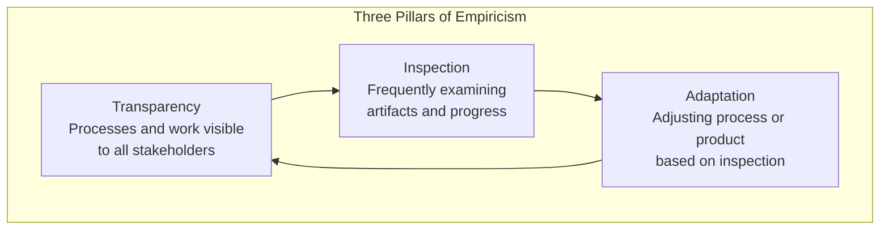
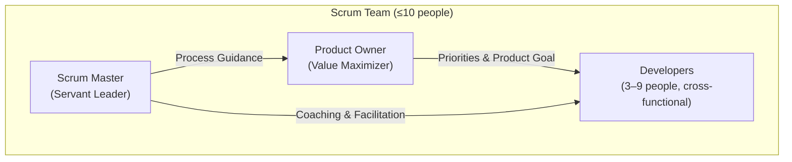
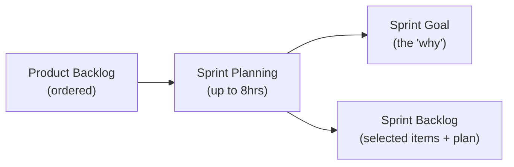
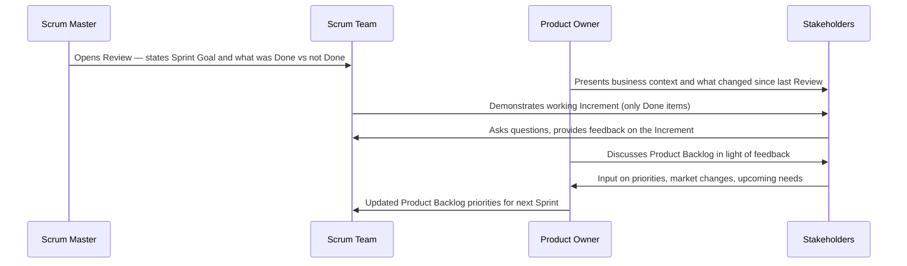
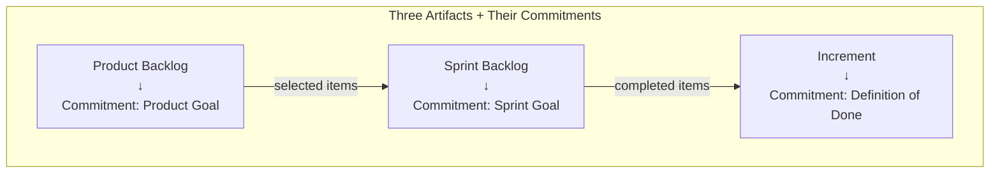
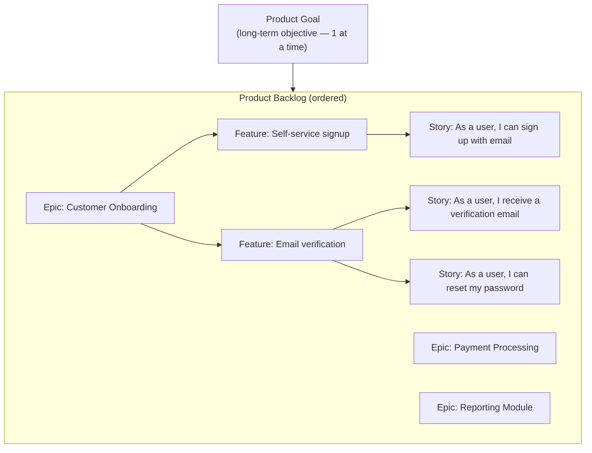
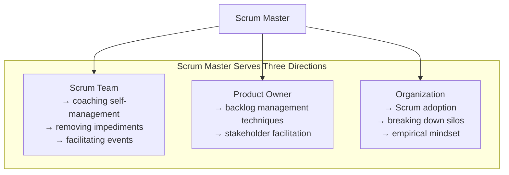
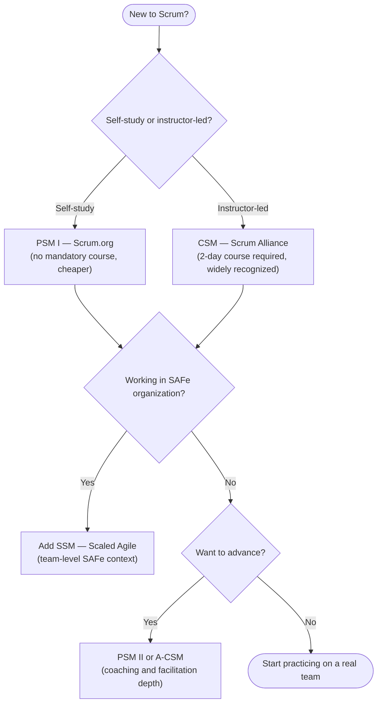

# Scrum Master Full Course

> **Source:** [YouTube — Scrum Master Full Course | Scrum Master Certifications Training | Scrum Master Tutorial](https://www.youtube.com/watch?v=SyIN_YMfoQs)
> **Channel/Event:** Simplilearn
> **Topic:** Scrum, Agile, Scrum Master, Product Owner, Ceremonies, Artifacts, Sprint, SAFe, CSM, PSM
> **Key Claim:** Scrum is a lightweight framework for generating value through adaptive solutions for complex problems — built on three roles, five events, and three artifacts.

---

## Table of Contents

1. [Overview](#1-overview)
2. [Why Scrum? The Problem It Solves](#2-why-scrum-the-problem-it-solves)
3. [Core Concepts — Empiricism & the 3-5-3 Rule](#3-core-concepts--empiricism--the-3-5-3-rule)
4. [Scrum Values](#4-scrum-values)
5. [Scrum Team Roles](#5-scrum-team-roles)
6. [Scrum Events — The Five Ceremonies](#6-scrum-events--the-five-ceremonies)
7. [Scrum Artifacts & Commitments](#7-scrum-artifacts--commitments)
8. [The Sprint — Container for Everything](#8-the-sprint--container-for-everything)
9. [Scrum Master Deep Dive](#9-scrum-master-deep-dive)
10. [Scrum Master vs Project Manager](#10-scrum-master-vs-project-manager)
11. [Scrum Master Certifications](#11-scrum-master-certifications)
12. [Interview Talking Points](#12-interview-talking-points)
13. [Learning Resources](#13-learning-resources)

---

## 1. Overview

Scrum is a lightweight agile framework for developing, delivering, and sustaining products in complex environments. Created by Ken Schwaber and Jeff Sutherland in the early 1990s and formalized in the Scrum Guide (last updated 2020), it provides just enough structure to enable empirical process control while leaving implementation details to the team. The Scrum Master is the role responsible for ensuring the team understands and lives Scrum — acting as a servant leader, coach, and impediment remover rather than a traditional manager.

---

## 2. Why Scrum? The Problem It Solves

### Classic Waterfall Pain Points

| Problem | Impact |
|---|---|
| Requirements locked upfront | Changes are costly and slow |
| Long delivery cycles (6–18 months) | Feedback arrives too late to act on |
| Siloed teams | Handoffs create delay and misunderstanding |
| "Big bang" delivery | All risk concentrated at release |
| No mechanism for continuous improvement | Teams repeat the same mistakes sprint after sprint |

> **Key Insight:** "Scrum replaces a programmatic approach with a heuristic one — creating opportunities for inspection and adaptation at regular intervals rather than executing a fixed plan."

### Scrum's Answer

```
Traditional: Plan → Build → Test → Release (one big cycle)

Scrum:       [Sprint 1: Plan→Build→Test→Release increment]
              → [Sprint 2: Plan→Build→Test→Release increment]
              → [Sprint N: ...]

Each Sprint produces a potentially shippable increment.
Feedback is gathered continuously. Plan adapts each cycle.
```

---

## 3. Core Concepts — Empiricism & the 3-5-3 Rule

### Three Pillars of Empiricism

Scrum is founded on empirical process control theory — decisions are based on observation and experimentation, not prediction.



| Pillar | What it means in practice |
|---|---|
| **Transparency** | Definition of Done is shared; Backlog is visible to all; burndown is public |
| **Inspection** | Daily Scrum, Sprint Review, and Retrospective are all inspection events |
| **Adaptation** | Backlog is re-ordered; Sprint plan adjusts; team process improves each sprint |

### The 3-5-3 Rule

A memory aid for the structural core of Scrum:

```
3 Roles      →  Scrum Master · Product Owner · Developers
5 Events     →  Sprint · Sprint Planning · Daily Scrum · Sprint Review · Sprint Retrospective
3 Artifacts  →  Product Backlog · Sprint Backlog · Increment
```

---

## 4. Scrum Values

The five Scrum values guide how the team works together. They reinforce — and are reinforced by — the framework's events and artifacts.

| Value | What it looks like in practice |
|---|---|
| **Commitment** | Team commits to the Sprint Goal, not just a list of tasks |
| **Focus** | Team works only on Sprint Backlog items during the Sprint |
| **Openness** | Progress, impediments, and mistakes are shared transparently |
| **Respect** | Each member is trusted as a capable professional |
| **Courage** | Raising blockers early; saying "no" to scope additions mid-sprint |

> **Interview tip:** "When asked about Scrum values, don't just list them — show them in action. Commitment is about the Sprint Goal, not tasks. Courage means a developer says 'this story is too big to complete this sprint' on day 1, not day 10."

---

## 5. Scrum Team Roles

The Scrum Team is a single, cohesive unit — no sub-teams, no hierarchy. Typically 10 or fewer people. Cross-functional: all skills needed to create value are present within the team.

### Architecture



### 5.1 Product Owner

**One person, not a committee.** Maximizes the value the product creates for users, customers, and the business.

| Responsibility | Detail |
|---|---|
| Product Goal | Defines and communicates the long-term objective |
| Product Backlog | Creates, orders, and continuously refines it |
| Backlog transparency | Ensures all stakeholders understand backlog content and priority |
| Stakeholder engagement | Sole interface between business and Scrum Team for priority decisions |

> **Key rule:** Developers may speak to stakeholders, but priority decisions go through the Product Owner. If someone else gives priority directions to developers, the Product Owner's effectiveness is undermined.

### 5.2 Scrum Master

The accountable servant leader for the Scrum Team's effectiveness. Not a project manager; not a team lead. Coaches the team on self-management and cross-functionality.

**Serves the team by:**
- Coaching members in self-management and cross-functionality
- Helping focus on high-value increments meeting the Definition of Done
- Removing impediments to the team's progress
- Ensuring Scrum events are positive, productive, and timeboxed

**Serves the Product Owner by:**
- Helping find techniques for effective Product Goal definition and backlog management
- Facilitating stakeholder collaboration on demand

**Serves the organization by:**
- Leading, training, and coaching Scrum adoption
- Planning and advising Scrum implementations
- Removing barriers between stakeholders and Scrum Teams

### 5.3 Developers

Everyone on the team who creates work in the Sprint — not just engineers. Designers, testers, analysts all count as Developers in Scrum terminology. The Scrum Guide uses "Developers" to emphasize the cross-functional nature of the role — anyone who contributes to creating the Increment is a Developer.

**Accountable for:**
- Creating the Sprint plan (Sprint Backlog)
- Maintaining quality by adhering to the Definition of Done
- Adapting their plan daily toward the Sprint Goal
- Holding each other accountable as professionals

### Developer Workflow Within a Sprint

```mermaid
sequenceDiagram
    participant PO as Product Owner
    participant Dev as Developers
    participant SM as Scrum Master

    PO->>Dev: Presents top backlog items + Sprint Goal
    Dev->>Dev: Sprint Planning — select items, create Sprint Backlog
    loop Every Day
        Dev->>Dev: Daily Scrum (15 min): inspect + adapt plan
        Dev->>Dev: Development work toward Sprint Goal
        SM->>Dev: Removes impediments as raised
    end
    Dev->>PO: Sprint Review — demonstrate Increment
    PO->>Dev: Feedback; backlog adjusted
    Dev->>Dev: Sprint Retrospective — process improvements
```

### Traditional Developer vs Scrum Developer

| Dimension | Traditional Developer | Scrum Developer |
|---|---|---|
| **Task assignment** | Assigned by manager or tech lead | Self-selects from Sprint Backlog |
| **Scope** | Specialist (e.g., backend only) | Cross-functional — helps wherever team needs it |
| **Quality gate** | QA team checks after delivery | Definition of Done applied by Developer before marking Done |
| **Planning involvement** | Receives spec; estimates on request | Owns Sprint Planning; builds the Sprint Backlog |
| **Accountability** | To manager | To Sprint Goal and to teammates |

> **Interview tip:** "When asked about the Developer role in Scrum, say: In Scrum, every team member who creates work is a Developer — not just engineers. A BA writing acceptance criteria, a designer creating wireframes, a tester writing automated tests — all Developers. The key shift is that Developers self-organize around the Sprint Goal rather than waiting for assignments. They pull work; it isn't pushed to them."

---

## 6. Scrum Events — The Five Ceremonies

All events are timeboxed. The timebox creates focus and a forcing function for decisions. Events that go over timebox are a signal of poor preparation, not complex topics.

### Event Timebox Reference

| Event | Timebox (1-month Sprint) | Scales to shorter sprints |
|---|---|---|
| **Sprint** | ≤ 1 month | Fixed per team; commonly 2 weeks |
| **Sprint Planning** | 8 hours | ~4 hours for 2-week sprint |
| **Daily Scrum** | 15 minutes | Fixed regardless of sprint length |
| **Sprint Review** | 4 hours | ~2 hours for 2-week sprint |
| **Sprint Retrospective** | 3 hours | ~1.5 hours for 2-week sprint |

### 6.1 Sprint Planning

Opens every Sprint. The entire Scrum Team attends. Three topics are addressed:

1. **Why** — What is the Sprint Goal? (gives the Sprint purpose and focus)
2. **What** — Which Product Backlog items can be Done in this Sprint?
3. **How** — How will the selected work get done? (developers decompose into tasks)



### 6.2 Daily Scrum

15-minute event for Developers **only** (Scrum Master facilitates if needed; Product Owner may attend but doesn't speak unless also a Developer). Same time and place each day to reduce complexity.

**Purpose:** Inspect progress toward the Sprint Goal; adapt the Sprint Backlog as necessary.

Three classic questions (not mandated by Scrum Guide, but commonly used):
- What did I do yesterday that helped the team meet the Sprint Goal?
- What will I do today to help the team meet the Sprint Goal?
- Do I see any impediments that prevent me or the team from meeting the Sprint Goal?

> **Anti-pattern:** The Daily Scrum becomes a status report to the Scrum Master. It should be a planning session for the Developers — the Scrum Master owns facilitation, not the content.

### 6.3 Sprint Review

Held at the end of the Sprint. The Scrum Team presents the Increment to stakeholders. It is a **working session**, not a demo show — the team and stakeholders collaborate on what to do next.

**Output:** Revised Product Backlog reflecting new priorities based on feedback.

**What it is NOT:** An approval gate. The increment is potentially releasable regardless of whether the Sprint Review happened.

### Sprint Review Flow



### Sprint Review vs Sprint Retrospective

| Dimension | Sprint Review | Sprint Retrospective |
|---|---|---|
| **Focus** | The **product** (what was built) | The **process** (how the team worked) |
| **Attendees** | Scrum Team + stakeholders | Scrum Team only |
| **Output** | Revised Product Backlog | Process improvement committed to next sprint |
| **Tone** | Collaborative demo + feedback | Candid team reflection |
| **Driven by** | Product Owner facilitates content | Scrum Master facilitates the session |

> **Interview tip:** "When asked about the Sprint Review, say: It's a working session, not a showcase. The goal is not to impress stakeholders — it's to inspect the Increment and adapt the Product Backlog based on what we learned. The most valuable Sprint Reviews are where stakeholders say 'actually, now that I see this, I'd rather you do X instead of Y next sprint.' That's empiricism in action."

### 6.4 Sprint Retrospective

The last event of the Sprint. The team reflects on the **process** (not the product — that's the Review). Timeboxed to 3 hours for a 1-month Sprint.

Three questions:
- What went well?
- What did not go well?
- What will we commit to improving next Sprint?

**Output:** At least one actionable improvement added to the next Sprint Backlog.

**Timebox:** 3 hours for a 1-month Sprint. Maximum — end early if done.

### Common Retrospective Formats

| Format | How it works | Best for |
|---|---|---|
| **Start / Stop / Continue** | Team lists: start doing, stop doing, keep doing | Teams new to retros |
| **Mad / Sad / Glad** | Emotional framing of events | Teams needing psychological safety conversations |
| **4Ls** (Liked, Learned, Lacked, Longed for) | Four-quadrant reflection | More structured teams |
| **5 Whys** | Root-cause drill-down on a specific problem | Teams with a recurring issue to solve |
| **Sailboat** | Wind (what helps), anchors (what slows), rocks (risks), island (goal) | Teams wanting a visual metaphor |

### Retrospective Flow


> **Interview tip:** "When asked about retrospectives, say: The output I care about is the one committed improvement that makes it into the next Sprint Backlog as an action item with an owner. Retros without that artifact are just venting sessions. I also watch for the same issues surfacing retro after retro — that's a signal the team identified a symptom, not the root cause. That's when I introduce 5 Whys."

### 6.5 Backlog Refinement (Not a Scrum Event)

Not defined as a Scrum event in the Scrum Guide, but a common team practice. The team reviews upcoming backlog items — breaking down epics, clarifying acceptance criteria, estimating complexity. Goal: keep the top of the backlog sprint-ready at least 2 sprints ahead.

**Recommended time investment:** No more than 10% of the team's capacity per Sprint (approximately 4 hours for a 2-week sprint with a 5-person team).

### What Happens in Backlog Refinement

| Activity | Who leads | Output |
|---|---|---|
| Break epics into user stories | Product Owner + Developers | Stories sized appropriately for one Sprint |
| Write / review acceptance criteria | Product Owner (BA assists) | Stories meet Definition of Ready |
| Estimate complexity | Developers (using story points or T-shirt sizes) | Backlog items have relative estimates |
| Identify dependencies | Scrum Master facilitates | Dependencies flagged before Sprint Planning |
| Clarify requirements | PO answers developer questions | No ambiguity entering Sprint Planning |

### Definition of Ready (DoR)

The DoR is a team agreement that defines when a backlog item is ready to be pulled into a Sprint. It is **not** in the Scrum Guide but is a widely used practice.

Common DoR checklist:
- [ ] User story written in "As a / I want / So that" format
- [ ] Acceptance criteria defined and agreed
- [ ] Dependencies identified
- [ ] Estimated by the team
- [ ] Small enough to complete within one Sprint

> **Interview tip:** "When asked about backlog refinement, say: It's not a Scrum event, but it's the work that makes Sprint Planning fast. If items aren't refined before Sprint Planning, the team spends the 8-hour timebox doing refinement instead of planning — and that's a smell. I schedule refinement mid-sprint, not the day before Planning. I also watch the queue depth: if we don't have at least 2 sprints of refined, estimated stories at the top of the backlog, we're one crisis away from a failed Sprint Planning."

---

## 7. Scrum Artifacts & Commitments

Each artifact has a **commitment** — a formal quality standard that provides focus and enables measurement of progress.



### 7.1 Product Backlog

An emergent, ordered list of everything needed to improve the product. Single source of work for the Scrum Team. Never "complete" — it evolves as the product and market evolve.

- **Ordered** (not prioritized) — the top items are more refined, smaller, and better understood
- **Commitment: Product Goal** — the long-term objective for the Scrum Team; only one at a time

### Product Backlog Structure



**The further down the backlog, the coarser the items.** Epics at the bottom are fine; stories at the top must meet the Definition of Ready before Sprint Planning.

| Backlog Zone | Item size | Refinement level |
|---|---|---|
| Top 2 sprints | Stories — small, estimated | Meets DoR; ready for Sprint Planning |
| Next 2–4 sprints | Features — medium | Partially refined; needs AC and sizing |
| Beyond 4 sprints | Epics — large | Just an idea; may be removed or reprioritized |

> **Interview tip:** "When asked about the Product Backlog, make the 'ordered, not prioritized' distinction. Prioritized implies a subjective ranking. Ordered means there is exactly one item at position 1, one at position 2. The PO makes precise ordering decisions — not group voting. Also: the backlog is never done. A team that says 'we finished all our backlog items' has stopped discovering user needs."

### 7.2 Sprint Backlog

Composed of three things:
- The **Sprint Goal** (why — the single objective)
- The **selected Product Backlog items** (what — pulled by Developers)
- A **plan for delivering them** (how — tasks created by Developers)

Created **by and for Developers** — the Product Owner doesn't build it. It is a real-time picture of the work Developers plan to accomplish during the Sprint.

- **Commitment: Sprint Goal** — the single objective for the Sprint; flexible on scope, fixed on goal

### Sprint Backlog vs Product Backlog

| Dimension | Product Backlog | Sprint Backlog |
|---|---|---|
| **Owner** | Product Owner orders it | Developers create and own it |
| **Scope** | Everything the product needs | Only what's committed for this Sprint |
| **Stability** | Changes continuously | Protected during Sprint; only Developers can change it |
| **Granularity** | Epics → Features → Stories | Stories → Tasks (hours-level) |
| **Visibility** | Visible to all stakeholders | Visible to all; owned by team |
| **Commitment** | Product Goal | Sprint Goal |

### Sprint Backlog in Practice

```
Sprint Goal: "Enable customers to complete checkout end-to-end"

Sprint Backlog:
├── Story: Payment form validation          [5 pts] — In Progress
│   ├── Task: Write validation logic        [3h] — Done
│   ├── Task: Unit tests                    [2h] — In Progress
│   └── Task: UI error messages             [1h] — To Do
├── Story: Order confirmation email         [3 pts] — To Do
└── Story: Inventory check on add-to-cart   [3 pts] — To Do
```

> **Interview tip:** "When asked about the Sprint Backlog, say: It belongs to the Developers. The Product Owner can't add to it during the Sprint without the team's agreement — and even then, something must come out to protect the Sprint Goal. I've seen teams lose sprints because the PO kept adding 'quick' tasks mid-sprint. Each one looks small; together they kill the goal. The Sprint Goal is the line in the sand — scope negotiates around it, not through it."

### 7.3 Increment

The sum of all completed Product Backlog items in the current and all previous Sprints. Must meet the Definition of Done. May be delivered to stakeholders at any time during the Sprint — not just at the Review.

- **Commitment: Definition of Done (DoD)** — a shared quality standard; if an item doesn't meet DoD, it isn't part of the Increment

| Item | Definition of Done Check | Result |
|---|---|---|
| Meets acceptance criteria | ✅ | Included in Increment |
| Code reviewed | ✅ | Included in Increment |
| Unit tested | ✅ | Included in Increment |
| Not code-reviewed | ❌ | Returns to Product Backlog |

---

## 8. The Sprint — Container for Everything

The Sprint is the heartbeat of Scrum. All other events occur inside a Sprint.

```
Sprint (1–4 weeks)
├── Sprint Planning          (Day 1)
├── Daily Scrum × N          (Every day)
├── Development Work         (All Sprint)
├── Backlog Refinement       (Ongoing, ~10% capacity)
├── Sprint Review            (Last day or day before)
└── Sprint Retrospective     (Final event)
```

**Rules during a Sprint:**
- No changes are made that endanger the Sprint Goal
- Quality does not decrease
- The Product Backlog is refined as needed
- Scope may be clarified and renegotiated with the Product Owner as more is learned

**Cancelling a Sprint:** Only the Product Owner can cancel a Sprint — and only if the Sprint Goal becomes obsolete. Rare in practice.

---

## 9. Scrum Master Deep Dive

### Servant Leadership Model

The Scrum Master's authority is influence, not command. They lead by serving — removing obstacles, creating conditions for the team to self-manage, and protecting the process from anti-patterns.



### Common Scrum Master Anti-Patterns

| Anti-Pattern | What it looks like | Correct approach |
|---|---|---|
| **Command-and-control SM** | Assigns tasks, tracks hours, demands status | Facilitate; let team self-organize |
| **Status reporter** | Daily Scrum becomes a status meeting to the SM | SM facilitates; developers plan for each other |
| **Impediment hoarder** | SM lists blockers but doesn't remove them | Remove or escalate blockers within 24 hours |
| **Sprint scope expander** | Allows stakeholders to add work mid-sprint | Protect the Sprint Goal; new items go to backlog |
| **Proxy PM** | Takes meeting invites, shields team from all contact | Coach team to engage stakeholders directly |
| **Certification-only SM** | Has CSM cert but no coaching or facilitation skills | Skills > certification; invest in practice |

### Impediment Removal Process

```
Impediment raised in Daily Scrum
    ↓
Is it resolvable by the team within the Sprint?
    ↓ Yes → Team resolves; SM facilitates
    ↓ No  → SM takes ownership
              ↓
         Can SM resolve independently?
              ↓ Yes → Resolve within 24–48 hours
              ↓ No  → Escalate to Sponsor/Management with impact statement
                       "If [impediment] is not resolved by [date], [sprint goal is at risk / delivery delays N days]"
```

---

## 10. Scrum Master vs Project Manager

This is one of the most common interview and workplace confusion points.

| Dimension | Project Manager | Scrum Master |
|---|---|---|
| **Authority** | Formal — owns project plan and resources | Informal — influence through coaching |
| **Focus** | Delivering to a fixed plan (scope, time, cost) | Enabling the team to deliver value iteratively |
| **Ownership** | Owns project outcomes | Team owns outcomes; SM removes blockers |
| **Planning** | Up-front detailed planning | Sprint-by-sprint; plan emerges from reality |
| **Success metric** | On-time, on-budget, on-scope delivery | Working software + team improvement velocity |
| **Relationship to team** | Assigns work; tracks performance | Coaches; protects; removes obstacles |
| **Meetings** | Chairs meetings; controls agenda | Facilitates meetings; serves the team's agenda |
| **Risk** | Identifies and reports risk | Creates conditions to surface risk early via inspection |
| **In SAFe** | May exist at program/portfolio level | Exists at team level in every Agile Release Train |

> **Key line:** "A PM asks 'Are we on plan?' A Scrum Master asks 'Is the team able to deliver value today, and what's in their way?'"

---

## 11. Scrum Master Certifications

| Certification | Issuing Body | Level | Prerequisites | Format |
|---|---|---|---|---|
| **CSM** (Certified Scrum Master) | Scrum Alliance | Beginner | 2-day course required | 50 MCQs, 60 min |
| **PSM I** (Professional Scrum Master I) | Scrum.org | Beginner | None — self-study valid | 80 MCQs, 60 min, 85% pass |
| **PSM II** | Scrum.org | Advanced | PSM I recommended | 30 questions, 90 min, 85% pass |
| **PSM III** | Scrum.org | Expert | Extensive experience | Essay + MCQ, 120 min |
| **SSM** (SAFe Scrum Master) | Scaled Agile (SAFe) | Intermediate | SAFe training recommended | 45 MCQs, 90 min, 73% pass |
| **A-CSM** (Advanced CSM) | Scrum Alliance | Advanced | CSM + 1yr experience | Coaching + exam |

### Which to Choose



---

## 12. Interview Talking Points

### "What is the difference between a Scrum Master and a Project Manager?"

> "A Project Manager owns the plan and is accountable for delivering it — scope, timeline, budget. A Scrum Master doesn't own delivery; the team does. The SM's job is to ensure the team can operate effectively by removing impediments, coaching self-management, and protecting the process. Where a PM asks 'Are we on schedule?', a Scrum Master asks 'What is in the team's way today?' The key difference is authority: a PM has formal authority over the team; a Scrum Master has influence through coaching."

### "What do you do when a stakeholder adds work mid-Sprint?"

> "I protect the Sprint Goal. If a stakeholder brings new work during a Sprint, I explain that anything new goes to the Product Backlog, and the Product Owner will prioritize it for the next Sprint. If the work is genuinely urgent — a production incident, a regulatory change — I facilitate a conversation between the stakeholder and Product Owner about whether it's worth cancelling the current Sprint Goal. That's a rare call, and it's always the Product Owner's decision, not the stakeholder's."

### "How do you handle a team member who keeps missing the Daily Scrum?"

> "I first try to understand why — is the timebox inconvenient, or does the person not see value in it? If it's a timing issue, I'll negotiate the timebox with the team. If it's a value issue, I'll work with the person one-on-one to understand what they feel they're missing and connect the Daily Scrum to outcomes they care about. I don't enforce attendance through a manager — that creates compliance, not engagement. The goal is for the team to want the Daily Scrum because it helps them hit the Sprint Goal."

### "What is the Definition of Done and why does it matter?"

> "The Definition of Done is the team's shared quality standard for what 'complete' means. It's not acceptance criteria — those are story-specific. The DoD applies to every item in the Sprint. If an item doesn't meet the DoD, it's not part of the Increment and goes back to the backlog. It matters because without a DoD, teams accumulate undone work — technical debt, untested code, unreviewed changes — that becomes a hidden liability. The DoD makes quality non-negotiable and creates transparency about what's actually been delivered."

### "Describe a Sprint Retrospective you facilitated that led to a real improvement."

> "Use STAR format: Situation — the team was consistently finishing sprints with 20% of committed stories incomplete. Task — as Scrum Master, I needed to find the root cause, not just accept 'we underestimated.' Action — I ran a retro using the '5 Whys' technique. The team identified that acceptance criteria were only being reviewed during Sprint Planning, not during story writing. We added a 'AC review' step to the Definition of Ready — stories couldn't enter Sprint Planning without reviewed ACs. Result — over 3 sprints, incomplete stories dropped from 20% to under 5%."

### "What is the Sprint Goal and why is it important?"

> "The Sprint Goal is the single objective that gives the Sprint its purpose. It's not a list of stories — it's the outcome the team is working toward. For example, the Sprint Goal might be 'Enable customers to complete the checkout flow end-to-end', while the Sprint Backlog contains the specific stories needed to achieve it. The Sprint Goal matters because it gives the team a basis for making decisions during the Sprint — if something unexpected happens, the team can negotiate scope with the Product Owner as long as the Sprint Goal is protected. Without a Sprint Goal, every story has equal weight and the team has no basis for tradeoffs."

---

## 13. Learning Resources

| Resource | Link | Type |
|---|---|---|
| Official Scrum Guide (2020) | [scrumguides.org/scrum-guide.html](https://scrumguides.org/scrum-guide.html) | Reference (free) |
| Scrum Master Full Course | [YouTube — Simplilearn](https://www.youtube.com/watch?v=SyIN_YMfoQs) | Video |
| PSM I Assessment | [scrum.org/assessments/professional-scrum-master-i-assessment](https://www.scrum.org/assessments/professional-scrum-master-i-assessment) | Certification |
| Scrum Alliance CSM | [scrumalliance.org/get-certified/scrum-master-track/certified-scrummaster](https://www.scrumalliance.org/get-certified/scrum-master-track/certified-scrummaster) | Certification |
| Scaled Agile SAFe SM | [scaledagileframework.com/scrum-master](https://scaledagileframework.com/scrum-master) | SAFe context |
| Atlassian Scrum Guide | [atlassian.com/agile/scrum](https://www.atlassian.com/agile/scrum) | Practitioner guide |

---

*Last Updated: July 2026 | Source: Simplilearn — Scrum Master Full Course*
