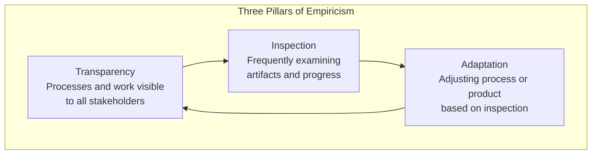
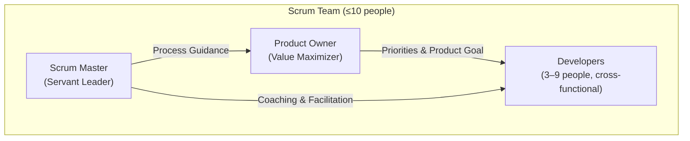
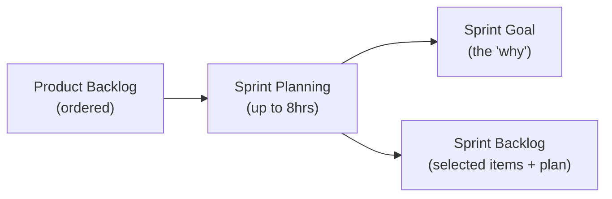
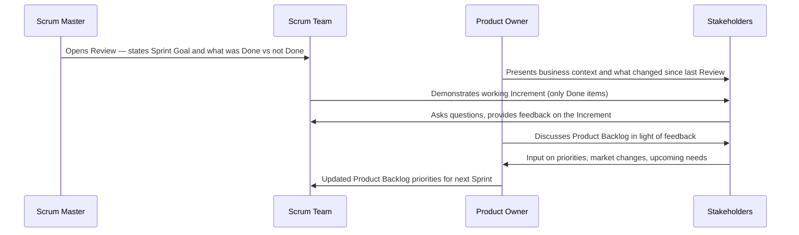
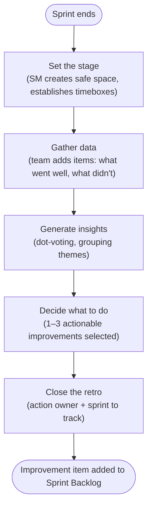
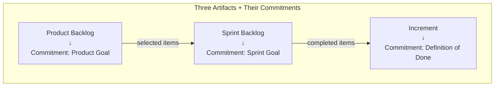
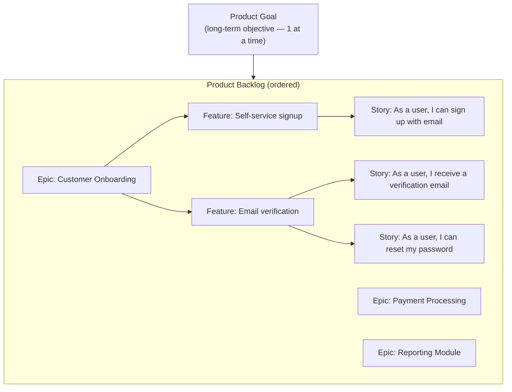
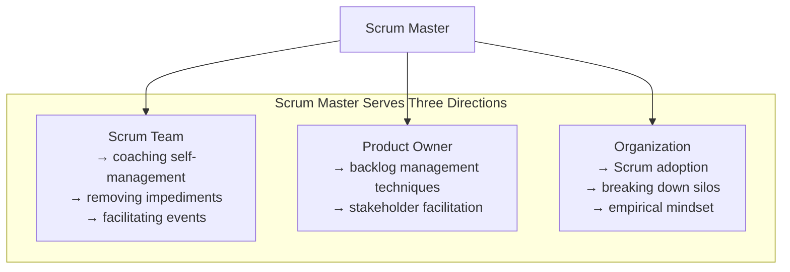

# Scrum Master Full Course

> **Source:** [YouTube — Scrum Master Full Course | Scrum Master Certifications Training | Scrum Master Tutorial](https://www.youtube.com/watch?v=SyIN_YMfoQs)
> **Channel/Event:** Simplilearn
> **Topic:** Scrum, Agile, Scrum Master, Product Owner, Ceremonies, Artifacts, Sprint, SAFe, CSM, PSM
> **Key Claim:** Scrum is a lightweight framework for generating value through adaptive solutions for complex problems — built on three roles, five events, and three artifacts.

---

## Table of Contents

1. [Overview](#1-overview)
2. [Why Scrum? The Problem It Solves](#2-why-scrum-the-problem-it-solves)
3. [Core Concepts — Empiricism & the 3-5-3 Rule](#3-core-concepts--empiricism--the-3-5-3-rule)
4. [Scrum Values](#4-scrum-values)
5. [Scrum Team Roles](#5-scrum-team-roles)
6. [Scrum Events — The Five Ceremonies](#6-scrum-events--the-five-ceremonies)
7. [Scrum Artifacts & Commitments](#7-scrum-artifacts--commitments)
8. [The Sprint — Container for Everything](#8-the-sprint--container-for-everything)
9. [Scrum Master Deep Dive](#9-scrum-master-deep-dive)
10. [Scrum Master vs Project Manager](#10-scrum-master-vs-project-manager)
11. [Scrum Master Certifications](#11-scrum-master-certifications)
12. [Interview Talking Points](#12-interview-talking-points)
13. [Learning Resources](#13-learning-resources)

---

## 1. Overview

Scrum is a lightweight agile framework for developing, delivering, and sustaining products in complex environments. Created by Ken Schwaber and Jeff Sutherland in the early 1990s and formalized in the Scrum Guide (last updated 2020), it provides just enough structure to enable empirical process control while leaving implementation details to the team. The Scrum Master is the role responsible for ensuring the team understands and lives Scrum — acting as a servant leader, coach, and impediment remover rather than a traditional manager.

### Business Conversation Example

**Context:** A newly hired Scrum Master introducing themselves to an engineering director accustomed to traditional project management.

> **Engineering Director:** "Welcome aboard. So are you our new project manager? We've been needing someone to track tasks and make sure the team hits deadlines."
>
> **SM:** "I appreciate the context — it helps me understand what the team has been missing. My role is a bit different from a traditional PM. I'm a Scrum Master, which means my job is to make the team more effective, not to manage tasks. I don't assign work or own the delivery plan. The team owns that."
>
> **Engineering Director:** "So what do you actually do? If you're not tracking work, how do we know we're going to ship on time?"
>
> **SM:** "I remove the things in the team's way — technical dependencies, unclear requirements, missing decisions that are blocking progress. I also coach the team on Scrum practices so that our sprints produce predictable, shippable increments. Over the next two sprints, I'd expect to reduce your weekly fire-fighting by about 40% just by getting our impediment-removal process working properly."
>
> **Engineering Director:** "That sounds useful. What do you need from me?"
>
> **SM:** "Access to you when we hit an organizational blocker I can't resolve at team level — something that needs a decision above our team. I'd rather bring that to you early with an impact statement than let it sit until it's a crisis."

**Why this works:** The SM resists being absorbed into a PM role by immediately clarifying the difference — not defensively, but by pivoting to what's in it for the director: less fire-fighting, predictable delivery. The concrete "40% reduction" makes it real rather than theoretical. The closing ask gives the director a specific small action to take immediately.

---

## 2. Why Scrum? The Problem It Solves

### Classic Waterfall Pain Points

| Problem | Impact |
|---|---|
| Requirements locked upfront | Changes are costly and slow |
| Long delivery cycles (6–18 months) | Feedback arrives too late to act on |
| Siloed teams | Handoffs create delay and misunderstanding |
| "Big bang" delivery | All risk concentrated at release |
| No mechanism for continuous improvement | Teams repeat the same mistakes sprint after sprint |

> **Key Insight:** "Scrum replaces a programmatic approach with a heuristic one — creating opportunities for inspection and adaptation at regular intervals rather than executing a fixed plan."

### Scrum's Answer

```
Traditional: Plan → Build → Test → Release (one big cycle)

Scrum:       [Sprint 1: Plan→Build→Test→Release increment]
              → [Sprint 2: Plan→Build→Test→Release increment]
              → [Sprint N: ...]

Each Sprint produces a potentially shippable increment.
Feedback is gathered continuously. Plan adapts each cycle.
```

### Business Conversation Example

**Context:** An Agile coach presenting to a CTO whose organization just experienced a failed 12-month waterfall delivery.

> **Agile Coach:** "The reason your last delivery went 6 months late and still needed 3 months of post-launch fixes isn't a resourcing problem — it's a feedback problem. Your team built for 12 months on requirements written 12 months earlier. Scrum's answer to that is: produce something shippable every 2 weeks and put it in front of users."
>
> **CTO:** "We tried Agile 3 years ago. Everyone renamed their Gantt charts to 'sprints' and nothing changed."
>
> **Agile Coach:** "That's a common pattern — it's called 'Wagile.' You got the terminology without the empirical process. The difference this time would be: every 2 weeks, stakeholders see real working software and give real feedback. Not a status report. Not a demo of 80%-done screens. Working software."
>
> **CTO:** "How long before we see results?"
>
> **Agile Coach:** "Most teams see a measurable improvement in predictability by Sprint 3 — that's 6 weeks. I'd recommend we run a 90-day pilot with one team and measure sprint goal completion rate, impediment resolution time, and stakeholder satisfaction. At week 12 we evaluate whether to scale."

**Why this works:** The coach diagnoses the real problem (feedback latency) rather than pitching Scrum abstractly. Addressing the "we tried Agile" objection head-on — with the term "Wagile" — shows experience and earns credibility. A 90-day, measurable pilot proposal reduces the CTO's perceived risk and gives a clear decision point rather than an open-ended commitment.

---

## 3. Core Concepts — Empiricism & the 3-5-3 Rule

### Three Pillars of Empiricism

Scrum is founded on empirical process control theory — decisions are based on observation and experimentation, not prediction.



| Pillar | What it means in practice |
|---|---|
| **Transparency** | Definition of Done is shared; Backlog is visible to all; burndown is public |
| **Inspection** | Daily Scrum, Sprint Review, and Retrospective are all inspection events |
| **Adaptation** | Backlog is re-ordered; Sprint plan adjusts; team process improves each sprint |

### The 3-5-3 Rule

A memory aid for the structural core of Scrum:

```
3 Roles      →  Scrum Master · Product Owner · Developers
5 Events     →  Sprint · Sprint Planning · Daily Scrum · Sprint Review · Sprint Retrospective
3 Artifacts  →  Product Backlog · Sprint Backlog · Increment
```

### Business Conversation Example

**Context:** A Scrum Master using Sprint velocity data to push back on a sponsor demanding the original delivery date be kept despite scope growth.

> **SM:** "At the Sprint 4 Review, I want to show you something. We've averaged 32 story points per Sprint. The remaining backlog — after the 3 scope additions last month — is 180 points. At current velocity, that's 5.6 more sprints, which puts us at mid-November, not September."
>
> **Sponsor:** "The September date is fixed. That's what we committed to leadership."
>
> **SM:** "I understand. So we have three levers: reduce scope, increase the team, or extend the date. I can't make all three variables fit without one of them moving. What I can do is show you, right now, which stories in the backlog deliver the most business value — and we descope the rest for a Phase 2."
>
> **Sponsor:** "How much would we need to cut to hit September?"
>
> **SM:** "About 60 points — roughly 30% of what's left. The Product Owner has already identified 4 epics that could move to Phase 2 without breaking the core use case. I'd like to walk you through those in the next 20 minutes."

**Why this works:** The SM uses actual Sprint data (32 pts/sprint, 180 remaining) rather than gut feel — empiricism in action. By presenting three options instead of delivering bad news, the SM shifts the conversation from problem to decision. Offering to show the descope candidates immediately makes the meeting productive rather than theoretical.

---

## 4. Scrum Values

The five Scrum values guide how the team works together. They reinforce — and are reinforced by — the framework's events and artifacts.

| Value | What it looks like in practice |
|---|---|
| **Commitment** | Team commits to the Sprint Goal, not just a list of tasks |
| **Focus** | Team works only on Sprint Backlog items during the Sprint |
| **Openness** | Progress, impediments, and mistakes are shared transparently |
| **Respect** | Each member is trusted as a capable professional |
| **Courage** | Raising blockers early; saying "no" to scope additions mid-sprint |

### Business Conversation Example

**Context:** A developer demonstrating the Scrum value of Courage by raising a scope concern on Sprint day 1 — before it becomes a Sprint failure.

> **Developer:** "I looked at the Authentication story overnight. It's more complex than we estimated. The OAuth integration alone is probably 8 points — and we have a 5-point estimate on the whole story. I don't think we can complete it this sprint."
>
> **SM:** "Thank you for raising that today and not on the last day of the sprint. What do you propose?"
>
> **Developer:** "We either split the story — deliver the basic login flow this sprint and defer OAuth to next — or we reduce something else to make room. I'd rather negotiate scope now than overpromise and fail."
>
> **SM:** "That's exactly right. Let me bring this to the Product Owner now so we can make that trade-off in the first 24 hours, not the last 24. What's the minimum viable piece of the Authentication story that still has value?"
>
> **Developer:** "Basic email/password login — 3 points. OAuth can be Sprint 6."
>
> **SM:** "Good. I'll set up 15 minutes with the PO this morning."

**Why this works:** This is the Scrum value of Courage made concrete — raising a problem when it's still solvable, not after it's become a failure. The developer doesn't hide the estimate error; they bring a proposal. The SM's response ("thank you for raising that today") reinforces this behavior, making it safe to surface problems early — which is exactly what inspection and adaptation requires.

> **Interview tip:** "When asked about Scrum values, don't just list them — show them in action. Commitment is about the Sprint Goal, not tasks. Courage means a developer says 'this story is too big to complete this sprint' on day 1, not day 10."

---

## 5. Scrum Team Roles

The Scrum Team is a single, cohesive unit — no sub-teams, no hierarchy. Typically 10 or fewer people. Cross-functional: all skills needed to create value are present within the team.

### Architecture



### 5.1 Product Owner

**One person, not a committee.** Maximizes the value the product creates for users, customers, and the business.

| Responsibility | Detail |
|---|---|
| Product Goal | Defines and communicates the long-term objective |
| Product Backlog | Creates, orders, and continuously refines it |
| Backlog transparency | Ensures all stakeholders understand backlog content and priority |
| Stakeholder engagement | Sole interface between business and Scrum Team for priority decisions |

> **Key rule:** Developers may speak to stakeholders, but priority decisions go through the Product Owner. If someone else gives priority directions to developers, the Product Owner's effectiveness is undermined.

### Business Conversation Example

**Context:** A Product Owner responding to a business director who has gone directly to the development team with a new feature request.

> **Business Director:** "I mentioned to the dev team last Tuesday that I needed the export feature by next Friday. They said it would take about 5 points. Can you make sure that gets into this sprint?"
>
> **PO:** "I appreciate the heads-up. Going forward, any new requests need to come through me first — not because of process for its own sake, but because I need to evaluate every request against the current Sprint Goal and the backlog. Right now, adding 5 points mid-sprint means something else doesn't get done."
>
> **Business Director:** "It seemed like a small ask."
>
> **PO:** "Each individual request looks small. The Sprint Backlog has 3 other 'small asks' from 3 other stakeholders this month. Taken together, they're 18 points — more than half a sprint. The team can't complete the checkout feature if we fragment their focus. I'll add the export feature to the backlog today and we can discuss priority at next Sprint Planning. What's driving the Friday timeline?"
>
> **Business Director:** "We have a board presentation. If the export isn't ready, I'll have to pull data manually."
>
> **PO:** "That's a legitimate need. Let me see if we can carve out 2 hours for a one-time CSV export script — that's different from building the feature. Would that solve the board presentation problem?"

**Why this works:** The PO redirects immediately without being dismissive — explaining the business cost (fragmented focus) rather than citing process rules. The discovery question surfaces the real need (board presentation) versus the requested solution (export feature), opening a faster alternative. This is the PO acting as value maximizer, not just backlog curator.

### 5.2 Scrum Master

The accountable servant leader for the Scrum Team's effectiveness. Not a project manager; not a team lead. Coaches the team on self-management and cross-functionality.

**Serves the team by:**
- Coaching members in self-management and cross-functionality
- Helping focus on high-value increments meeting the Definition of Done
- Removing impediments to the team's progress
- Ensuring Scrum events are positive, productive, and timeboxed

**Serves the Product Owner by:**
- Helping find techniques for effective Product Goal definition and backlog management
- Facilitating stakeholder collaboration on demand

**Serves the organization by:**
- Leading, training, and coaching Scrum adoption
- Planning and advising Scrum implementations
- Removing barriers between stakeholders and Scrum Teams

### Business Conversation Example

**Context:** A Scrum Master having a 1:1 with a senior developer who is frustrated that the SM "doesn't seem to do anything."

> **Senior Dev:** "Honestly, I'm not sure what value you're adding. You sit in meetings and ask questions. The old project manager at least made decisions."
>
> **SM:** "That's fair feedback and I want to address it directly. My job isn't to make your technical decisions — you're better at those than I am. My job is to make sure nothing's in your way. Tell me: what's the one thing in the last two weeks that slowed you down the most?"
>
> **Senior Dev:** "The staging environment has been broken for 6 days. DevOps keeps saying they'll fix it."
>
> **SM:** "Six days is unacceptable. I should have picked that up in the Daily Scrum. Why wasn't it flagged as an impediment?"
>
> **Senior Dev:** "We didn't think you'd be able to do anything about it."
>
> **SM:** "Let me fix that today. I'll escalate to the DevOps lead with an impact statement: 6 days × 4 developers × 3 hours/day = 72 hours of developer time lost this sprint. I'll have an answer for you by end of day. If I can't resolve it by tomorrow morning, I'll escalate to the Engineering Director."
>
> **Senior Dev:** "If you can actually get that fixed, that would be more useful than any meeting."

**Why this works:** The SM doesn't get defensive — they use the complaint as diagnostic data, asking "what slowed you down most?" That question shifts from abstract criticism to concrete impediment. Quantifying the impact (72 hours lost) before escalating gives the SM credibility and gives the DevOps lead a compelling reason to act. Committing to a same-day answer demonstrates servant leadership in action.

### 5.3 Developers

Everyone on the team who creates work in the Sprint — not just engineers. Designers, testers, analysts all count as Developers in Scrum terminology. The Scrum Guide uses "Developers" to emphasize the cross-functional nature of the role — anyone who contributes to creating the Increment is a Developer.

**Accountable for:**
- Creating the Sprint plan (Sprint Backlog)
- Maintaining quality by adhering to the Definition of Done
- Adapting their plan daily toward the Sprint Goal
- Holding each other accountable as professionals

### Developer Workflow Within a Sprint

```mermaid
sequenceDiagram
    participant PO as Product Owner
    participant Dev as Developers
    participant SM as Scrum Master

    PO->>Dev: Presents top backlog items + Sprint Goal
    Dev->>Dev: Sprint Planning — select items, create Sprint Backlog
    loop Every Day
        Dev->>Dev: Daily Scrum (15 min): inspect + adapt plan
        Dev->>Dev: Development work toward Sprint Goal
        SM->>Dev: Removes impediments as raised
    end
    Dev->>PO: Sprint Review — demonstrate Increment
    PO->>Dev: Feedback; backlog adjusted
    Dev->>Dev: Sprint Retrospective — process improvements
```

### Traditional Developer vs Scrum Developer

| Dimension | Traditional Developer | Scrum Developer |
|---|---|---|
| **Task assignment** | Assigned by manager or tech lead | Self-selects from Sprint Backlog |
| **Scope** | Specialist (e.g., backend only) | Cross-functional — helps wherever team needs it |
| **Quality gate** | QA team checks after delivery | Definition of Done applied by Developer before marking Done |
| **Planning involvement** | Receives spec; estimates on request | Owns Sprint Planning; builds the Sprint Backlog |
| **Accountability** | To manager | To Sprint Goal and to teammates |

### Business Conversation Example

**Context:** A Scrum Master coaching a manager who wants to pre-assign stories to specific developers before Sprint Planning.

> **Manager:** "I've set up a spreadsheet. I've already assigned each story to the developer who's the best fit. Can you use that in Sprint Planning?"
>
> **SM:** "I understand the intent — you want to make sure the right people work on the right things. The issue is that in Scrum, the Developers self-select their work. If I go into Sprint Planning with pre-assigned stories, we lose two things: the team's commitment to what they chose, and the ability to flex when one developer gets blocked and another could help."
>
> **Manager:** "But if we let everyone self-assign, the junior devs will grab the easy stories."
>
> **SM:** "That's a real concern. Here's what I'd suggest: in Sprint Planning, the team selects stories together as a unit, starting from the top of the ordered backlog. I'll coach the senior developers to take on the harder items first. But the decision has to be theirs — if it's imposed, we lose psychological ownership, and that's what drives teams to flag problems early instead of hiding them."
>
> **Manager:** "Fine. But I want a check-in after Sprint 1 to see if it worked."
>
> **SM:** "Absolutely. Let's look at story completion rate and whether the Sprint Goal was met. That's the empirical test."

**Why this works:** The SM explains the business cost of imposed assignment — loss of commitment and flexibility — rather than citing Scrum rules. Offering a concrete coaching approach ("I'll coach senior devs to take harder items") addresses the manager's real concern without reverting to task assignment. The offer of an empirical check-in at Sprint 1 turns this into a hypothesis to test, not a debate to win.

> **Interview tip:** "When asked about the Developer role in Scrum, say: In Scrum, every team member who creates work is a Developer — not just engineers. A BA writing acceptance criteria, a designer creating wireframes, a tester writing automated tests — all Developers. The key shift is that Developers self-organize around the Sprint Goal rather than waiting for assignments. They pull work; it isn't pushed to them."

---

## 6. Scrum Events — The Five Ceremonies

All events are timeboxed. The timebox creates focus and a forcing function for decisions. Events that go over timebox are a signal of poor preparation, not complex topics.

### Event Timebox Reference

| Event | Timebox (1-month Sprint) | Scales to shorter sprints |
|---|---|---|
| **Sprint** | ≤ 1 month | Fixed per team; commonly 2 weeks |
| **Sprint Planning** | 8 hours | ~4 hours for 2-week sprint |
| **Daily Scrum** | 15 minutes | Fixed regardless of sprint length |
| **Sprint Review** | 4 hours | ~2 hours for 2-week sprint |
| **Sprint Retrospective** | 3 hours | ~1.5 hours for 2-week sprint |

### 6.1 Sprint Planning

Opens every Sprint. The entire Scrum Team attends. Three topics are addressed:

1. **Why** — What is the Sprint Goal? (gives the Sprint purpose and focus)
2. **What** — Which Product Backlog items can be Done in this Sprint?
3. **How** — How will the selected work get done? (developers decompose into tasks)



### Business Conversation Example

**Context:** A Scrum Master opening Sprint Planning after the previous sprint was poorly planned — the team had no Sprint Goal and ended with 40% of stories incomplete.

> **SM:** "Before we pull items from the backlog, I want to spend 10 minutes on the Sprint Goal. Last sprint we picked 11 stories and ended with 4 incomplete because we had no unifying objective. A Sprint Goal isn't 'work on everything in the backlog.' What's the one outcome the business most needs from us in the next 2 weeks?"
>
> **Product Owner:** "The checkout flow needs to be end-to-end testable. Finance is waiting to run their UAT."
>
> **SM:** "Good. So the Sprint Goal is: 'Enable Finance to run end-to-end UAT on the checkout flow.' Everything we pull into this sprint should contribute to that goal. If a story doesn't connect to it, we leave it for next sprint. Does the team agree?"
>
> **Developer:** "What about the reporting bug? That's been on the backlog for 3 sprints."
>
> **SM:** "Does the reporting bug block Finance's UAT?"
>
> **Developer:** "No."
>
> **SM:** "Then it waits. We'll add it to the top of the backlog for Sprint 7 Planning. One goal, focused sprint. Let's start pulling stories."

**Why this works:** The SM opens by diagnosing the previous sprint's failure (no Sprint Goal) before touching the backlog. Defining the Sprint Goal first — and using it as a filter for every story — is how Scrum is supposed to work. The exchange about the reporting bug demonstrates the Sprint Goal in action: it gives the team a decision framework, not just a task list.

### 6.2 Daily Scrum

15-minute event for Developers **only** (Scrum Master facilitates if needed; Product Owner may attend but doesn't speak unless also a Developer). Same time and place each day to reduce complexity.

**Purpose:** Inspect progress toward the Sprint Goal; adapt the Sprint Backlog as necessary.

Three classic questions (not mandated by Scrum Guide, but commonly used):
- What did I do yesterday that helped the team meet the Sprint Goal?
- What will I do today to help the team meet the Sprint Goal?
- Do I see any impediments that prevent me or the team from meeting the Sprint Goal?

> **Anti-pattern:** The Daily Scrum becomes a status report to the Scrum Master. It should be a planning session for the Developers — the Scrum Master owns facilitation, not the content.

### Business Conversation Example

**Context:** A Scrum Master addressing a team where developers have been giving status reports to the SM in the Daily Scrum instead of planning with each other.

> **SM:** "I want to change something about our Daily Scrum. For the last 3 sprints, everyone has been reporting to me: 'Yesterday I did X, today I'll do Y.' I'm not the audience. The Sprint Goal is. I'm going to step back from the whiteboard. From now on, I want each of you to speak to the team — specifically to anyone who needs to know what you're working on or who might be blocked by your work."
>
> **Developer A:** "So we just... talk to each other?"
>
> **SM:** "Exactly. Start with the Sprint Goal. Are we on track? What did you complete yesterday that moves us toward it? What are you picking up today? And critically — is anything in your way?"
>
> **Developer B:** "I've been blocked on the API contract for 2 days. I didn't want to mention it because I thought it might resolve itself."
>
> **SM:** "That's exactly the kind of thing this event is for. Two days on a blocker without it surfacing is two days of lost sprint progress. I'll take ownership of the API contract issue now — I'll have a resolution by tomorrow's Daily Scrum."

**Why this works:** The SM corrects the anti-pattern (SM as audience) without blaming the team — framing the Daily Scrum as a tool that benefits them. By stepping back physically, the SM signals the ownership shift. Developer B's hidden 2-day blocker surfaces in the first retrained session, and the SM demonstrates impediment removal within 24 hours — making the value of the format immediately visible.

### 6.3 Sprint Review

Held at the end of the Sprint. The Scrum Team presents the Increment to stakeholders. It is a **working session**, not a demo show — the team and stakeholders collaborate on what to do next.

**Output:** Revised Product Backlog reflecting new priorities based on feedback.

**What it is NOT:** An approval gate. The increment is potentially releasable regardless of whether the Sprint Review happened.

### Sprint Review Flow



### Sprint Review vs Sprint Retrospective

| Dimension | Sprint Review | Sprint Retrospective |
|---|---|---|
| **Focus** | The **product** (what was built) | The **process** (how the team worked) |
| **Attendees** | Scrum Team + stakeholders | Scrum Team only |
| **Output** | Revised Product Backlog | Process improvement committed to next sprint |
| **Tone** | Collaborative demo + feedback | Candid team reflection |
| **Driven by** | Product Owner facilitates content | Scrum Master facilitates the session |

### Business Conversation Example

**Context:** A Scrum Master running a Sprint Review where stakeholders are used to receiving PowerPoint status decks rather than seeing working software.

> **Stakeholder:** "Can you send the deck beforehand so I know what I'm looking at?"
>
> **SM:** "There's no deck. We're going to show you the actual software — what's working today. We want your reactions in real time, not your reactions to slide descriptions. The whole point is for you to see reality, not a representation of it."
>
> **Stakeholder:** "That sounds risky. What if it's not polished?"
>
> **SM:** "Everything we show today meets our Definition of Done — tested, reviewed, ready to deploy. What we need from you is feedback that changes what we build next sprint — not approval of what we've already built. Can I show you the checkout flow first?"
>
> **Stakeholder:** "Sure. But I have a concern about address validation — we mentioned it in the requirements."
>
> **SM:** "That's exactly the kind of thing we want to hear today. Show me the specific scenario and we'll see how it behaves. If it needs a change, the Product Owner will add it to the backlog and prioritize it for next sprint."

**Why this works:** The SM reframes "risky" (showing real software) as exactly the point — if it's broken, stakeholders need to know now, not after 6 more months of building on a broken foundation. "Feedback that changes what we build next sprint" is the core value proposition of empiricism. The stakeholder's concern about address validation is welcomed as evidence the format is working — not as a problem.

> **Interview tip:** "When asked about the Sprint Review, say: It's a working session, not a showcase. The goal is not to impress stakeholders — it's to inspect the Increment and adapt the Product Backlog based on what we learned. The most valuable Sprint Reviews are where stakeholders say 'actually, now that I see this, I'd rather you do X instead of Y next sprint.' That's empiricism in action."

### 6.4 Sprint Retrospective

The last event of the Sprint. The team reflects on the **process** (not the product — that's the Review). Timeboxed to 3 hours for a 1-month Sprint.

Three questions:
- What went well?
- What did not go well?
- What will we commit to improving next Sprint?

**Output:** At least one actionable improvement added to the next Sprint Backlog.

**Timebox:** 3 hours for a 1-month Sprint. Maximum — end early if done.

### Common Retrospective Formats

| Format | How it works | Best for |
|---|---|---|
| **Start / Stop / Continue** | Team lists: start doing, stop doing, keep doing | Teams new to retros |
| **Mad / Sad / Glad** | Emotional framing of events | Teams needing psychological safety conversations |
| **4Ls** (Liked, Learned, Lacked, Longed for) | Four-quadrant reflection | More structured teams |
| **5 Whys** | Root-cause drill-down on a specific problem | Teams with a recurring issue to solve |
| **Sailboat** | Wind (what helps), anchors (what slows), rocks (risks), island (goal) | Teams wanting a visual metaphor |

### Retrospective Flow



### Business Conversation Example

**Context:** A Scrum Master opening a retrospective after 3 consecutive sprints where the retro produced complaints but no committed improvements.

> **SM:** "Before we start today, I want to name something. For 3 sprints, we've surfaced issues in the retro and nothing has changed. That's not a reflection on the team — it means our retrospective isn't producing actionable output. Today we're using 5 Whys on one specific recurring problem. Which problem is most worth solving?"
>
> **Developer:** "Testing always piles up at the end of the sprint. We're always rushing QA in the last 2 days."
>
> **SM:** "Good. Why does testing pile up at the end?"
>
> **Developer:** "Because stories only go to QA when development is done."
>
> **SM:** "Why does QA only start after development is done?"
>
> **Developer:** "We don't involve QA in story planning. They don't know what's coming until it's handed over."
>
> **SM:** "So the root cause isn't too many stories — it's that QA is a downstream step, not a concurrent one. What's one change we can make this sprint to fix that?"
>
> **Developer:** "QA writes acceptance criteria with us during refinement — before the sprint starts."
>
> **SM:** "That's our improvement for Sprint 8. Who owns it?"
>
> **Developer:** "I'll work with QA to set that up."
>
> **SM:** "That action item goes into the Sprint Backlog today — your name, due end of week 1."

**Why this works:** The SM diagnoses why the retro has been failing (no actionable output) and changes the format before the content. 5 Whys digs to the real root cause (QA is downstream, not concurrent) rather than treating the symptom (end-of-sprint testing rush). Committing the improvement to the Sprint Backlog with an owner and due date is what transforms a venting session into an improvement that actually happens.

> **Interview tip:** "When asked about retrospectives, say: The output I care about is the one committed improvement that makes it into the next Sprint Backlog as an action item with an owner. Retros without that artifact are just venting sessions. I also watch for the same issues surfacing retro after retro — that's a signal the team identified a symptom, not the root cause. That's when I introduce 5 Whys."

### 6.5 Backlog Refinement (Not a Scrum Event)

Not defined as a Scrum event in the Scrum Guide, but a common team practice. The team reviews upcoming backlog items — breaking down epics, clarifying acceptance criteria, estimating complexity. Goal: keep the top of the backlog sprint-ready at least 2 sprints ahead.

**Recommended time investment:** No more than 10% of the team's capacity per Sprint (approximately 4 hours for a 2-week sprint with a 5-person team).

### What Happens in Backlog Refinement

| Activity | Who leads | Output |
|---|---|---|
| Break epics into user stories | Product Owner + Developers | Stories sized appropriately for one Sprint |
| Write / review acceptance criteria | Product Owner (BA assists) | Stories meet Definition of Ready |
| Estimate complexity | Developers (using story points or T-shirt sizes) | Backlog items have relative estimates |
| Identify dependencies | Scrum Master facilitates | Dependencies flagged before Sprint Planning |
| Clarify requirements | PO answers developer questions | No ambiguity entering Sprint Planning |

### Definition of Ready (DoR)

The DoR is a team agreement that defines when a backlog item is ready to be pulled into a Sprint. It is **not** in the Scrum Guide but is a widely used practice.

Common DoR checklist:
- [ ] User story written in "As a / I want / So that" format
- [ ] Acceptance criteria defined and agreed
- [ ] Dependencies identified
- [ ] Estimated by the team
- [ ] Small enough to complete within one Sprint

### Business Conversation Example

**Context:** A Scrum Master persuading a Product Owner to invest time in mid-sprint refinement after Sprint Planning ran 3 hours over timebox.

> **SM:** "Our Sprint Planning ran 5 hours today when it should be 4. Do you know why?"
>
> **PO:** "Too many questions from the team about requirements."
>
> **SM:** "Exactly. The stories that caused the most questions had no acceptance criteria and hadn't been estimated. We spent Sprint Planning doing refinement. That's backwards. I need 90 minutes from you on Wednesday — mid-sprint, every sprint — to refine the top 8–10 stories so they're sprint-ready before Planning."
>
> **PO:** "I don't have 90 minutes every week. I'm in stakeholder meetings constantly."
>
> **SM:** "A 5-hour Sprint Planning costs the whole team — that's 5 hours × 7 people = 35 person-hours of wasted time, every sprint. Ninety minutes of refinement with you saves 35 hours of everyone else's time. Also: if we enter Sprint Planning with unrefined stories, the team can't commit to a Sprint Goal — we end up with a vague sprint and missed stories."
>
> **PO:** "Fine. Wednesday at 2 PM. But I need an agenda."
>
> **SM:** "I'll own the agenda. We'll go through the top 10 backlog items, you'll write AC for the top 5 with the team, and we'll estimate the rest. I'll keep it to 60 minutes."

**Why this works:** The SM quantifies the cost of skipping refinement (35 person-hours) instead of arguing for process compliance. Converting the abstract "we should refine" into a number the PO can compare to 90 minutes of their time makes the ROI undeniable. Offering to own the agenda removes the friction that's driving the PO's resistance — making it easy to say yes.

> **Interview tip:** "When asked about backlog refinement, say: It's not a Scrum event, but it's the work that makes Sprint Planning fast. If items aren't refined before Sprint Planning, the team spends the 8-hour timebox doing refinement instead of planning — and that's a smell. I schedule refinement mid-sprint, not the day before Planning. I also watch the queue depth: if we don't have at least 2 sprints of refined, estimated stories at the top of the backlog, we're one crisis away from a failed Sprint Planning."

---

## 7. Scrum Artifacts & Commitments

Each artifact has a **commitment** — a formal quality standard that provides focus and enables measurement of progress.



### 7.1 Product Backlog

An emergent, ordered list of everything needed to improve the product. Single source of work for the Scrum Team. Never "complete" — it evolves as the product and market evolve.

- **Ordered** (not prioritized) — the top items are more refined, smaller, and better understood
- **Commitment: Product Goal** — the long-term objective for the Scrum Team; only one at a time

### Product Backlog Structure



**The further down the backlog, the coarser the items.** Epics at the bottom are fine; stories at the top must meet the Definition of Ready before Sprint Planning.

| Backlog Zone | Item size | Refinement level |
|---|---|---|
| Top 2 sprints | Stories — small, estimated | Meets DoR; ready for Sprint Planning |
| Next 2–4 sprints | Features — medium | Partially refined; needs AC and sizing |
| Beyond 4 sprints | Epics — large | Just an idea; may be removed or reprioritized |

### Business Conversation Example

**Context:** A Product Owner explaining to a business analyst why two stakeholder "high priority" items cannot both be at the top of the backlog.

> **Business Analyst:** "Both the Finance Director and the Operations Head have marked their requests as Priority 1. How do we handle that?"
>
> **PO:** "We don't. The backlog has one item at position 1, one at position 2. Not two Priority 1s. My job is to order the backlog — not prioritize by stakeholder rank."
>
> **Business Analyst:** "But both of them are senior leaders. They'll both push back."
>
> **PO:** "Which is exactly why I need the data to make this conversation factual. What is the cost of delay for each request? Which one generates more revenue if we build it first? Once I have those numbers, I can tell both stakeholders: 'Here is why item A is at position 1 and item B is at position 2 this sprint.' It's a business decision, not a political one."
>
> **Business Analyst:** "The Finance request affects month-end close — if it's not done by the 28th, Finance will do it manually and it takes 8 hours."
>
> **PO:** "That's a hard deadline with a quantified cost: 8 person-hours of manual work per month, indefinitely. Finance goes to position 1. What's the impact of delaying the Operations request?"
>
> **Business Analyst:** "Operations said it would be good to have 'eventually.'"
>
> **PO:** "Then it waits. Position 1 is Finance. Operations is position 3 after the checkout story."

**Why this works:** The PO frames the ordering decision as a business analysis exercise, not a stakeholder politics exercise. Asking for cost-of-delay data for each item forces a factual conversation instead of a competing-preferences impasse. The contrast between "hard deadline with $X cost per month" and "good to have eventually" makes the ordering obvious — and defensible to both stakeholders when it's challenged.

> **Interview tip:** "When asked about the Product Backlog, make the 'ordered, not prioritized' distinction. Prioritized implies a subjective ranking. Ordered means there is exactly one item at position 1, one at position 2. The PO makes precise ordering decisions — not group voting. Also: the backlog is never done. A team that says 'we finished all our backlog items' has stopped discovering user needs."

### 7.2 Sprint Backlog

Composed of three things:
- The **Sprint Goal** (why — the single objective)
- The **selected Product Backlog items** (what — pulled by Developers)
- A **plan for delivering them** (how — tasks created by Developers)

Created **by and for Developers** — the Product Owner doesn't build it. It is a real-time picture of the work Developers plan to accomplish during the Sprint.

- **Commitment: Sprint Goal** — the single objective for the Sprint; flexible on scope, fixed on goal

### Sprint Backlog vs Product Backlog

| Dimension | Product Backlog | Sprint Backlog |
|---|---|---|
| **Owner** | Product Owner orders it | Developers create and own it |
| **Scope** | Everything the product needs | Only what's committed for this Sprint |
| **Stability** | Changes continuously | Protected during Sprint; only Developers can change it |
| **Granularity** | Epics → Features → Stories | Stories → Tasks (hours-level) |
| **Visibility** | Visible to all stakeholders | Visible to all; owned by team |
| **Commitment** | Product Goal | Sprint Goal |

### Sprint Backlog in Practice

```
Sprint Goal: "Enable customers to complete checkout end-to-end"

Sprint Backlog:
├── Story: Payment form validation          [5 pts] — In Progress
│   ├── Task: Write validation logic        [3h] — Done
│   ├── Task: Unit tests                    [2h] — In Progress
│   └── Task: UI error messages             [1h] — To Do
├── Story: Order confirmation email         [3 pts] — To Do
└── Story: Inventory check on add-to-cart   [3 pts] — To Do
```

### Business Conversation Example

**Context:** A Scrum Master responding to a sales director who has asked the development team directly to add a demo feature during the current Sprint.

> **Sales Director:** "I've already told the dev team — just a small dashboard tweak, maybe 3 points. The client demo is Thursday."
>
> **SM:** "I understand the demo is Thursday and this matters to you. I need to explain what happens when we add work mid-sprint. The team committed to a Sprint Goal on Monday: 'Complete payment integration for Phase 1 launch.' Adding 3 points means either the payment integration story gets dropped or someone absorbs it in overtime. Neither is acceptable."
>
> **Sales Director:** "But the demo is for a $500K deal."
>
> **SM:** "That context changes things. If this is a $500K opportunity, the Product Owner needs to make a call: is it worth pausing the Sprint Goal? That's not my decision — it's theirs. What I can do is set up a 15-minute conversation between you and the PO in the next hour. If the PO decides this warrants interrupting the sprint, we'll formally descope something to make room. But I can't let a stakeholder add work to the Sprint Backlog unilaterally — it creates a precedent that breaks every sprint after this one."
>
> **Sales Director:** "Fine. Set up the call."

**Why this works:** The SM doesn't say "no" to a $500K deal — they escalate to the correct decision-maker (Product Owner) with the correct information (Sprint Goal at stake, $500K opportunity). The key line — "creates a precedent that breaks every sprint after this one" — explains the systemic consequence rather than citing process rules. The SM protects the process while respecting the business reality.

> **Interview tip:** "When asked about the Sprint Backlog, say: It belongs to the Developers. The Product Owner can't add to it during the Sprint without the team's agreement — and even then, something must come out to protect the Sprint Goal. I've seen teams lose sprints because the PO kept adding 'quick' tasks mid-sprint. Each one looks small; together they kill the goal. The Sprint Goal is the line in the sand — scope negotiates around it, not through it."

### 7.3 Increment

The sum of all completed Product Backlog items in the current and all previous Sprints. Must meet the Definition of Done. May be delivered to stakeholders at any time during the Sprint — not just at the Review.

- **Commitment: Definition of Done (DoD)** — a shared quality standard; if an item doesn't meet DoD, it isn't part of the Increment

| Item | Definition of Done Check | Result |
|---|---|---|
| Meets acceptance criteria | ✅ | Included in Increment |
| Code reviewed | ✅ | Included in Increment |
| Unit tested | ✅ | Included in Increment |
| Not code-reviewed | ❌ | Returns to Product Backlog |

### Business Conversation Example

**Context:** A Scrum Master responding to a developer who wants to mark a story as Done without completing the code review because the reviewer is out sick.

> **Developer:** "The story is functionally complete and tested. The reviewer is out sick — I'm going to mark it Done and we can do the review next sprint."
>
> **SM:** "If the code review isn't complete, the story doesn't meet our Definition of Done. It can't be marked Done or included in this Sprint's Increment."
>
> **Developer:** "That means we lose 5 points and miss the Sprint Goal."
>
> **SM:** "Missing the Sprint Goal is a real consequence and I take that seriously. But if we ship code that hasn't been reviewed, we don't know what's in it. Last quarter, we had 2 production incidents from unreviewed code — each one cost the team 2 days of rework. The DoD isn't bureaucracy; it's our protection."
>
> **Developer:** "Can someone else do the review?"
>
> **SM:** "Who on the team is closest to this area of the codebase?"
>
> **Developer:** "Probably Maya — she worked on the auth module."
>
> **SM:** "Can Maya do a 30-minute review this afternoon?"
>
> **Developer:** "I'll ask her now."
>
> **SM:** "Good. If we get the review done today, the story is Done and counts toward the Sprint Goal. If not, it goes back to the backlog — no exceptions."

**Why this works:** The SM enforces the DoD without being arbitrary — they immediately connect it to a real business cost (2 production incidents from unreviewed code). Rather than just refusing, the SM problem-solves: "Who else could review it?" This gives the developer a path to Done that respects the quality standard. The non-negotiable closing ("no exceptions") matters — a DoD with exceptions isn't a DoD.

---

## 8. The Sprint — Container for Everything

The Sprint is the heartbeat of Scrum. All other events occur inside a Sprint.

```
Sprint (1–4 weeks)
├── Sprint Planning          (Day 1)
├── Daily Scrum × N          (Every day)
├── Development Work         (All Sprint)
├── Backlog Refinement       (Ongoing, ~10% capacity)
├── Sprint Review            (Last day or day before)
└── Sprint Retrospective     (Final event)
```

**Rules during a Sprint:**
- No changes are made that endanger the Sprint Goal
- Quality does not decrease
- The Product Backlog is refined as needed
- Scope may be clarified and renegotiated with the Product Owner as more is learned

**Cancelling a Sprint:** Only the Product Owner can cancel a Sprint — and only if the Sprint Goal becomes obsolete. Rare in practice.

### Business Conversation Example

**Context:** A Scrum Master handling a sponsor who wants to redirect the development team to an urgent regulatory task 5 days into a 2-week sprint.

> **Sponsor:** "There's a regulatory audit in 3 weeks. I need the team to drop everything and build the audit trail feature. Starting today."
>
> **SM:** "I hear the urgency — a regulatory audit in 3 weeks is significant. One question first: when did this audit become known?"
>
> **Sponsor:** "We got the notice last Friday."
>
> **SM:** "Last Friday was after Sprint Planning. The team made commitments based on the Sprint Goal set Monday. If we redirect them now, we're cancelling the Sprint — and that's the Product Owner's call to make, not mine. I'll set up a call with you and the PO in the next 30 minutes. Before that call, I need you to have one number: what is the regulatory penalty if the audit trail is missing?"
>
> **Sponsor:** "The penalty could be up to $200K."
>
> **SM:** "Then the answer is probably yes — we cancel the sprint and redirect. But the team needs to hear that decision with the full context, not just 'drop everything.' I'll facilitate the conversation."
>
> **Sponsor:** "Fair. Let's do the call now."

**Why this works:** The SM doesn't refuse a $200K regulatory risk — they create the right decision-making process. By establishing that Sprint cancellation is the PO's call and asking for the penalty amount, the SM ensures the decision is made with full information, not reactive urgency. The team is protected from an arbitrary "drop everything" directive because the SM converts that into a formal Sprint cancellation — which is exactly what the Scrum Guide allows for when a Sprint Goal becomes obsolete.

---

## 9. Scrum Master Deep Dive

### Servant Leadership Model

The Scrum Master's authority is influence, not command. They lead by serving — removing obstacles, creating conditions for the team to self-manage, and protecting the process from anti-patterns.



### Common Scrum Master Anti-Patterns

| Anti-Pattern | What it looks like | Correct approach |
|---|---|---|
| **Command-and-control SM** | Assigns tasks, tracks hours, demands status | Facilitate; let team self-organize |
| **Status reporter** | Daily Scrum becomes a status meeting to the SM | SM facilitates; developers plan for each other |
| **Impediment hoarder** | SM lists blockers but doesn't remove them | Remove or escalate blockers within 24 hours |
| **Sprint scope expander** | Allows stakeholders to add work mid-sprint | Protect the Sprint Goal; new items go to backlog |
| **Proxy PM** | Takes meeting invites, shields team from all contact | Coach team to engage stakeholders directly |
| **Certification-only SM** | Has CSM cert but no coaching or facilitation skills | Skills > certification; invest in practice |

### Impediment Removal Process

```
Impediment raised in Daily Scrum
    ↓
Is it resolvable by the team within the Sprint?
    ↓ Yes → Team resolves; SM facilitates
    ↓ No  → SM takes ownership
              ↓
         Can SM resolve independently?
              ↓ Yes → Resolve within 24–48 hours
              ↓ No  → Escalate to Sponsor/Management with impact statement
                       "If [impediment] is not resolved by [date], [sprint goal is at risk / delivery delays N days]"
```

### Business Conversation Example

**Context:** A Scrum Master recognizing they have been acting as an "impediment hoarder" — taking blockers into meetings but not resolving them — and resetting the team's expectations.

> **Developer:** "The database migration issue has been in your impediments list for 8 days. It keeps appearing in the Daily Scrum but nothing happens."
>
> **SM:** "You're right, and that's on me. I listed it as an impediment and escalated it, but I didn't follow up with a deadline. That's not impediment removal — that's impediment documentation. I'm fixing it today."
>
> **Developer:** "What would 'fixed' look like?"
>
> **SM:** "By end of today, I will have either: a confirmed date from the database team when the migration runs — or an escalation to the Engineering Director with this statement: 'The database migration blocker has delayed 3 stories for 8 days. If it isn't resolved by Thursday, we lose the Sprint Goal and 2 weeks of team progress.' That's an impact statement — it gives the Engineering Director a reason to act."
>
> **Developer:** "And if they still don't fix it?"
>
> **SM:** "Then at Thursday's Daily Scrum I'll tell the team exactly what I did, who I escalated to, and what the response was. My job is to remove impediments or make the failure of removal transparent. Both of those protect the team."

**Why this works:** The SM models the anti-pattern correction in real time — acknowledging the failure ("that's not impediment removal, that's documentation") and naming the specific behavior that should have happened. Committing to a same-day escalation with a specific impact statement shows how impediment removal actually works. The closing commitment — "remove it or make the failure transparent" — is the honest definition of what a Scrum Master can and should promise.

---

## 10. Scrum Master vs Project Manager

This is one of the most common interview and workplace confusion points.

| Dimension | Project Manager | Scrum Master |
|---|---|---|
| **Authority** | Formal — owns project plan and resources | Informal — influence through coaching |
| **Focus** | Delivering to a fixed plan (scope, time, cost) | Enabling the team to deliver value iteratively |
| **Ownership** | Owns project outcomes | Team owns outcomes; SM removes blockers |
| **Planning** | Up-front detailed planning | Sprint-by-sprint; plan emerges from reality |
| **Success metric** | On-time, on-budget, on-scope delivery | Working software + team improvement velocity |
| **Relationship to team** | Assigns work; tracks performance | Coaches; protects; removes obstacles |
| **Meetings** | Chairs meetings; controls agenda | Facilitates meetings; serves the team's agenda |
| **Risk** | Identifies and reports risk | Creates conditions to surface risk early via inspection |
| **In SAFe** | May exist at program/portfolio level | Exists at team level in every Agile Release Train |

> **Key line:** "A PM asks 'Are we on plan?' A Scrum Master asks 'Is the team able to deliver value today, and what's in their way?'"

### Business Conversation Example

**Context:** A Scrum Master candidate in a job interview explaining the difference between their SM role and a Project Manager to a company that is new to Scrum.

> **Interviewer:** "Your last role was Scrum Master. How is that different from a Project Manager? We've had PMs here for years — I want to understand why we'd add a different role."
>
> **Candidate:** "The shortest answer: a PM owns the delivery plan. A Scrum Master owns the conditions that allow the team to execute. A PM asks 'are we on plan?' — I ask 'what's in the team's way today?' In my last organization, the team owned the sprint commitments. I was accountable for removing blockers and running the Scrum events. If we missed a Sprint Goal, the team and PM investigated scope and estimation; I investigated what impediment I missed."
>
> **Interviewer:** "Wouldn't a senior PM just do all of that?"
>
> **Candidate:** "A senior PM can do some of it — and in smaller organizations, roles overlap. The structural difference is authority. A PM has formal authority to assign tasks and track individuals. A Scrum Master has no formal authority — influence only. That difference changes how the team behaves. When a team member knows the SM can't rate their performance, they're more likely to surface problems honestly. That's actually what you want — early problem visibility."
>
> **Interviewer:** "Give me a concrete example of an impediment you removed."
>
> **Candidate:** "In Sprint 4, the team's test environment was broken for 3 days. I quantified the impact — 3 days × 4 developers × 4 hours/day of blocked work = 48 developer hours. I took that number to the DevOps manager and said: 'This is what the environment outage is costing the Sprint. Can we get a dedicated fix window today?' We had the environment restored by noon. The team regained 2 full days of sprint capacity."

**Why this works:** The candidate demonstrates the SM role through behavior, not definitions. "I ask 'what's in the team's way today?'" is more memorable than any framework slide. The specific example — 48 developer hours quantified, escalated with a number, resolved in 4 hours — makes the value claim concrete and credible. Acknowledging that "roles overlap in smaller orgs" shows maturity rather than defending turf.

---

## 11. Scrum Master Certifications

| Certification | Issuing Body | Level | Prerequisites | Format |
|---|---|---|---|---|
| **CSM** (Certified Scrum Master) | Scrum Alliance | Beginner | 2-day course required | 50 MCQs, 60 min |
| **PSM I** (Professional Scrum Master I) | Scrum.org | Beginner | None — self-study valid | 80 MCQs, 60 min, 85% pass |
| **PSM II** | Scrum.org | Advanced | PSM I recommended | 30 questions, 90 min, 85% pass |
| **PSM III** | Scrum.org | Expert | Extensive experience | Essay + MCQ, 120 min |
| **SSM** (SAFe Scrum Master) | Scaled Agile (SAFe) | Intermediate | SAFe training recommended | 45 MCQs, 90 min, 73% pass |
| **A-CSM** (Advanced CSM) | Scrum Alliance | Advanced | CSM + 1yr experience | Coaching + exam |

### Which to Choose


---

## 12. Interview Talking Points

### "What is the difference between a Scrum Master and a Project Manager?"

> "A Project Manager owns the plan and is accountable for delivering it — scope, timeline, budget. A Scrum Master doesn't own delivery; the team does. The SM's job is to ensure the team can operate effectively by removing impediments, coaching self-management, and protecting the process. Where a PM asks 'Are we on schedule?', a Scrum Master asks 'What is in the team's way today?' The key difference is authority: a PM has formal authority over the team; a Scrum Master has influence through coaching."

### "What do you do when a stakeholder adds work mid-Sprint?"

> "I protect the Sprint Goal. If a stakeholder brings new work during a Sprint, I explain that anything new goes to the Product Backlog, and the Product Owner will prioritize it for the next Sprint. If the work is genuinely urgent — a production incident, a regulatory change — I facilitate a conversation between the stakeholder and Product Owner about whether it's worth cancelling the current Sprint Goal. That's a rare call, and it's always the Product Owner's decision, not the stakeholder's."

### "How do you handle a team member who keeps missing the Daily Scrum?"

> "I first try to understand why — is the timebox inconvenient, or does the person not see value in it? If it's a timing issue, I'll negotiate the timebox with the team. If it's a value issue, I'll work with the person one-on-one to understand what they feel they're missing and connect the Daily Scrum to outcomes they care about. I don't enforce attendance through a manager — that creates compliance, not engagement. The goal is for the team to want the Daily Scrum because it helps them hit the Sprint Goal."

### "What is the Definition of Done and why does it matter?"

> "The Definition of Done is the team's shared quality standard for what 'complete' means. It's not acceptance criteria — those are story-specific. The DoD applies to every item in the Sprint. If an item doesn't meet the DoD, it's not part of the Increment and goes back to the backlog. It matters because without a DoD, teams accumulate undone work — technical debt, untested code, unreviewed changes — that becomes a hidden liability. The DoD makes quality non-negotiable and creates transparency about what's actually been delivered."

### "Describe a Sprint Retrospective you facilitated that led to a real improvement."

> "Use STAR format: Situation — the team was consistently finishing sprints with 20% of committed stories incomplete. Task — as Scrum Master, I needed to find the root cause, not just accept 'we underestimated.' Action — I ran a retro using the '5 Whys' technique. The team identified that acceptance criteria were only being reviewed during Sprint Planning, not during story writing. We added a 'AC review' step to the Definition of Ready — stories couldn't enter Sprint Planning without reviewed ACs. Result — over 3 sprints, incomplete stories dropped from 20% to under 5%."

### "What is the Sprint Goal and why is it important?"

> "The Sprint Goal is the single objective that gives the Sprint its purpose. It's not a list of stories — it's the outcome the team is working toward. For example, the Sprint Goal might be 'Enable customers to complete the checkout flow end-to-end', while the Sprint Backlog contains the specific stories needed to achieve it. The Sprint Goal matters because it gives the team a basis for making decisions during the Sprint — if something unexpected happens, the team can negotiate scope with the Product Owner as long as the Sprint Goal is protected. Without a Sprint Goal, every story has equal weight and the team has no basis for tradeoffs."

---

## 13. Learning Resources

| Resource | Link | Type |
|---|---|---|
| Official Scrum Guide (2020) | [scrumguides.org/scrum-guide.html](https://scrumguides.org/scrum-guide.html) | Reference (free) |
| Scrum Master Full Course | [YouTube — Simplilearn](https://www.youtube.com/watch?v=SyIN_YMfoQs) | Video |
| PSM I Assessment | [scrum.org/assessments/professional-scrum-master-i-assessment](https://www.scrum.org/assessments/professional-scrum-master-i-assessment) | Certification |
| Scrum Alliance CSM | [scrumalliance.org/get-certified/scrum-master-track/certified-scrummaster](https://www.scrumalliance.org/get-certified/scrum-master-track/certified-scrummaster) | Certification |
| Scaled Agile SAFe SM | [scaledagileframework.com/scrum-master](https://scaledagileframework.com/scrum-master) | SAFe context |
| Atlassian Scrum Guide | [atlassian.com/agile/scrum](https://www.atlassian.com/agile/scrum) | Practitioner guide |

---

*Last Updated: July 2026 | Source: Simplilearn — Scrum Master Full Course*
