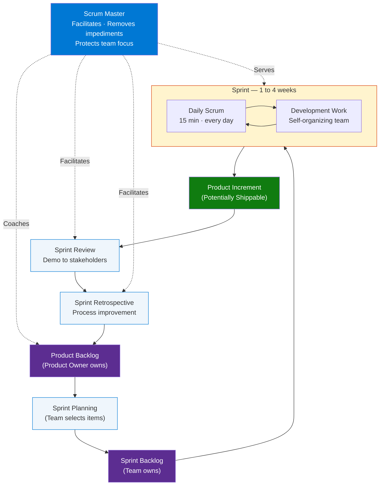
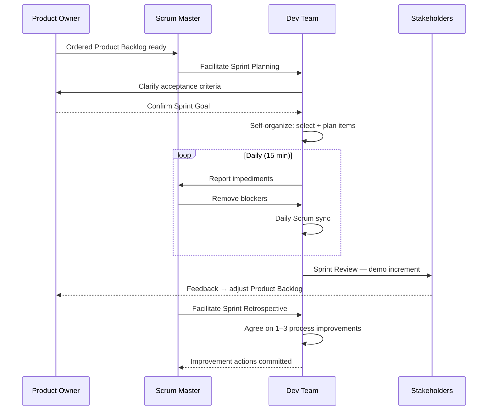
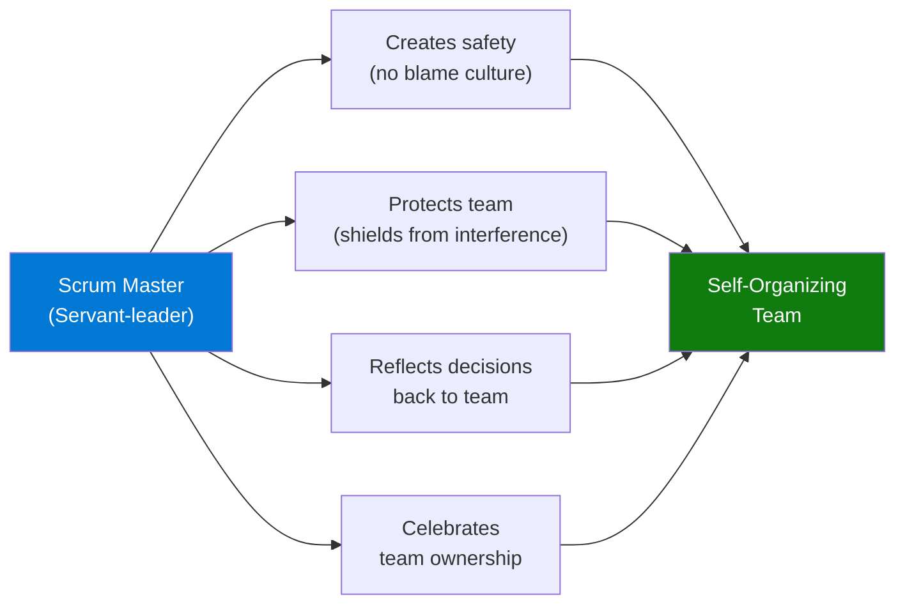

# Top 21 Real Scrum Master Interview Questions and Answers

> **Source:** [YouTube — Top 21 REAL scrum master interview questions and answers](https://www.youtube.com/watch?v=DywJz5EcuGs)
> **Topic:** Scrum, Agile, Scrum Master, Interview Preparation, Project Management
> **Key Claim:** Scrum Masters need deep knowledge of basics — they teach, train, mentor, and coach both teams and the wider organization.

---

## Table of Contents

1. [Overview](#1-overview)
2. [Scrum Framework Quick Reference](#2-scrum-framework-quick-reference)
3. [Scrum Roles Compared](#3-scrum-roles-compared)
4. [Scrum Sprint Cycle — Architecture](#4-scrum-sprint-cycle--architecture)
5. [How a Sprint Works — Step by Step](#5-how-a-sprint-works--step-by-step)
6. [The 21 Interview Questions](#6-the-21-interview-questions)
   - [Foundational Questions (Q1–Q7)](#foundational-questions-q1q7)
   - [Roles & Responsibilities (Q8–Q10)](#roles--responsibilities-q8q10)
   - [Process & Artifacts (Q11–Q16)](#process--artifacts-q11q16)
   - [Behavioral / Scenario-Based (Q17–Q21)](#behavioral--scenario-based-q17q21)
7. [Comparison Table: Scrum vs Kanban vs Waterfall](#7-comparison-table-scrum-vs-kanban-vs-waterfall)
8. [STAR Method for Behavioral Questions](#8-star-method-for-behavioral-questions)
9. [What Interviewers Look For](#9-what-interviewers-look-for)
10. [Interview Talking Points](#10-interview-talking-points)
11. [Learning Resources](#11-learning-resources)

---

## 1. Overview

This reference file covers the top 21 real Scrum Master interview questions drawn from actual hiring practices. Questions span foundational Scrum knowledge, role distinctions, artifact definitions, and behavioral/scenario challenges. Mastering these prepares you to demonstrate both conceptual depth and practical judgment — the two dimensions all strong Scrum Master candidates show. The real differentiator is not memorized answers but the ability to think in systems, coach without authority, and connect delivery with organizational strategy.

---

## 2. Scrum Framework Quick Reference

### Three Pillars of Scrum (Empirical Process Control)

| Pillar | Definition | Practice |
|---|---|---|
| **Transparency** | Consistent standards and shared definitions for all team members | Definition of Done, visible Sprint Backlog |
| **Inspection** | Regular review of progress toward Sprint goal | Daily Scrum, Sprint Review |
| **Adaptation** | Process modification when deviation detected | Sprint Retrospective, Backlog Refinement |

> **Interview tip:** If asked "why is Scrum empirical?" — say: "It does not assume we can plan everything upfront. Instead it relies on short feedback loops: Transparency lets us see reality, Inspection checks if we're on track, and Adaptation corrects course. This is why Scrum outperforms plan-driven approaches in complex, uncertain work."

### Five Scrum Values

| Value | Meaning in Practice |
|---|---|
| **Commitment** | Team commits to Sprint Goal, not just tasks |
| **Courage** | Raise impediments, challenge process, give honest feedback |
| **Focus** | Stay on Sprint Goal; say no to scope creep |
| **Openness** | Transparent about work, progress, and challenges |
| **Respect** | Honor each person's skills, background, and perspective |

> **Interview tip:** Interviewers ask "which Scrum value is most important to you and why?" — pick one and defend it with a story. Strong answer: "Courage — because most Scrum failures happen when someone knows a Sprint is failing but doesn't say so. The SM must model the courage to surface bad news early."

### Scrum Artifacts

| Artifact | Owner | Purpose |
|---|---|---|
| Product Backlog | Product Owner | Ordered list of everything the product needs |
| Sprint Backlog | Development Team | Selected items + plan for current Sprint |
| Product Increment | Development Team | Potentially shippable product at Sprint end |

> **Interview tip:** When asked about artifacts, emphasize *ownership* — the Product Owner owns the Product Backlog, the Development Team owns the Sprint Backlog. The SM owns none of them. Confusing ownership is a common gap in junior candidates.

### Scrum Events (Ceremonies)

| Event | Timebox | Purpose |
|---|---|---|
| Sprint | 1–4 weeks | Container for all other events |
| Sprint Planning | Max 8h (4-week Sprint) | What can be done? How will it be done? |
| Daily Scrum | 15 min | Inspect progress toward Sprint Goal, adapt plan |
| Sprint Review | Max 4h (4-week Sprint) | Inspect increment, adapt Product Backlog |
| Sprint Retrospective | Max 3h (4-week Sprint) | Inspect team process, create improvement plan |

> **Interview tip:** Know the timebox formula: for a 2-week Sprint, all timeboxes halve (Planning = 4h, Review = 2h, Retro = 1.5h). Interviewers test this. Also: Daily Scrum is owned by the **Development Team** — the SM does not run it, they facilitate it when needed and teach the team to own it themselves.

### Business Conversation Example

**Context:** A Scrum Master explaining the Scrum framework to a new VP Engineering who came from a Waterfall background and is skeptical about the lack of a traditional PM.

> **VP Engineering:** "So there's no project manager tracking the plan. Who's accountable if the sprint fails?"
>
> **SM:** "The team is collectively accountable for the Sprint Goal, and I'm accountable for the health of the process that helps them achieve it. In Waterfall you had one person absorbing all the risk — which works when requirements are stable. In Scrum, risk is distributed and visible earlier. If a Sprint fails, we find out in 2 weeks and we adapt. In Waterfall, we might not find out until month 6."
>
> **VP Engineering:** "But who do I call when things go wrong?"
>
> **SM:** "Me — for process problems. The Product Owner — for scope or priority decisions. The team — for technical blockers. I know that's three people instead of one. The benefit is that each of those three can actually solve the problem in their domain without waiting for a PM to relay the message. Last quarter, our average impediment resolution time dropped from 4 days to 18 hours once we removed that relay."
>
> **VP Engineering:** "18 hours. Okay, walk me through what that looks like in a Sprint."
>
> **SM:** "Start with Sprint Planning — the team commits to a Sprint Goal, not just a task list. Then daily standups to surface blockers same-day. Mid-sprint I see the burndown; if we're off-track by day 5 I'm already in conversation with the PO about descoping. Sprint Review on day 10 — you're invited to that and can give direct feedback to the team."

**Why this works:** The SM doesn't defend Scrum abstractly — they translate it into the VP's language (accountability, risk, speed of response) and anchor it in a specific metric (18-hour resolution time). The invitation to the Sprint Review is strategic: it gives the skeptical stakeholder a concrete touchpoint that costs them nothing and demonstrates the framework in action rather than in theory.

---

## 3. Scrum Roles Compared

| Dimension | Scrum Master | Product Owner | Development Team |
|---|---|---|---|
| **Focus** | Process & team health | Product value & ROI | Building the increment |
| **Authority over team?** | No — servant-leader | No — influencer | Self-organizing |
| **Manages backlog?** | No | Yes — owns & orders | Refines & estimates |
| **Manages people?** | No | No | No — self-manages |
| **Sprint commitment** | Removes impediments | Defines Sprint Goal | Commits to delivery |
| **Reports to** | No one in Scrum | Business/stakeholders | No one in Scrum |
| **Size** | 1 per team | 1 per product | 3–9 members |

> **Interview tip:** The most common trap question is "Is the Scrum Master a manager?" — the correct answer is that the SM manages the **Scrum process**, not the people. They have no direct authority over the Development Team.

### Business Conversation Example

**Context:** A panel interview where the hiring manager pushes back on whether a Scrum Master without managerial authority can actually be effective.

> **Interviewer:** "You said you don't manage the team. So if a developer keeps missing their commitments, what do you actually do? You can't fire them, you can't put them on a performance plan."
>
> **SM:** "You're right — those levers belong to the line manager, not me. My job is to find out why the commitment is being missed before it becomes a performance issue. Is it unclear requirements? A technical dependency they didn't surface? Scope that was underestimated? 80% of the time it's a systems problem, not a people problem."
>
> **Interviewer:** "And the other 20%?"
>
> **SM:** "I have a candid 1:1 conversation and involve the line manager if needed. But I'm usually not the first person to reach that point — the team often surfaces it themselves in retrospectives. In my last role, we had a situation where one developer consistently underdelivered. Rather than escalating, I facilitated a team agreement on how commitments are defined. Velocity stabilized within 2 sprints without any HR involvement."
>
> **Interviewer:** "So you rely on peer pressure?"
>
> **SM:** "I'd call it team accountability. Peer pressure is coercive. Team accountability is the team co-creating their own standards and then holding themselves to them. My job is to create the structure — Definition of Done, clear Sprint Goals, honest retrospectives — so the team can self-regulate. That's why self-organizing teams consistently outperform traditionally managed ones on sustained velocity."

**Why this works:** The SM never gets defensive about lacking authority — they reframe authority as less relevant than root cause analysis. The real-world example (velocity stabilized in 2 sprints) makes the approach concrete. Distinguishing peer pressure from team accountability shows mature facilitation thinking, not word games.

---

## 4. Scrum Sprint Cycle — Architecture



> **Interview tip:** When drawing the Sprint cycle in an interview, position the SM on the outside of the loop — serving all events, not driving them. The SM's arrow is dotted (influence), not solid (authority). This visual distinction signals you understand servant-leadership structurally.

### Business Conversation Example

**Context:** A Scrum Master's first week at a new company, meeting with the Product Director to explain how the Sprint cycle works and what the SM role looks like from the outside.

> **Product Director:** "We've had Scrum Masters before but I never really understood what they do day-to-day. Can you walk me through a typical Sprint from your perspective?"
>
> **SM:** "Happy to. Think of the Sprint cycle as a loop with 5 checkpoints. Sprint Planning on day 1 — I facilitate a 4-hour session where the team pulls from the prioritized backlog and commits to a Sprint Goal. My job there is to protect the goal from scope creep and make sure the team is committing to outcomes, not just tasks."
>
> **Product Director:** "And then?"
>
> **SM:** "Daily Scrum — 15 minutes each morning. I'm there but I'm not running it. The team owns that. I'm listening for impediments — anything that would slow the team down that they can't solve themselves. If I hear one, I've typically removed it before they leave the room or within 24 hours."
>
> **Product Director:** "What counts as an impediment you'd take on?"
>
> **SM:** "Three categories: external dependencies — another team blocking us; process gaps — missing access, unclear policy; and organizational dysfunction — unclear priorities from the PO causing context switching. In my last company I tracked 34 impediments in Q3. Average resolution time was 22 hours. 8 of those required escalation to you or someone at your level."
>
> **Product Director:** "So you'd come to me with 8 things over a quarter?"
>
> **SM:** "Yes — but each one would arrive with a clear problem statement, what I've already tried, and a specific ask from you. Not a vague escalation. You'd be making a decision, not inheriting a problem."

**Why this works:** The SM makes themselves tangible to an executive by translating abstract Scrum events into visible value (impediment stats, escalation protocol). The "8 things over a quarter" framing reframes the SM role from overhead to a high-quality escalation filter — exactly what a Product Director wants.

---

## 5. How a Sprint Works — Step by Step



**Step-by-step breakdown:**

1. **Sprint Planning** — PO presents ordered backlog; Team selects items and defines Sprint Goal
2. **Daily Scrum** — 15-minute sync: what did I do yesterday? what today? any blockers?
3. **Development** — Team self-organizes; SM removes impediments daily
4. **Sprint Review** — Team demos increment to stakeholders; PO updates backlog based on feedback
5. **Sprint Retrospective** — Team inspects process: what went well, what to improve, 1–3 action items

### Business Conversation Example

**Context:** An interview where the candidate is asked what they do when the Sprint Goal is in danger mid-sprint.

> **Interviewer:** "Walk me through what happens when your team is at day 7 of a 10-day sprint and only 40% of the Sprint Backlog is done."
>
> **SM:** "First thing I do is separate the question 'will we hit the Sprint Goal?' from 'will we finish all backlog items?' — those aren't the same thing. At 40% with 3 days left, the Sprint Goal might still be achievable if the remaining 60% is lower priority items."
>
> **Interviewer:** "What if the Sprint Goal is also at risk?"
>
> **SM:** "Then I immediately bring the PO into the conversation. Not to panic — to decide. We have two options: descope items from the Sprint Backlog to protect the Sprint Goal, or acknowledge the Sprint Goal won't be met and flag it to stakeholders now rather than at the Sprint Review. Option two is rare, but it's better than a surprise on day 10."
>
> **Interviewer:** "Have you had to do that?"
>
> **SM:** "Yes. In a previous sprint, external API dependencies delayed 3 stories. By day 6 I could see the burndown wasn't recovering. I called a 30-minute session with the PO. We descoped 2 stories and moved them to the next Sprint. We hit the Sprint Goal. The stakeholders weren't surprised because we'd communicated early. The retrospective action item was to add third-party dependency checks to Sprint Planning criteria."
>
> **Interviewer:** "What was the cost?"
>
> **SM:** "Two stories delayed by one sprint — about 10 days. The alternative — missing the Sprint Goal and losing stakeholder trust — would have been more expensive. You can recover from scope descoping. It's harder to recover from a team that says 'done' when it isn't."

**Why this works:** The SM demonstrates they understand that the Sprint Goal is the commitment, not the task list — a subtle but critical Scrum distinction. The real example includes a specific action (30-minute session), a specific outcome (Sprint Goal met), and a systems improvement (retrospective action item). The final line shows risk calibration thinking, not just process knowledge.

---

## 6. The 21 Interview Questions

Questions are grouped by type — foundational knowledge tests come first, followed by role/artifact definitions, and finally behavioral scenarios that require structured storytelling. Interviewers typically cover all three tiers; weak candidates stall on behavioral questions because they memorize definitions but skip scenario practice.

---

### Foundational Questions (Q1–Q7)

These test whether you understand the Scrum framework at the conceptual level — pillars, values, roles, and the key distinction between Scrum and adjacent methodologies (Agile, Kanban, Waterfall). Every SM candidate must answer these without hesitation.

---

#### Q1. Can you explain the role of a Scrum Master and how it differs from other project management roles?

The Scrum Master is a **servant-leader** — they facilitate the Scrum framework without having direct authority over the team. Unlike a traditional project manager who assigns tasks, owns the schedule, and reports on status, the Scrum Master focuses on removing impediments, fostering self-organization, and ensuring the team follows Scrum principles. The SM is accountable for the team's effectiveness; the PM is accountable for the project's delivery. Key distinction: the SM manages the **process**, not the people.

| Dimension | Scrum Master | Traditional Project Manager |
|---|---|---|
| **Authority over team** | None — servant-leader | Direct — assigns and reviews work |
| **Owns schedule?** | No | Yes |
| **Success measured by** | Team effectiveness & process health | On-time, on-budget delivery |
| **Reporting status** | Facilitates team transparency | Reports to sponsor/stakeholder |
| **Handles impediments** | Removes or escalates | Resolves via authority or escalation |
| **Works on backlog?** | No | Manages project plan |

> **Interview tip:** Always contrast with the traditional PM role. Interviewers are testing whether you understand the authority boundary — SM has zero authority over team members but significant influence through coaching.

---

#### Q2. What is Scrum and how does it work?

Scrum is an **empirical Agile framework** for delivering complex products incrementally. It works through fixed-length Sprints (1–4 weeks), defined roles (Scrum Master, Product Owner, Development Team), four events (Sprint Planning, Daily Scrum, Sprint Review, Retrospective), and three artifacts (Product Backlog, Sprint Backlog, Increment). The three pillars — Transparency, Inspection, Adaptation — underpin every Scrum decision. Teams learn through short feedback cycles rather than long upfront planning.

| Component | Count | Names |
|---|---|---|
| Roles | 3 | Scrum Master, Product Owner, Development Team |
| Events | 5 | Sprint, Planning, Daily Scrum, Review, Retrospective |
| Artifacts | 3 | Product Backlog, Sprint Backlog, Increment |
| Pillars | 3 | Transparency, Inspection, Adaptation |
| Values | 5 | Commitment, Courage, Focus, Openness, Respect |

> **Interview tip:** Lead with "empirical" — it signals you understand Scrum's theoretical foundation, not just the mechanics.

---

#### Q3. What is the difference between Scrum and Agile?

Agile is a **set of values and principles** (from the Agile Manifesto, 2001) — a mindset for iterative, customer-focused software delivery. Scrum is one **framework that implements Agile values** in a structured way with defined roles, events, and artifacts. Other Agile frameworks include Kanban, SAFe, LeSS, and XP. All Scrum is Agile; not all Agile is Scrum.

```
Agile (mindset / values)
  └── Scrum (framework — roles, events, artifacts)
  └── Kanban (flow-based method)
  └── XP (engineering practices)
  └── SAFe (enterprise scaling)
```

> **Interview tip:** This is a definitional trap question — don't say they're the same. Show the parent-child relationship.

---

#### Q4. What are the Scrum events (ceremonies)?

There are **five Scrum events**: Sprint (container), Sprint Planning, Daily Scrum, Sprint Review, and Sprint Retrospective. (Some older materials list four, excluding Sprint itself.) Each event has a defined purpose, timebox, and participants. Missing or shortening events violates Scrum and reduces transparency and adaptation opportunities.

| Event | Who attends | Key output |
|---|---|---|
| Sprint Planning | All Scrum Team | Sprint Goal + Sprint Backlog |
| Daily Scrum | Dev Team (SM optional) | Adapted 24h plan |
| Sprint Review | All Scrum Team + Stakeholders | Updated Product Backlog |
| Sprint Retrospective | All Scrum Team | Improvement actions |

> **Interview tip:** Interviewers often probe timeboxes — know Sprint Planning = max 8h/4-week-Sprint, Daily = 15 min, Review = 4h, Retro = 3h.

---

#### Q5. What is the Definition of Done (DoD)?

The Definition of Done is a **shared, formal understanding** of what "complete" means for a Product Backlog Item or an Increment. It typically includes: code written, peer-reviewed, unit-tested, integration-tested, deployed to staging, and documentation updated. The DoD creates transparency and provides a quality gate. If an item doesn't meet the DoD, it cannot be included in the Sprint Increment. The DoD is owned by the Development Team (or the organization if one exists at that level).

**Example DoD checklist (software team):**
```
Definition of Done — Engineering Team v2.3
[ ] Code written and peer-reviewed (PR approved by ≥ 1 reviewer)
[ ] Unit tests written — coverage ≥ 80% for new code
[ ] Integration tests passing in CI pipeline
[ ] No new Sonar critical/blocker issues
[ ] Deployed to staging environment
[ ] Product Owner accepted in staging (if UI change)
[ ] Release notes updated
[ ] Documentation updated (API docs / README)
```

| | Definition of Done | Acceptance Criteria |
|---|---|---|
| **Scope** | All items in the Sprint | One specific user story |
| **Owner** | Development Team | Product Owner |
| **Changes how often?** | Rarely — Sprint Retro only | Per story |
| **Failure means** | Item excluded from Increment | Story rejected by PO |

> **Interview tip:** Distinguish DoD (shared across all items) from Acceptance Criteria (specific to one user story). Confusing them is a common junior mistake.

---

#### Q6. What is the difference between Scrum and Kanban?

| Dimension | Scrum | Kanban |
|---|---|---|
| Cadence | Fixed Sprints (1–4 weeks) | Continuous flow, no iteration |
| Roles | SM, PO, Dev Team defined | No prescribed roles |
| Work limit | Sprint Backlog locked mid-Sprint | WIP limits on board columns |
| Planning | Sprint Planning at start | Pull items as capacity allows |
| Change | No scope change mid-Sprint | Can add items anytime |
| Best for | Feature development, complex work | Support, maintenance, unpredictable demand |

> **Interview tip:** Neither is better — choose based on work type. Scrum suits iterative feature delivery; Kanban suits continuous service/support queues.

---

#### Q7. What is the difference between Scrum and Waterfall?

| Dimension | Scrum | Waterfall |
|---|---|---|
| Delivery | Incremental — every Sprint | Big-bang — end of project |
| Planning | Just-in-time, adaptive | Upfront, comprehensive |
| Risk | Reduced — validated early | High — late discovery |
| Change | Welcomed (in backlog) | Expensive, process-heavy |
| Feedback | Every Sprint Review | After full delivery |
| Documentation | Working software first | Extensive upfront docs |

> **Interview tip:** Frame Waterfall as "works when requirements are stable and well-understood" — avoid disparaging it. Interviewers test whether you can articulate trade-offs, not recite dogma.

---

### Roles & Responsibilities (Q8–Q10)

---

#### Q8. What is the role of the Product Owner?

The Product Owner is the **single voice of the customer** and is accountable for maximizing the value of the product. Responsibilities: maintain and order the Product Backlog, define acceptance criteria for items, make trade-off decisions on scope, communicate the product vision, and accept or reject Sprint increments. The PO is one person (not a committee) and has final say on what gets built.

| PO Does | PO Does NOT Do |
|---|---|
| Order the Product Backlog | Assign tasks to developers |
| Define acceptance criteria | Run Daily Scrum |
| Accept/reject Sprint Increment | Make technical implementation decisions |
| Communicate product vision | Manage sprint scope mid-sprint (without team agreement) |
| Prioritize stakeholder requests | Manage team members' performance |
| Make scope trade-off decisions | Delegate final backlog decisions to a committee |

> **Interview tip:** Stress "single accountable person" — the PO can take input from stakeholders but cannot delegate backlog ownership to a committee.

---

#### Q9. Is the Scrum Master a manager?

The Scrum Master is **not a traditional manager**. They manage the **Scrum process** — the events, the health of team dynamics, impediment removal, and adoption of Scrum practices — but they do not manage people, assign tasks, conduct performance reviews, or control schedules. The Development Team self-manages. The SM operates through influence, coaching, and facilitation, not authority.

```
Traditional Manager:          Scrum Master:
  ├─ Assigns tasks              ├─ Facilitates Planning
  ├─ Controls schedule          ├─ Removes impediments
  ├─ Performance reviews        ├─ Coaches Scrum process
  └─ Decision-making authority  └─ Serves the team
```

> **Interview tip:** This is the most-asked definitional question. Know it cold. The phrase "servant-leader" is the key signal.

---

#### Q10. How does the Scrum Master serve the organization?

The SM serves the organization by: leading, training, and coaching on Scrum adoption; planning and advising on Scrum implementations; helping employees and stakeholders understand empirical product development; causing change that increases team productivity; working with other Scrum Masters to increase framework effectiveness organization-wide.

| Who the SM Serves | How |
|---|---|
| **Development Team** | Remove impediments, facilitate events, coach self-organization |
| **Product Owner** | Help maintain effective backlog, facilitate stakeholder collaboration |
| **Organization** | Coach leadership on empirical thinking, drive Scrum adoption |
| **Other Scrum Teams** | Share patterns, coordinate dependencies in scaled contexts |
| **Stakeholders** | Teach how to engage with Scrum team without disrupting Sprint |

> **Interview tip:** This question tests whether you see the SM role as only team-scoped or also organization-scoped. Strong candidates mention scaling impact beyond one team.

---

### Process & Artifacts (Q11–Q16)

---

#### Q11. What is a User Story and how is it written?

A User Story captures a **requirement from the end user's perspective** using the format:

```
As a <type of user>,
I want <to perform some task>,
So that <I can achieve some goal/benefit/value>.

Example:
  As a Customer,
  I want to shop online from websites,
  So that I do not need to visit the local market.
```

Good user stories follow **INVEST**: Independent, Negotiable, Valuable, Estimable, Small, Testable. Acceptance Criteria define measurable conditions that confirm the story is done.

> **Interview tip:** If asked "who writes user stories?" — anyone on the team can, but the PO is accountable for their quality and order in the backlog.

---

#### Q12. What is User Story Mapping?

User Story Mapping is a collaborative technique for **organizing stories into a two-dimensional map**: the horizontal axis represents user workflow (activities in sequence); the vertical axis represents priority/detail (from backbone at top to details below). It helps teams identify the Minimum Viable Product (MVP) by drawing a horizontal line — everything above the line is MVP; below is future scope.

```
Activity 1     Activity 2     Activity 3
   │               │               │
Story 1.1      Story 2.1      Story 3.1   ← MVP line
Story 1.2      Story 2.2      Story 3.2
Story 1.3      Story 2.3      Story 3.3   ← Future scope
```

> **Interview tip:** Story mapping is Jeff Patton's technique. Mention it by name if you're interviewing for a senior SM or PO role.

---

#### Q13. What is Sprint 0?

Sprint 0 is an **informal term** (not official Scrum) for a brief pre-project phase where teams: set up infrastructure, create an initial rough Product Backlog, establish the Definition of Done, and clarify the technical approach. Because it produces no shippable increment, it's technically not a Sprint. Better terms: discovery phase, inception, or release planning.

| Dimension | Sprint 0 (informal) | Regular Sprint |
|---|---|---|
| In Scrum Guide? | No | Yes |
| Produces increment? | No | Yes (required) |
| Purpose | Setup, exploration, initial backlog | Deliver value to users |
| Duration | Flexible | Fixed timebox |
| Sprint Review? | No | Yes |
| Recommended? | Avoid the name; use "inception" | Always |

> **Interview tip:** If an interviewer asks about Sprint 0, the "trap" answer is treating it as standard Scrum. The correct answer: "It's not in the Scrum Guide, but teams use it informally for foundational setup."

---

#### Q14. What is the difference between a Product Backlog and a Release Backlog?

| Dimension | Product Backlog | Release Backlog |
|---|---|---|
| Scope | Everything the product needs — ever | Subset committed to a specific release |
| Owner | Product Owner | Product Owner (with stakeholder input) |
| Time horizon | Indefinite | Specific release date/milestone |
| Stability | Continuously refined | Relatively stable once committed |
| Scrum Guide | Official artifact | Not in Scrum Guide — used in scaled contexts |

> **Interview tip:** The Release Backlog is not a Scrum Guide concept — it appears in SAFe and larger program management contexts. Demonstrate awareness of when it applies.

---

#### Q15. What is a Spike in Scrum?

A Spike is an **Enabler Story** (borrowed from XP/SAFe) used to: investigate technical feasibility of an approach, reduce uncertainty in an estimate, or research an unfamiliar area. Spikes are time-boxed. They produce knowledge, not shippable code. Examples: "Spike: Evaluate whether GraphQL meets our latency requirements (2 days)" or "Spike: POC for integrating with Payment Gateway API (3 days)."

```
Story Type    | Produces          | Counts toward velocity?
User Story    | Working software  | Yes
Spike         | Knowledge/POC     | Usually No (or tracked separately)
Bug Fix       | Fixed software    | Team decides
```

> **Interview tip:** Spikes are time-boxed — this is the key constraint that prevents research from going open-ended.

---

#### Q16. Can the Definition of Done be changed mid-Sprint?

**No — and this is a trap question.** The DoD must remain stable within a Sprint. Changing it mid-Sprint means either:
- **Lowering quality standards under pressure** — a sign of technical debt accumulation
- **Adding requirements nobody agreed to** — unfair to the team

If the DoD needs updating, do it at the **Sprint Retrospective** and apply the new standard from the next Sprint onward. The only exception: if the team discovers the DoD is fundamentally broken (e.g., a testing environment is permanently down), a conversation is warranted — but this should be an exception, not a habit.

| Scenario | Correct Response |
|---|---|
| PO asks to lower DoD to ship faster | Refuse; explain tech debt risk; negotiate scope instead |
| Team can't meet DoD due to infrastructure issue | Escalate as impediment; don't relax DoD |
| Team wants to raise DoD (stricter) mid-Sprint | Defer to Retrospective; agree it starts next Sprint |
| Stakeholder demands DoD change | PO shields team; SM coaches on process |

> **Interview tip:** This question tests whether candidates will defend quality under pressure. The right answer shows backbone: "No, and here's why."

---

### Behavioral / Scenario-Based (Q17–Q21)

---

#### Q17. How do you handle conflicts within the Scrum team?

**Framework:** Transparency → Empathy → Consistency → Follow-through

1. **Create safety** — hold a private 1:1 with each party first; never force public resolution before people feel heard
2. **Name the conflict** — surface it transparently in the retrospective (if team-level) or privately (if interpersonal)
3. **Focus on the problem, not the person** — use "I" statements; ask what the person needs, not what they want the other person to do
4. **Agree on a way forward** — documented, time-boxed action
5. **Follow up** — check in at next retrospective to confirm resolution held

Strong answers include **specific examples** (STAR format) and show the SM as a facilitator, not an arbitrator.

| Conflict Type | SM Response |
|---|---|
| Technical disagreement (e.g., architecture choice) | Time-boxed spike; let data decide |
| Interpersonal friction | Private 1:1 with each; then joint facilitated session |
| Team vs. PO (scope push) | Facilitate backlog conversation; protect Sprint Goal |
| Estimation disagreement | Planning Poker; encourage team consensus |
| Missed commitment blame | Retrospective blameless post-mortem; systemic fix |

> **Interview tip:** Weak answer: "I bring them together and ask them to be professional." Strong answer: describes a specific conflict, the SM's facilitation steps, and the measurable outcome.

---

#### Q18. How do you handle a team member who consistently misses commitments?

**Step 1 — Private conversation first.** Ask open-ended questions: Are they blocked technically? Do they need training? Are personal issues affecting focus? Are other priorities competing?

**Step 2 — Identify the pattern.** Is this one person or a systemic estimation problem? If the whole team is missing Sprint Goals, the issue is likely estimation or scope — not one person.

**Step 3 — Remove the impediment.** If they need pairing, provide it. If they need clearer acceptance criteria, fix that. If they have unmanaged competing priorities, escalate.

**Step 4 — Re-estimate together.** Bring the pattern back to Sprint Planning so the team right-sizes commitments.

| Root Cause | SM Action |
|---|---|
| Technical blocker | Pair with another team member or escalate |
| Unclear acceptance criteria | Work with PO to sharpen stories before Planning |
| Competing priorities (other manager) | Escalate to leadership; protect team's focus |
| Skill gap | Arrange training or pairing; adjust story complexity |
| Personal issue | Empathize privately; connect to HR/EAP if needed |
| Systemic overcommitment | Reduce velocity target; adjust Sprint Planning |

> **Interview tip:** Never jump to "I escalate to their manager" — that undermines self-organization. Show you exhaust facilitation options first.

---

#### Q19. How do you handle unforeseen challenges that threaten the Sprint Goal?

1. **Immediate transparency** — raise in Daily Scrum; don't wait
2. **Assess with the team** — can the Sprint Goal still be met with reduced scope? Or is the goal itself at risk?
3. **Inform the Product Owner** — they decide whether to adjust scope, cancel the Sprint, or accept a partial increment
4. **Escalate external impediments** — if the blocker is outside the team's control (e.g., a vendor API is down), the SM escalates immediately
5. **Never silently sacrifice quality** — cutting corners to preserve velocity is a tech-debt trap

| Threat Type | Response |
|---|---|
| Scope too large (underestimated) | Remove lowest-priority items; protect Sprint Goal |
| External dependency blocked | SM escalates immediately; don't wait |
| Team member sick/unavailable | Replan remaining capacity; reduce scope |
| Technical blocker discovered | Spike or pair; inform PO if goal is at risk |
| Sprint Goal itself becomes obsolete | PO cancels Sprint; team plans new one |

> **Interview tip:** The Sprint Goal is protected — scope can flex, quality cannot. This distinction shows maturity.

---

#### Q20. How do you foster self-organization within a Scrum team?

Self-organization is **built, not declared**. Tactics:

- During Sprint Planning, resist assigning tasks — let the team pull work
- When a team member asks "what should I do next?", reflect back: "What does the team need most right now?"
- Celebrate team decisions publicly; don't override them even if you'd choose differently
- Protect the team from external interference — the SM is the team's shield
- Use retrospectives to give the team ownership of their process improvements



> **Interview tip:** The test here is whether the candidate understands that self-organization cannot be mandated. It requires the SM to *step back*, not step in.

---

#### Q21. How do you handle scope creep?

Scope creep is **continuous and uncontrolled changes** to agreed Sprint scope, often driven by stakeholders adding requests mid-Sprint.

**Prevention tactics:**
- Strong Sprint Goal — a well-defined goal makes "out of scope" clear
- Locked Sprint Backlog — once Sprint Planning ends, new items go to the Product Backlog, not the current Sprint
- Stakeholder education — teach the feedback loop: raise it now → goes in backlog → prioritized → next Sprint

**Response when it happens:**
1. Acknowledge the request — don't dismiss it
2. Add it to the Product Backlog — it's not lost, it's queued
3. Ask the PO to prioritize — if it's urgent, the PO can negotiate: add it if we remove something of equal size
4. Never say yes without a corresponding removal

| Approach | Prevention | Response When It Happens |
|---|---|---|
| **Sprint Goal** | Clear goal makes "out of scope" obvious | "This doesn't serve our Sprint Goal — adding to backlog" |
| **Sprint Backlog lock** | Agree at Planning: no additions without removal | Politely decline; log in backlog |
| **PO as buffer** | PO intercepts stakeholder requests | SM routes new requests to PO immediately |
| **Stakeholder onboarding** | Educate on backlog flow in Sprint Review | Show them the backlog priority queue |
| **Velocity transparency** | Share team capacity openly | "Adding this means removing X — PO decides" |

> **Interview tip:** Scope creep is not always the stakeholder's fault — it often signals a weak Sprint Goal. Address root cause, not just the symptom.

---

## 7. Comparison Table: Scrum vs Kanban vs Waterfall

| Dimension | Scrum | Kanban | Waterfall |
|---|---|---|---|
| **Work cadence** | Fixed Sprints (1–4 weeks) | Continuous flow | Sequential phases |
| **Planning** | Sprint-by-Sprint | Continuous pull | Upfront comprehensive |
| **Roles** | SM, PO, Dev Team | None prescribed | PM, Analyst, Dev, QA |
| **Change handling** | In backlog; next Sprint | Anytime | Change control process |
| **Delivery** | Increment every Sprint | Whenever item done | End of project |
| **Metrics** | Velocity, Burndown | Cycle time, Throughput | Milestones, Gantt |
| **Best for** | Complex feature development | Maintenance, support, bugs | Regulated, stable requirements |
| **Feedback cadence** | Every Sprint Review | Item completion | User Acceptance Testing |
| **Team size** | 3–9 developers | Any | Any |
| **Risk exposure** | Low — validated early | Low — small batch | High — late discovery |

### Business Conversation Example

**Context:** An interview where the VP of Engineering asks which methodology to adopt for a new cross-functional product initiative with unclear requirements.

> **VP Engineering:** "We're starting a new customer-facing product. Requirements are fuzzy and the market is evolving fast. Should we use Scrum, Kanban, or just do it the old way?"
>
> **SM:** "The most important signal is requirement stability. You said fuzzy and evolving — that's a Scrum signal. Waterfall needs stable requirements upfront; when they change, you pay re-planning costs. Scrum is built for change; each Sprint is a structured bet that lasts 2 weeks, and you re-prioritize after every Sprint Review based on what you learned."
>
> **VP Engineering:** "What about Kanban? We've used that for our support team."
>
> **SM:** "Kanban is excellent for your support team because their work is incoming, unpredictable, and doesn't need a commitment cadence. For new product development, you need Sprint Goals — a shared commitment around which the team self-organizes. Without a timebox, there's no forcing function for stakeholder feedback, and fuzzy requirements stay fuzzy indefinitely."
>
> **VP Engineering:** "How long before we see value?"
>
> **SM:** "If we start Sprint 1 next week, you'll see a working increment — something demonstrable to real users — in 10 business days. Not complete, but real. Most Waterfall projects don't show anything testable for 6–9 months. The question isn't which methodology is best in theory; it's which one surfaces your biggest assumption the fastest. For a new customer-facing product with fuzzy requirements, that's Scrum."
>
> **VP Engineering:** "What's the catch?"
>
> **SM:** "Scrum requires an available Product Owner who can make daily prioritization decisions. If the PO is a part-time role or has competing priorities, Sprint Planning degrades and the framework breaks down. That's the single biggest risk factor I'd want to verify before committing to this approach."

**Why this works:** The SM avoids the "it depends" non-answer by asking about the right diagnostic question (requirement stability) and then giving a direct recommendation. Naming Scrum's failure condition (unavailable PO) shows mature judgment — not advocacy, but honest risk assessment. The 10-day working increment stat makes the Scrum value proposition concrete.

---

## 8. STAR Method for Behavioral Questions

All Q17–Q21 behavioral questions should be answered using STAR:

```
S — Situation:  Set the scene briefly (1–2 sentences)
T — Task:       What was your specific responsibility?
A — Action:     What concrete steps did YOU take? (most important section)
R — Result:     Measurable outcome — what improved? (%, time, team sentiment)
```

**Example STAR answer for Q17 (conflict):**

> **S:** In a previous role, two senior engineers on my Scrum team had repeated friction in Daily Scrum over technical approach — one preferred microservices, the other monolith.
> **T:** My job was to prevent this from derailing the Sprint and damaging the team dynamic.
> **A:** I pulled each aside privately, listened to their concerns without judgment, then facilitated a 45-minute technical spike that let both approaches be evaluated objectively. I structured the retrospective to surface the decision as a team, not mine to make.
> **R:** The team chose a hybrid approach with team buy-in. Conflict resolved; they became collaborators on the architecture decision and co-authored the ADR.

### Business Conversation Example

**Context:** A mock interview coaching session where a Scrum Master candidate is practicing their behavioral answers and improving their STAR structure in real time.

> **Coach:** "Tell me about a time you removed a blocker. Go."
>
> **Candidate:** "So we had this dependency on another team that was slowing us down, and I reached out to their manager and eventually it got resolved after about a week."
>
> **Coach:** "That's a situation with a vague action and no result. Let's build it up. What was the Sprint Goal at stake?"
>
> **Candidate:** "We were trying to ship the payment integration. The dependency was the auth service team — they needed to expose a new endpoint and hadn't prioritized it."
>
> **Coach:** "Good. That's your Situation and Task. Now specifics: what did YOU do, step by step?"
>
> **Candidate:** "I mapped the dependency in our Sprint Planning risk log, flagged it on day 2 when it wasn't resolved, and asked for a joint refinement session. When the auth team said they were 3 weeks out, I escalated to my director with a written impact statement showing we'd miss the Sprint Goal and delay the quarter release."
>
> **Coach:** "Now we have an Action. What was the Result?"
>
> **Candidate:** "Director reprioritized the auth team's backlog. They delivered the endpoint in 4 days. We shipped the payment integration on schedule, and the quarter release wasn't delayed."
>
> **Coach:** "That's a 9/10 STAR answer. What made the difference?"
>
> **Candidate:** "Escalating with a written impact statement rather than just saying 'we're blocked.' Quantifying the downstream risk got the decision made in 2 hours instead of 2 weeks."

**Why this works:** This dialogue teaches the STAR method by showing the before/after improvement process rather than just presenting the final answer. The specific escalation technique (written impact statement), the timeline difference (2 hours vs 2 weeks), and the concrete outcome (on-schedule delivery) are all things an interviewer can probe — and the candidate can now defend them.

---

## 9. What Interviewers Look For

| Dimension | Weak Candidate | Strong Candidate |
|---|---|---|
| **Framework knowledge** | Recites definitions | Explains trade-offs and when to deviate |
| **Authority model** | "I make sure the team..." | "I facilitate the team to decide..." |
| **Conflict handling** | "I escalate to management" | Exhausts facilitation options first |
| **Quality under pressure** | "We adjusted the DoD" | Defends DoD; negotiates scope instead |
| **Self-organization** | "I assign work in Daily Scrum" | Team pulls work; SM shields from interference |
| **Stakeholder management** | "I protect the team from stakeholders" | Collaborates; manages expectations; builds trust |
| **Metrics** | Tracks velocity only | Uses multiple metrics: cycle time, DoD compliance, team health |
| **Scaling awareness** | Only knows single-team Scrum | Aware of SAFe, LeSS, or Nexus concepts |

### Business Conversation Example

**Context:** A Scrum Master coaching a junior colleague who is preparing for their first SM interview, walking through the difference between a weak and strong candidate mindset.

> **Junior SM:** "I've been reading the Scrum Guide. I think I've got the definitions down. What else do I need?"
>
> **Senior SM:** "Definitions are the floor, not the ceiling. Tell me — what do you say if an interviewer asks 'what would you do if a developer keeps skipping the Daily Scrum?'"
>
> **Junior SM:** "I'd remind them it's a Scrum event and make sure they attend."
>
> **Senior SM:** "That's a weak answer. You just said 'make sure they attend' — that's authority language. You don't have that authority. What would you actually do?"
>
> **Junior SM:** "I'd... ask them why they're skipping?"
>
> **Senior SM:** "Better. And then?"
>
> **Junior SM:** "Find out if it's the format, the time, or something else?"
>
> **Senior SM:** "Exactly. A strong answer is: I'd have a 1:1 conversation to understand the root cause. If the format isn't working for them, I'd facilitate a team discussion to adapt it. If they feel Daily Scrum doesn't give them value, that's a sign the team isn't using it right — and that's my problem to solve, not theirs. The goal isn't attendance for the sake of process; it's the team having a daily synchronization that actually helps them."
>
> **Junior SM:** "So every question is about facilitation and root cause, not enforcement?"
>
> **Senior SM:** "Yes. The moment you say 'I make sure' or 'I enforce' in an interview, you've shown you don't understand the SM role. Replace those phrases with 'I facilitate', 'I coach', and 'I create the conditions for'. That's the switch from weak to strong candidate."

**Why this works:** The coaching dialogue makes the weak-vs-strong distinction visceral rather than abstract — the junior SM makes the mistake in real time and corrects it. The concrete phrase replacements ("I make sure" → "I facilitate") give the reader immediately usable interview technique, not just conceptual awareness.

---

## 10. Interview Talking Points

### "What makes a great Scrum Master?"

> The best Scrum Masters are measured by team outcomes, not their own visibility. A great SM makes themselves increasingly unnecessary — the team self-organizes, impediments get raised without prompting, and retrospectives produce real improvement. If the SM is the most important person in the room, something is wrong.

### "How do you measure your effectiveness as a Scrum Master?"

> I look at three signals: (1) Are impediments surfaced faster than last quarter? (2) Are Sprint Goals met more consistently over time? (3) Is the team's Definition of Done getting stronger — higher quality, not easier to pass? Velocity is a team tool for planning, not a metric for SM effectiveness.

### "How do you handle a Product Owner who ignores the backlog?"

> A neglected backlog is a planning debt that shows up in poor Sprint Goals and misaligned increments. I'd start by understanding why — too busy? unsure of the process? competing priorities? Then I'd work with them to establish a lightweight backlog refinement rhythm — even 1 hour a week — and show them the downstream benefit: faster Sprint Planning, clearer team commitment.

### "Have you ever cancelled a Sprint? How did you handle it?"

> Sprint cancellation is rare but legitimate. The PO can cancel if the Sprint Goal becomes obsolete — e.g., market conditions changed, a strategic pivot occurred. When it happened on my team, we ran a compressed Retrospective to surface the cause, updated the Product Backlog with the PO, and launched the next Sprint within 48 hours. The key is not to treat it as a failure but as the empirical process working — the team pivoted before investing further in the wrong direction.

### "What is your approach to new team onboarding?"

> First, I never assume the team knows Scrum. I run a brief Scrum foundations session in Week 1 — covering roles, events, artifacts, and the three pillars. Then I shadow the first Sprint Planning without facilitating, just observing. By Sprint 2, I introduce the Definition of Done collaboratively. I believe teams own their process — my job is to set up the structure, then step back.

---

## 11. Learning Resources

| Resource | Link | Type |
|---|---|---|
| YouTube — Top 21 REAL Scrum Master Interview Questions | [Watch](https://www.youtube.com/watch?v=DywJz5EcuGs) | Video |
| The Scrum Guide (Official — 2020) | [scrum.org/resources/scrum-guide](https://www.scrum.org/resources/scrum-guide) | Official Guide |
| Scrum.org — SM Interview Questions Blog | [scrum.org/resources/blog/scrum-master-interview-questions](https://www.scrum.org/resources/blog/scrum-master-interview-questions) | Article |
| 52 Scrum Master Interview Questions — Scrum.org | [scrum.org/resources/blog/52-scrum-master-interview-questions](https://www.scrum.org/resources/blog/52-scrum-master-interview-questions) | Article |
| Simplilearn — Top 50+ SM Interview Questions | [simplilearn.com](https://www.simplilearn.com/tutorials/agile-scrum-tutorial/scrum-master-interview-questions) | Article |
| Coursera — 13 SM Interview Q&A | [coursera.org](https://www.coursera.org/articles/scrum-master-interview-questions-and-answers) | Article |
| Professional Scrum Master (PSM I) Certification | [scrum.org/professional-scrum-master-i-certification](https://www.scrum.org/professional-scrum-master-i-certification) | Certification |

---

*Last Updated: July 2026 | Source: YouTube — Top 21 REAL Scrum Master Interview Questions and Answers*
